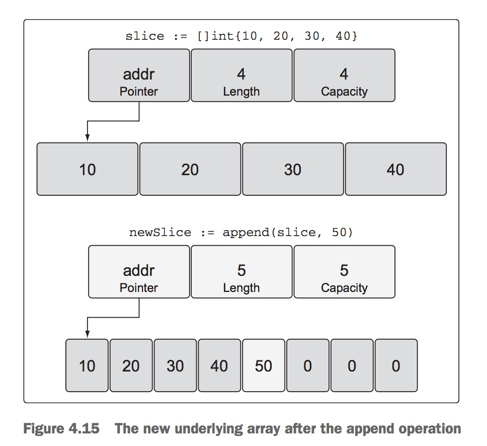
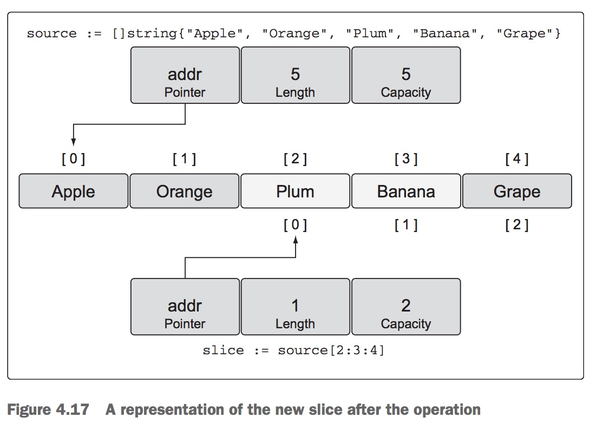
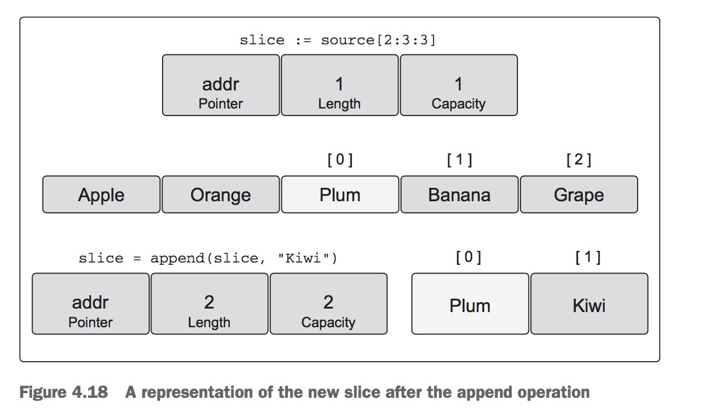
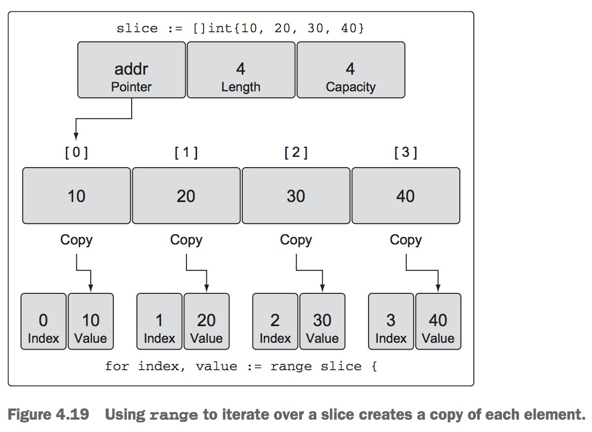
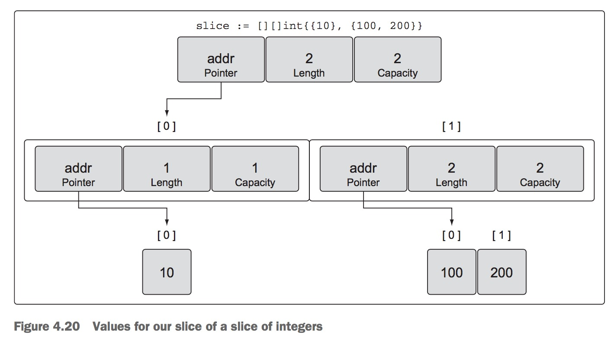
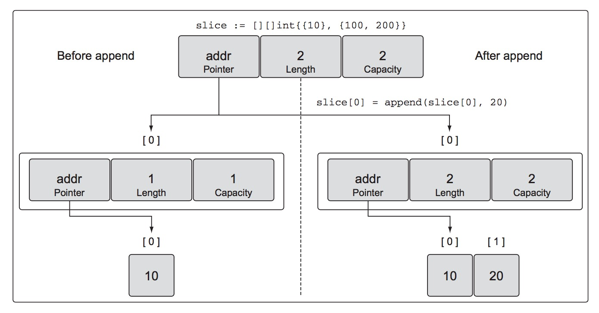
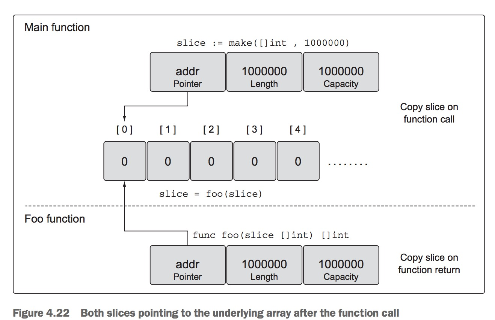
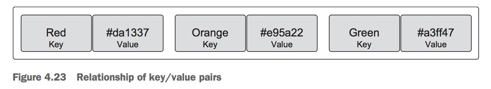
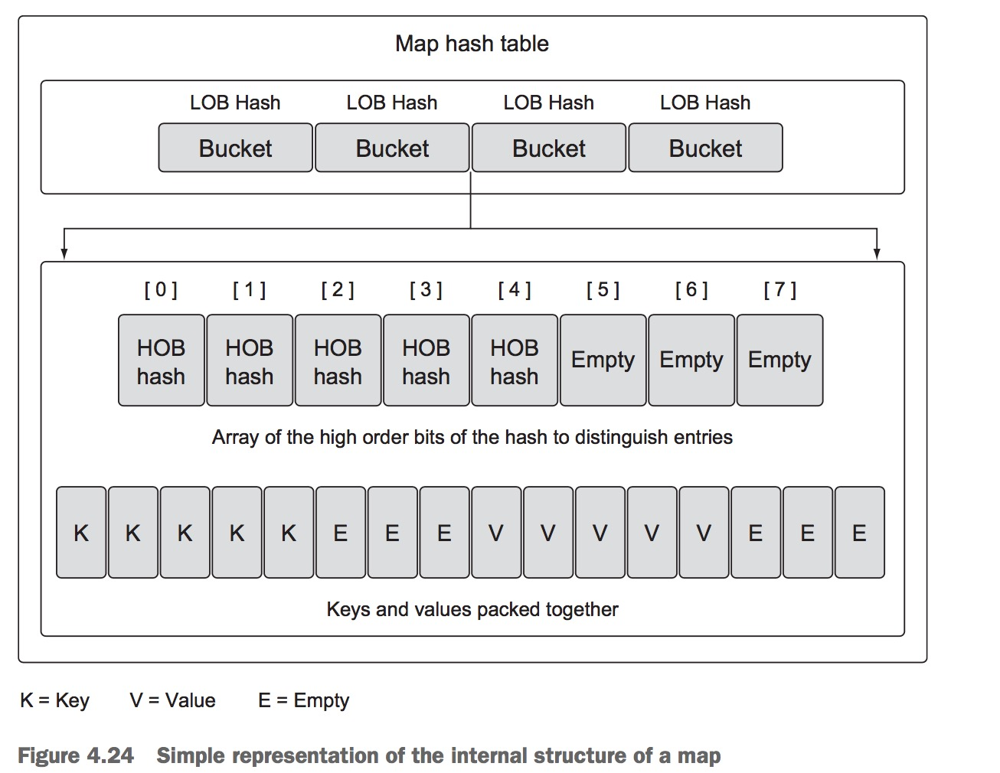
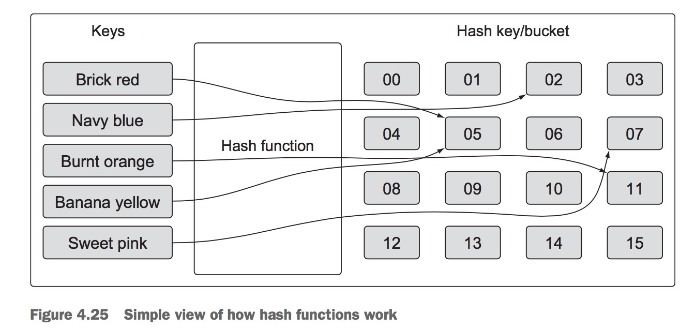

第四章 数组、分片和map
===================

本章概要

- 数组内核和基础
- 使用分片管理数据集合
- 使用map操作key/value对

很难写出不需要存储和读取数据集合的程序。 如果使用数据库或文件，或访问网站，需要一种处理接受和发送数据的方式。Go有三种不同的数据结构允许你操作数据集合: 数组、分片和映射。这些数据结构内置到Go语言中，并且可以通过标准库使用它们。一旦你指导这些数据结构如何工作，Go语言编程会变的愉快、快速和灵活。

## 4.1 数组内部结构和基本原则
从数组开始是有意义的，因为它是组成分片和映射的基本数据结构。 理解数组如何工作，将有助于领会分片和映射提供的优雅和强大能力。


### 4.1.1 内部结构(internals)
Go语言的数组是固定长度的数据类型，包含相同类型元素的连续块。可以是内置的整型、字符串，也可以是结构体类型。


在图4.1中你可以看到数组的表现。数组元素用灰色正方形表示，它们连成一串。每个元素包含相同的类型，这个例子中是整型，可以通过唯一索引位置访问。


数组是有用的数据结构，因为它们的内存是连续分配的。以连续的形式的内存有助于保持你使用的内存在CPU载入缓存后保持更长时间。使用索引运算，可以快速遍历所有元素。数组的类型信息为内存中移动查找元素提供了距离参数。既然每个元素的类型都是相同的，并且顺序紧随着的，因此在数组上移动是一致快捷的。

### 4.1.2 声明和初始化
数组是通过指明存储的数据类型和必要的元素总数(也就是数组长度)进行声明的。
```
// Declare an integer array of five elements
var array [5]int
```
一旦数组被声明，不管是存储数据的类型还是它的长度都不能改变。如果你需要更多元素，需要使用新的长度来创建新的数组，然后将原来数组的内容拷贝到新的数组中。

Go语言中变量声明后，通常都会被初始化为它们具体类型的零值, 数组也是一样。 当数组被初始化，属于数组的每个独立的元素被初始化为它的零值。图4.2, 你可以看到整数数组， 每个元素都被初始化为0， 也就是整数的零值。


快捷创建和初始化数组的方式是使用数组字面量。 数组字面量允许你声明需要的元素数以及为这些元素指定值。
```
// Declare an integer array of five elements.
// Initialize each element with a specific value

array := [5]int{10, 20, 30, 40, 50}
```
如果数组长度用...给定，那么Go语言会自动根据初始化的元素个数标识数组长度。
```
// Declare an integer array.
// Initialize each element with a specific value.
// Capacity is determined based on the number of values initialized.
array := [...]int{10, 20, 30, 40, 50}
```

如果你知道你需要的数组长度，但是你只想初始化其中特定索引的值，可以使用下面的语法:
```
// Declare an integer array.
// Initialize index 1 and 2 with specific values.
// The rest of the elements contain their zero value.
array := [5]int{1: 10, 2: 20}
```
上面数组声明后，数组声明并初始化后看起来就像下面4.3图的样子。


### 4.1.3 处理数组
正如我们所讨论的，数组是有效的数据结构，因为内存是顺序排列的。这样就让数组能有效的访问每个单独元素。要访问单独的元素，使用[]操作符。

```
// Declare an integer array of five elements.
// Initialize each element with a specific value.
array := [5]int{10, 20, 30, 40, 50}
// Change the value at index 2.
array[2] = 35
```
上面声明的数组在操作完成后，看起来如下图所示。


同样可以拥有一个指针的数组。就像第二章那样， 使用 * 操作符来访问每个元素指针指向的值。
```
// Declare an integer pointer array of five elements.
// Initialize index 0 and 1 of the array with integer pointers.
array := [5]*int{0: new(int), 1: new(int)}
// Assign values to index 0 and 1.
*array[0] = 10
*array[1] = 20
```
上面的声明的数组在数组操作完成后看起来类似图4.5所示:


在Go语言中数组是一个值。 这就意味着你可以在赋值操作中使用它。变量名表示整个数组，因此数组可以赋值给其他相同类型的数组。

```go
// Declare a string array of five elements.
var array1 [5]string
// Declare a second string array of five elements.
// Initialize the array with colors.
array2 := [5]string{"Red", "Blue", "Green", "Yellow", "Pink"}
// Copy the values from array2 into array1.
array1 = array2
```
拷贝之后，两个数组具有相同的值，如下图所示:


数组变量的类型包含可以存储在每个元素里边的数据长度以及类型。只有相同类型的数组才能赋值。
```go
// Declare a string array of four elements.
var array1 [4]string
// Declare a second string array of five elements.
// Initialize the array with colors.
array2 := [5]string{"Red", "Blue", "Green", "Yellow", "Pink"}
// Copy the values from array2 into array1.
array1 = array2
// Compiler Error:
// cannot use array2 (type [5]string) as type [4]string in assignment
```
拷贝指针数组是拷贝指针值，而不是拷贝指针指向的值。
```
// Declare a string pointer array of three elements.
var array1 [3]*string
// Declare a second string pointer array of three elements.
// Initialize the array with string pointers.
array2 := [3]*string{new(string), new(string), new(string)}
// Add colors to each element
*array2[0] = "Red"
*array2[1] = "Blue"
*array2[2] = "Green"
// Copy the values from array2 into array1.
array1 = array2
```
拷贝之后，有两个数组指向相同的字符串，如下所示:


### 4.1.4 多维数组
数组一般是一维的，但是可以组合创建多维数组。多维数组对于要处理有父子关系或坐标系统相关的数据时就变得非常方便了。

```
// Declare a two dimensional integer array of four elements
// by two elements.
var array [4][2]int
// Use an array literal to declare and initialize a two
// dimensional integer array.
array := [4][2]int{{10, 11}, {20, 21}, {30, 31}, {40, 41}}
// Declare and initialize index 1 and 3 of the outer array.
array := [4][2]int{1: {20, 21}, 3: {40, 41}}
// Declare and initialize individual elements of the outer
// and inner array.
array := [4][2]int{1: {0: 20}, 3: {1: 41}}
```


要访问单独元素，再次使用[]操作符合一个组成部分。
```
// Declare a two dimensional integer array of two elements.
var array [2][2]int
// Set integer values to each individual element.
array[0][0] = 10
array[0][1] = 20
array[1][0] = 30
array[1][1] = 40
```
可以互相间拷贝多维数组,只要它们类型相同。 多维数组的类型是基于每个维度的长度和每个元素可以存储的数据类型。

```
// Declare two different two dimensional integer arrays.
var array1 [2][2]int
var array2 [2][2]int
// Add integer values to each individual element.
array2[0][0] = 10
array2[0][1] = 20
array2[1][0] = 30
array2[1][1] = 40
// Copy the values from array2 into array1.
array1 = array2
```
因为数组是值，你可以拷贝单独维度。
```
// Copy index 1 of array1 into a new array of the same type.
var array3 [2]int = array1[1]
// Copy the integer found in index 1 of the outer array
// and index 0 of the interior array into a new variable of
// type integer.
var value int = array1[1][0]
```
### 4.1.5 函数间数组传递
在函数间传递数组可能是一项内存和性能方面的昂贵操作。当你在函数间传递变量，它们通常以值的形式传递。 当变量是数组的时候，这就意味着传递的是整个数组，而不管它的尺寸, 被拷贝并传给函数。

要实战看看这个，让我们创建一个含有1亿个int类型的元素的数组。 在64位架构中，这将需要8亿字节或8M字节内存。当你声明这样尺寸的数组并将其传入函数会发生什么?

```
// Declare an array of 8 megabytes.
var array [1e6]int
// Pass the array to the function foo.
foo(array)
// Function foo accepts an array of one million integers.
func foo(array [1e6]int) {
}
```
每次foo被调用，栈上都需要分配8M内存。然后数组的值，所有8M内存要拷贝到那个分配区。 Go语言可以处理这个拷贝操作，但是还有更加好并且更有效的完成这个的方式。你可以传入数组指针，只需要拷贝8字节，而不是栈上8M内存。
```
// Allocate an array of 8 megabytes.
var array [1e6]int
// Pass the address of the array to the function foo.
foo(&array)
// Function foo accepts a pointer to an array of one million integers.
func foo(array *[1e6]int) {
    // ... 
}
```
这次函数foo接受一个有一亿整型元素的数组指针。 函数调用时传入数组的地址，那么只需要在栈上为指针变量分配8字节。

使用内存操作更加有效, 可以产生更好的性能。你只需要注意到你现在用的是指针，改变指针指向的值，就会改变共享的内存。真正令人敬畏的是分片天生具有处理这类问题的能力，你将马上看到。

## 4.2 分片内部结构和基本原则
分片是一种数据结构，为你提供了一种数据集合处理和管理的方式。分片是围绕动态数组创建的，可以根据你的需要增长和缩小。它们在增长方面是灵活的，因为它们有叫做append的内置函数， 可以快速有效的增长分片。你也可以分出底层内存的一部分达到减少分片尺寸的目的。 分片依然给你索引、迭代和垃圾回收优化方面的便利，因为它们底层内存还是连续块分配的。

### 4.2.1 内部结构

分片是抽象和操作底层数组的小对象。 它们是三个字段的数据结构，包含Go语言需要操作底层数组的元数据。如下图所示:


这三个字段是指向底层数组的指针、分片要访问的长度或元素数量、以及分片可以利用来增长的元素数量或容量。长度和容量的区别稍后弄清楚。

### 4.2.2 创建及初始化
在Go语言中有几种创建和初始化分片的方式。提前知道需要的容量通常决定了分片的创建方式。

** make和分片字面量 **
创建分片的一种方式就是使用内置函数make。 当使用make的时候，一个选项就是制定分片的长度。

```
// Create a slice of strings.
// Contains a length and capacity of 5 elements.
slice := make([]string, 5)
```
当你只指定分片长度，容量就和长度一致。 你也可以分别指定长度和容量。
```
// Create a slice of integers.
// Contains a length of 3 and has a capacity of 5 elements.
slice := make([]int, 3, 5)
```
当你分别指定长度和容量的时候，你可以创建带有底层数组可用容量的分片，而在初始化数组中你不能访问到它。图4.9描述了上面列表中声明的整数分片仔使用一些值初始化后，可能看起来的样子。上面代码中的分片有三个元素，但是底层数组有5个元素。两个元素没有和分片长度关联, 可以包含进来，这样分片也可以使用这些元素。也可以创建新的分片共享底层数组并使用任何存在的能力。尝试创建一个容量比长度要小的分片是不允许的。

```
// Create a slice of integers.
// Make the length larger than the capacity.
slice := make([]int, 5, 3)
// Compiler Error:
// len larger than cap in make([]int)
```

创建分片的惯用方式是使用分片字面量。有点类似于创建数组，除了在[]里边不指定值。 初始化长度和容量会根据初始化的元素数量来决定。
```
// Create a slice of strings.
// Contains a length and capacity of 5 elements.
slice := []string{"Red", "Blue", "Green", "Yellow", "Pink"}
// Create a slice of integers.
// Contains a length and capacity of 3 elements.
slice := []int{10, 20, 30}
```
当使用分片字面量的时候，可以设置初始化长度和容量。 所有需要做的是初始化代表所需长度和容量的索引。下面语法将创建一个长度和容量都是100个元素的分片。
```
// Create a slice of strings.
// Initialize the 100th element with an empty string.
slice := []string{99: ""}
```
请记住，如果在[]中指定了值，你就是在创建数组。 如果不指定值，你就是在创建分片。

```
// Create an array of three integers.
array := [3]int{10, 20, 30}
// Create a slice of integers with a length and capacity of three.
slice := []int{10, 20, 30}
```

** nil和空分片 **
有时候在程序中需要声明一个nil分片。 nil分片就是声明一个分片而不初始化它。
```
// Create a nil slice of integers.
var slice []int
```

在Go语言中，nil分片是最常见的创建分片的方式。它们可以用于很多处理分片的标准库和内置函数。对于需要代表一个不存在的分片的时候非常有用， 例如当返回分片的函数发生异常时。


你也可以使用初始化来创建一个空分片。
```
// Use make to create an empty slice of integers.
slice := make([]int, 0)
// Use a slice literal to create an empty slice of integers.
slice := []int{}
```
空分片包含0个元素底层数组不用分配存储。空分片在需要代表空集合的时候非常有用，例如数据查询返回0个接口的时候。


不管你使用的是nil分片或空分片，内置函数append, len, cap都能工作。

### 4.2.3 处理分片
现在你知道分片是什么以及如何创建分片了， 那么你可以了解在程序中如何使用它们。

** 赋值和分片 **
在分片中给特定索引赋值和数组中如何操作是一样的。改变单独元素的值使用[]操作符。

```
// Create a slice of integers.
// Contains a length and capacity of 5 elements.
slice := []int{10, 20, 30, 40, 50}
// Change the value of index 1.
slice[1] = 25
```
切片这样叫是因为你可以将底层数组分一部分来创建新分片。

```
// Create a slice of integers.
// Contains a length and capacity of 5 elements.
slice := []int{10, 20, 30, 40, 50}
// Create a new slice.
// Contains a length of 2 and capacity of 4 elements.
newSlice := slice[1:3]
```

上面代码分片操作执行后，我们有两个分片共享底层数组。然而，每个分片以不同的方式看底层数组:


最初的分片查看底层数组，具有5个元素的容量，但是newSlice分片不同。对newSlice分片只有4个元素的容量。 newSlice不能访问底层数组中位置在指针之前的元素。对于newSlice来说，这些元素甚至不存在。

计算新分片的长度和容量是执行下面的公式.

对于底层数组容量为k的分片slice[i:j], 长度为j-i, 容量为k-i。

将这个公式应用到newSlice，得到下面的结果。
newSlice的长度为3-1 = 2， 容量为5-1 = 4.

另外一种方法是，第一个值代表的是新分片的元素开始的索引位置, 该情况中为1. 第二个值代表开始索引位置加你想要包含的元素数2；1 + 2 = 3，因此第二个值为3. 容量就是该分片相关的元素总数。

你需要记住，现在有两个分片共享同一个底层数组。其中一个分片对共享区域做修改，另外一个分片就能看到。

```
// Create a slice of integers.
// Contains a length and capacity of 5 elements.
slice := []int{10, 20, 30, 40, 50}
// Create a new slice.
// Contains a length of 2 and capacity of 4 elements.
newSlice := slice[1:3]
// Change index 1 of newSlice.
// Change index 2 of the original slice.
newSlice[1] = 35
```

当35赋值给newSlice的第二个元素的时候，这个改变可以被原来的分片看到，及原来分片的第三个元素。(见图4.13).

分片只能访问到它长度位置的索引。试图访问长度外边的元素会导致运行时异常。与分片容量关联的元素只能用于增长。必须在包含到分片长度之后才能被使用。


```
// Create a slice of integers.
// Contains a length and capacity of 5 elements.
slice := []int{10, 20, 30, 40, 50}
// Create a new slice.
// Contains a length of 2 and capacity of 4 elements.
newSlice := slice[1:3]
// Change index 3 of newSlice.
// This element does not exist for newSlice.
newSlice[3] = 45
// Runtime Exception:
// panic: runtime error: index out of range
```

有容量非常棒，但是除非你不能它到你的分片长度中。 幸运的是，Go语言使用内置函数append的时候非常方便做到这点。

** 增长分片 **

使用分片比使用数组的一个优势就是你可以按需增加分片容量。当使用内置函数append的时候，Go语言负责所有操作细节。

要使用append, 你需要一个源分片和一个需要附加到分片后面的值。 当append调用返回，它提供给你一个新的带着变化的分片。append函数总是增加新分片的长度。 另外，容量，可能会受影响，具体取决于源分片的容量。

```
// Create a slice of integers.
// Contains a length and capacity of 5 elements.
slice := []int{10, 20, 30, 40, 50}
// Create a new slice.
// Contains a length of 2 and capacity of 4 elements.
newSlice := slice[1:3]
// Allocate a new element from capacity.
// Assign the value of 60 to the new element.
newSlice = append(newSlice, 60)
```

上面代码中append操作完成后，分片和底层数组看起来如图4.14所示。

因为对于newSlice来说，底层数组有可用容量， append操作包含可用元素到slice的长度，然后赋值。 既然原来的分片共享底层数组，分片也能看到索引3处的改变。


当分片的底层数组没有容量可用，append函数会创建一个新的底层数组，然后将原数组相关的值拷贝过去, 然后赋给新的值。
```
// Create a slice of integers.
// Contains a length and capacity of 4 elements.
slice := []int{10, 20, 30, 40}
// Append a new value to the slice.
// Assign the value of 50 to the new element.
newSlice := append(slice, 50)
```

在append操作之后，newSlice被赋予了新的底层数组，数组的容量也变成原来的2倍。
append操作在增加底层数组的容量时非常聪明。容量在分片元素数量在1000元素以下的时候扩容总是翻倍。一旦元素数量超过1000个，容量扩容就会变成1.25倍或者说增加25%的容量。这个语言中的增长算法可能过一段时间会修改。

** THREE INDEX SLICES **
还有第三个索引选项我们还没有提到过, 分片的时候可以用到。这第三个索引让你可以控制新分片的容量。 目的不是为了增加容量，而是限制容量。如你所见，能限制新分片容量提供了对底层数组的保护，可以对append操作有更多控制。



让我们建立一个分片包含5中在市场都能找到的水果。
```
// Create a slice of strings.
// Contains a length and capacity of 5 elements.
source := []string{"Apple", "Orange", "Plum", "Banana", "Grape"}
```

如果你要检视这些水果的值，可能看起来如下：


下面我们使用第三个选项来进行分片操作。
```
// Slice the third element and restrict the capacity.
// Contains a length of 1 element and capacity of 2 elements.
slice := source[2:3:4]
```

在这个分片操作之后，我们有了新的分片，从底层数组引用一个元素，容量是两个元素。特别的，新的分片引用Plum元素，容量到Banana元素，如4.17图。

我们同样可以使用之前定义的公式来计算新分片的长度和容量。
对于slice[i:j:k]或[2,3,4]来说， 分片长度: j-i,或3-2=1， 容量是k-i或4-2=2.

同样，第一个值表示新分片元素的开始索引位置，上面例子中为2。 第二个值为开始索引2+希望包含的元素数1， 2+1=3, 因此第二个值为3. 对于容量设置， 从开始索引2开始，加上希望包含的容量2， 得到值4.



如果你尝试设置一个超过可用容量的容量值时，会得到运行时error错误。

```
// This slicing operation attempts to set the capacity to 4.
// This is greater than what is available.
slice := source[2:3:6]
// Runtime Error:
// panic: runtime error: slice bounds out of range
```

正如我们已经讨论的，内置函数append首先使用所有可用容量。一旦容量用完，他会分配新的底层数组。很容易忘记哪些分片共享同样的底层数组。如果发生这样的事情，对分片的修改可能会导致随机和奇怪的bug。突然的改变出现在不知何处的分片。

通过设置新分片容量和长度一样，可以强制第一次append就将新分片和底层的数组分离. 将新分片和最初的源数组分开，修改就变的安全了。

```
// Create a slice of strings.
// Contains a length and capacity of 5 elements.
source := []string{"Apple", "Orange", "Plum", "Banana", "Grape"}
// Slice the third element and restrict the capacity.
// Contains a length and capacity of 1 element.
slice := source[2:3:3]
// Append a new string to the slice.
slice = append(slice, "Kiwi")
```

没有第三个索引，append Kiwi到我们的分片，我们会将底层数组索引为3处的Banana的值进行修改, 因为所有可用容量将仍然属于分片。但是在上面代码中，我们限制了分片容量为1. 当我们第一次调用append的时候，复制了水果Plum, 并将新水果Kiwi添加进去，然后返回新的分片来引用这个底层数组，如4.18图。

对于新的分片有自己的底层数组， 我们已经避免了潜在的问题。我们可以继续append水果到我们新的分片中，而不用担心我们正在改变其他分片不恰当的水果。为该分片分配新的底层数组也很容易且干净。



内置函数append也是个可变参函数。这就意味着可以同时传递多个需要附加到分片的值。如果使用...操作符，可以将一个分片的所有元素附加到另外一个分片中。

```
// Create two slices each initialized with two integers.
s1 := []int{1, 2}
s2 := []int{3, 4}
// Append the two slices together and display the results.
fmt.Printf("%v\n", append(s1, s2...))
// Output:
// [1 2 3 4]
```

正如你所看到的输出，s2分片的所有元素值都被附加到s1分片的后面。append返回的新分片的值通过Printf打印到控制台。

** 分片迭代 **
既然分片是集合，那么就可以迭代其元素。 Go语言有一个特殊的关键词range, 可以结合关键词for来迭代分片。

```
// Create a slice of integers.
// Contains a length and capacity of 4 elements.
slice := []int{10, 20, 30, 40}
// Iterate over each element and display each value.
for index, value := range slice {
  fmt.Printf("Index: %d  Value: %d\n", index, value)
}
```

输入内容：
Output:
Index: 0  Value: 10
Index: 1  Value: 20
Index: 2  Value: 30
Index: 3  Value: 40

关键词range, 当迭代分片的时候，会返回两个值。第一个值为值是索引位置，第二个值为索引处值的副本。



知道range会对值进行拷贝、而非引用非常重要. 如果你将value变量的地址指向每个元素的，你就会犯错。让我们看看为什么。

```
// Create a slice of integers.
// Contains a length and capacity of 4 elements.
slice := []int{10, 20, 30, 40}
// Iterate over each element and display the value and addresses.
for index, value := range slice {
   fmt.Printf("Value: %d  Value-Addr: %X  ElemAddr: %X\n",
       value, &value, &slice[index])
}
```
Output:
Value: 10  Value-Addr: 10500168  ElemAddr: 1052E100
Value: 20  Value-Addr: 10500168  ElemAddr: 1052E104
Value: 30  Value-Addr: 10500168  ElemAddr: 1052E108
Value: 40  Value-Addr: 10500168  ElemAddr: 1052E10C

value变量的地址总是相同的，因为它只是包含副本的变量。每个单独元素的地址可以使用分片变量和索引值来捕获。

如果你不需要索引值，可以使用下划线来丢弃掉它的值。

```
// Create a slice of integers.
// Contains a length and capacity of 4 elements.
slice := []int{10, 20, 30, 40}
// Iterate over each element and display each value.
for _, value := range slice {
    fmt.Printf("Value: %d\n", value)
}
```

Output:
Value: 10
Value: 20
Value: 30
Value: 40

关键词range总是从分片的开始进行迭代。如果需要对分片迭代进行更多控制，可以使用传统的for循环。
```
// Create a slice of integers.
// Contains a length and capacity of 4 elements.
slice := []int{10, 20, 30, 40}
// Iterate over each element starting at element 3.
for index := 2; index < len(slice); index++ {
    fmt.Printf("Index: %d  Value: %d\n", index, slice[index])
}
```
Output:
Index: 2  Value: 30
Index: 3  Value: 40

还有两个特殊的内置函数len和cap，可以用于数组、分片和通道。对于分片来说，len函数返回分片的长度， cap返回分片容量。 上面例子中，我们使用len来决定是否停止分片。

现在你知道如何创建分片，以及如何处理分片， 那么可以使用它们来组合多维分片和迭代多维分片了。

### 4.2.4 多维分片
类似数组，分片是一维的，但是可以以前面我们讨论的原因来组装来创建多维分片。
```
// Create a slice of a slice of integers.
slice := [][]int{{10}, {100, 200}}
```

我们外层分片有两个包含整型的内层分片的两个元素. 整数分片的分片值看起来如图4.20。

在图4.20中，你可以看到组合如何用于嵌入分片到分片中的。外分片包含两个元素，每个元素都是分片。第一个元素使用单独的整数10初始化，第二个分片元素包含两个整数100， 200.
组合允许我们创建非常复杂和强大的数据结构。 你学到的所有内置函数append的规则依然适用它们。


```
// Create a slice of a slice of integers.
slice := [][]int{{10}, {100, 200}}
// Append the value of 20 to the first slice of integers.
slice[0] = append(slice[0], 20)
```


append函数和Go语言在如何处理增长和赋予新整型分片回外分片的第一个元素时是优雅的。当上面的代码完成时，整个新整型分片和新的底层数组都被分配，然后拷贝回外层分片的0索引，正如上图所示。 

即便使用这个简单的多维分片，还有要涉及到很多层和值。 函数之间传入这样的数据结构就看起来复杂了。但是分片很廉价，而且微不足道。

### 4.2.5 函数间传递分片
在两个函数间传递分片只需要通过分片值传递。既然分片的尺寸很小，在函数间传递拷贝很廉价。让我们创建一个大分片，然后将其传入叫做foo的函数。

```
// Allocate a slice of 1 million integers.
slice := make([]int, 1e6)
// Pass the slice to the function foo.
slice = foo(slice)
// Function foo accepts a slice of integers and returns the slice back.
func foo(slice []int) []int {
...
    return slice
}
```

在64位架构中，分片需要24位内存。指针字段需要8字节，长度和容量字节格子需要8字节。既然与分片关联的数据在底层数据中包含着，传递分片的副本到函数没有什么问题。只有分片自己被拷贝，底层数组没有被拷贝(见4.22图)。



在函数间传递24字节是很快也很容易。 这就是分片的魅力。 你无需传递指针和处理复杂的语法。你只要创建分片副本，做你需要的修改，然后传回新的副本。

## 4.3 映射内部结构和基本原则

映射是为你提供了无序key/value对的集合的数据结构。
根据key向map存储值。 下图展示了一个可以存储在map中的key/value对的例子。 map的强大在于它能快速基于key检索。 key就像索引一样，指向和key相关的值。




### 4.3.1 内部结构

map是集合，你可以像数组和分片一样迭代它们。 但是map是无序集合， 没有办法预测key/value对返回的顺序。 即便你使用key/value存储相同的顺序，每次对map迭代都可能返回不同的顺序。 这是因为map使用hash table实现的，如下图所示。



map的hash table包含了一个bucket集合。当存储、删除或查找key/value对的时候，都是起源于选择一个bucket。 这是通过向map的hash函数传入要操作的map中的特定key. hash函数的目的是产生一个索引，在所有可用的bucket中均匀分布你的key/value。

分布越好，在map增大的情况下查找key/value对就越快。如果存储在map中存储1万个元素，你不希望通过1万个key/value对来查找你想要的。 你希望查找最少数量的可能key/value对。在1万个项目中只查找8个key/value对是最均衡的map。 均衡的key/value列表对跨越刚好数量的bucket让这成为可能。

在Go语言map中产生的hash键要比你在下图看到的要长些，但是工作原理相同。在我们的例子中，key是代表颜色的字符串。这些字符串被转换为我们用来存储的bucket数量之内的数字值. 数字值然后用于选择一个bucket来存储和查找特定的key/value对。 在Go语言map的例子中，生成hash键的一部分，特别是低序位(LOB), 用于选择bucket。


如果你回头再看看4.24图，你可以看到bucket的内部结构看起来像这样。
有两个包含map数据的数据结构。
第一，一个保存哈希值HOB的数组，这个hash是用于选择bucket的那个，将其顶部8位高序位(HOB)放入数组中。这个数组用以区别每个单独的保存在各自桶中的key/value对。
第二, 一个字节数组, 保存key/value对的字节数组。 这个字节数组将所有key以及value一起打包放在各自的bucket中。对key/value对的打包是为了实现减少每个bucket所必须的内存。

关于map还有很多其他底层实现细节，那些都超出本章范围。 不需要理解所有的内部结构来了解如何创建和使用map。重要记住一件事: map是无序的key/value对集合。


### 4.3.2 创建和初始化map

在Go语言中，有几种方法可以创建和初始化map。可以使用内建函数make或者使用map字面量。

```
// Create a map with a key of type string and a value of type int.
dict := make(map[string]int)
// Create a map with a key and value of type string.
// Initialize the map with 2 key/value pairs.
dict := map[string]string{"Red": "#da1337", "Orange": "#e95a22"}
```

使用map字面量是创建map的惯用方式。初始化长度是基于你初始化时指定的key/value对的数来的。
map的key可以是任意内建的或结构体类型的值， 只要这个值可以用于表达式==操作。分片、函数和包含分片的结构体类型不能用于map的key. 这将产生编译器错误。

```
// Create a map using a slice of strings as the key.
dict := map[[]string]int{}
// Compiler Exception:
// invalid map key type []string
```

没有什么可以阻止你使用分片作为map的值。 这样对于单个map key需要和数据结合关联的时候非常好用。

```
// Create a map using a slice of strings as the value.
dict := map[int][]string{}
```

### 4.3.3 处理map

Assigning a key/value pair to a map is performed by specifying a key of the proper type and assigning a value to that key.

```
// Create an empty map to store colors and their color codes.
colors := map[string]string{}
// Add the Red color code to the map.
colors["Red"] = "#da1337"
```

You can create a nil map by declaring a map without any initialization. A nil map can’t be used to store key/value pairs. Trying will produce a runtime error.

```
// Create a nil map by just declaring the map.
var colors map[string]string
// Add the Red color code to the map.
colors["Red"] = "#da1337"
// Runtime Error:
// panic: runtime error: assignment to entry in nil map
```

Testing if a map key exists is an important part of working with maps. It allows you to write logic that can determine if you’ve performed an operation or if you’ve cached some particular data in the map. It can also be used to compare two maps to identify what key/value pairs match or are missing.
When retrieving a value from a map, you have two choices. You can retrieve the value and a flag that explicitly lets you know if the key exists.

```
// Retrieve the value for the key "Blue".
value, exists := colors["Blue"]
// Did this key exist?
if exists {
    fmt.Println(value)
}
```

The other option is to just return the value and test for the zero value to determine if the key exists. This will only work if the zero value is not a valid value for the map.

```
// Retrieve the value for the key "Blue".
value := colors["Blue"]
// Did this key exist?
if value != "" {
    fmt.Println(value)
}
```

When you index a map in Go, it will always return a value, even when the key doesn’t exist. In this case, the zero value for the value’s type is returned.
Iterating over a map is identical to iterating over an array or slice. You use the keyword range; but when it comes to maps, you don’t get back the index/value, you get back the key/value pairs.

```
// Create a map of colors and color hex codes.
colors := map[string]string{
    "AliceBlue":   "#f0f8ff",
    "Coral":       "#ff7F50",
    "DarkGray":    "#a9a9a9",
    "ForestGreen": "#228b22",
}
// Display all the colors in the map.
for key, value := range colors {
    fmt.Printf("Key: %s  Value: %s\n", key, value)
}
```

If you want to remove a key/value pair from the map, you use the built-in function delete.
```
// Remove the key/value pair for the key "Coral".
delete(colors, "Coral")
// Display all the colors in the map.

for key, value := range colors {
    fmt.Printf("Key: %s  Value: %s\n", key, value)
}
```

This time when you iterate through the map, the color Coral would not be displayed on the screen.

### 4.3.4 函数间传递map

Passing a map between two functions doesn’t make a copy of the map. In fact, you can pass a map to a function and make changes to the map, and the changes will be reflected by all references to the map.

```
func main() {
    // Create a map of colors and color hex codes.
    colors := map[string]string{
       "AliceBlue":   "#f0f8ff",
       "Coral":       "#ff7F50",
       "DarkGray":    "#a9a9a9",
       "ForestGreen": "#228b22",
}
    // Display all the colors in the map.
    for key, value := range colors {
        fmt.Printf("Key: %s  Value: %s\n", key, value)
    }
    // Call the function to remove the specified key.
    removeColor(colors, "Coral")
    // Display all the colors in the map.
    for key, value := range colors {
        fmt.Printf("Key: %s  Value: %s\n", key, value)
    }
}
// removeColor removes keys from the specified map.
func removeColor(colors map[string]string, key string) {
    delete(colors, key)
}
```
If you run this program, you’ll get the following output.

Key: AliceBlue Value: #F0F8FF
Key: Coral Value: #FF7F50
Key: DarkGray Value: #A9A9A9
Key: ForestGreen Value: #228B22
Key: AliceBlue Value: #F0F8FF
Key: DarkGray Value: #A9A9A9
Key: ForestGreen Value: #228B22

You can see that after the call to removeColor is complete, the color Coral is no longer present in the map referenced by main. Maps are designed to be cheap, similar to slices.


## 4.4 总结

- 数组是分片和映射的构建块
- 分片是Go语言处理数据集合的惯用方式。map是处理数据key/value对的方式。
- 内置函数make可使用初始化长度和容量来创建分片、映射。分片和映射字面量也可以用于设置初始值来使用。
- 分片具有容量限制，但是可以使用内置函数append来扩容。
- 映射对于动态扩展没有容量和其他任何限制。
- 内置函数len可用于检索分片或映射的长度。
- 内置函数cap只用于分片容量获取。
- 通过组合可以创建多维数组和分片。你也可以使用分片或其他映射作为值来创建映射。 分片不能用于映射key。
- 给函数传递分片或映射非常廉价，它不会产生底层数据结构的副本。

## 中英文对照
- 内部结构和基本原则: internals and fundamentals
- 优雅和强大: elegance and power
- 表现: representation
- 索引运算: index arithmetic
- 增长和缩小: grow and shrink
- 低序位(LOB): Low order bits

## 链接

- [上一章节](3.1.md)
- [目录](../README.md)
- [下一章节](5.1.md)
