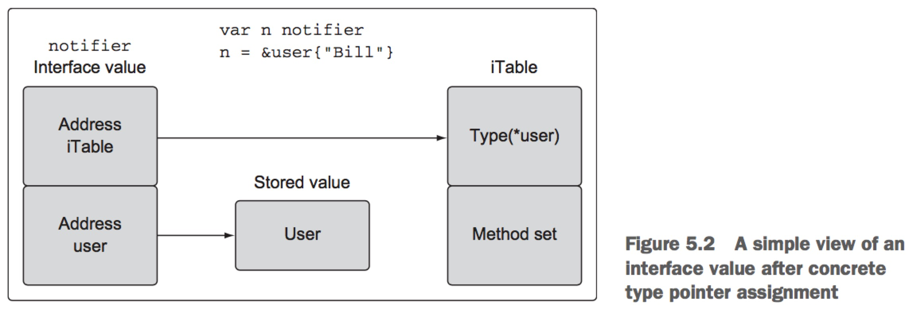

第五章 Go语言的类型系统
=========================

本章概要

- 声明新的用户自定类型
- 为类型添加行为
- 知道什么时间用指针什么时间用值
- 使用接口实现多态
- 通过组合扩展和改变类型
- 暴露和不暴露标识符

Go是一个静态类型的编程语言。那就意味着编译器总是想要知道程序中每个值的类型是什么。当编译器提前知道类型信息， 他能帮助程序确保安全的方式处理值。这样可以帮助减少潜在的内存损坏和bug, 并为编译器提供产生更有效代码的机会。

值的类型为编译器提供了两条信息: 
- 值的尺寸: 分配多少内存。
- 内存代表什么。

在很多内置类型的情况下，尺寸和代表什么都是类型名的一部分。 int64类型的值需要8字节内存(64位),代表的是整数值。 float32类型的值需要4字节内存(32位)， 代表的是IEEE-754二进制浮点数。bool类型值需要1字节内存(8位), 代表的是布尔值true或false。

有些类型代表什么是基于代码构建机器架构。例如， int类型的值，尺寸可能是8字节(64位), 也可能是4字节(32位), 具体依赖机器架构。还有些其他架构特定的类型，例如Go语言中的所有引用类型。 幸运的是，创建和处理这些值的时候你不需要知道这些信息。 但是编译器不知道这些信息的话，它就不能防止你做可能引起在程序内和在运行机器上有伤害的事情了。

## 5.1 用户定义类型

Go语言支持自定义类型声明。 当声明新类型时，声明构建为编译器提供尺寸信息和代表什么的信息， 类似于内置类型工作方式。 Go语言中有两种声明用户自定义类型的方法。最常用的一种方法是用关键词struct，用它创建组合类型。

结构体类型是由固定的独立字段组合起来声明的。结构体中的每个字段都是由已知类型声明，可以是内置类型或者用户自定义类型。

```
type user struct {
    name string
    email string
    ext int
    privileged bool
}
```
上面声明了一个结构体。 声明以type关键词开头，然后加上新类型的名字，最后关键词struct。这个结构体包含四个字段，每个字段都是基于内置类型的。 你可以看这些字段如何一起组合成数据结构体。 一旦声明了一个类型，就可以使用它创建值。

```
// Declare a type of user
var bill user
```
上面通过关键词var创建了一个名字为bill的user类型变量。 当声明变量的时候， 代表变量的值总是被初始化的。 值可以使用特定值来初始化， 或者使用它的零值来初始化， 也就是变量类型的默认值。 对于数字类型，零值是0；对于字符串来说零值是空字符串；对于布尔值来说零值就是false。上面的结构体中，零值需要应用到结构体中的每个字段。

任何时候变量被创建并初始化为它的零值，使用关键词var是惯用方式。保留使用关键词var是一种指示变量被设置为它的零值的方式。如果变量需要初始化为零值以外的其他值，使用短变量声明操作符带一个结构体字面量。

```
lisa := user{
    name: "Lisa",
    email: "lisa@email.com",
    ext: 123,
    privileged: true,
}
```
上面代码展示了如何声明user类型的变量，并使用非零值进行初始化的。变量名 := user{}. 使用短变量声明操作符(:=), 它提供两个目的，声明和初始化变量。 根据操作符右侧的类型信息，短变量声明操作符可以确定变量的类型。

既然我们创建并初始化了一个结构体类型，那么我们可以使用结构体字面量来执行初始化。结构体字面量使用大括号带上里边的初始化声明。

```
// 使用结构体字面量创建结构体类型
// 第一种形式: 字段和值
lisa := user{
    name: "Lisa",
    email: "lisa@email.com",
    ext: 123,
    privileged: true,
}
```
一个结构体类型的结构体字面量可以接受两种形式的东西。 上面展示了第一种形式的， 在单独的行里声明结构体中每个字段和值, 使用分号分割字段和值，然后在值后面使用逗号。字段的顺序无关紧要。 第二种形式是不使用字段名，只用值来声明。 如下所示:

```
// 第二种形式: 仅用值
lisa := user{"Lisa", "lisa@email.com", 123, true}
```

值也可以分多行列出， 但是传统值以上面这种形式都是放一行，结尾没有逗号。这种情况下， 值的顺序就非常重要了, 需要匹配结构体声明中的字段顺序。当声明结构体类型时， 不限制仅使用内置类型。 你同样可以声明一些使用其他自定义类型的字段。
```
type admin struct {
    person user
    level string
}
```

上面展示了一个新的名为admin的结构体类型。这个结构体类型有一个名字为person的字段，其类型为person, 另外还声明了一个字符串类型的level字段。当创建这样的一个变量时，初始化该类型时结构体字面量稍有变化。

```
// Declare a variable of type admin.
fred := admin{
    person: user{
        name: "Lisa",
        email: "lisa@email.com",
        ext: 123,
        privileged: true,
    },
    level: "super",
}
```
要初始化person字段，需要创建一个user类型的值。这就是上面我们的lisa变量的字面量。 使用结构体字面量形式，user类型的值被创建并赋值给person字段。


另外一种声明用户自定义类型的方式是使用现有类型，使用它作为新类型的类型规范。在需要新类型可以用现有类型表示的情况下，这种方式非常有用。 标准库使用这种类型声明从内置类型来创建高级别的功能。

```
type Duration int64
```
上面展示了标准库time包中声明Duration类型的代码。Duration代表的是持续的纳秒时间。这个类型代表的是内置类型int64。 Duration和int64是两个有区别和不同的类型。

为了更好的阐述这个意思，看看下面这个不能编译的小程序。
```
package main

type Duration int64

func main() {
    var dur Duration
    dur = int64(1000)
}

// prog.go:7: cannot use int64(1000) (type int64) as type Duration in assignment
```

编译器清楚的知道问题是什么。 int64类型的值不能用于类型Duration. 换句话说，即便类型int64是Duration的基础类型， Duration仍然属于它自己的唯一类型。不同类型的值不能互相赋值， 即便它们能兼容。编译器不能隐式转换不同类型的值。

## 5.2 方法
方法提供了一种为用户自定义类型添加行为的方式。方法实际上就是函数，在关键词func和函数名之间包含了一个额外参数。
```
// Sample program to show how to declare methods and how the Go
// compiler supports them.

package main

import "fmt"

// user defines a user in the program.
type user struct {
    name string
    email string
}

// notify implements a method with a value receiver.

func (u user) notify() {
    fmt.Printf("Sending User Email to %s<%s>\n", u.name, u.email)
}
// changeEmail implements a method with a pointer receiver.
func (u *user) changeEmail(email) {
    u.email = email
}

// main is the entry point for the application.
func main() {
    // Values of type user can be used to call methods
    // declared with a value receiver.
    bill := user{"Bill", "bill@email.com"}
    bill.notify()

    // Pointers of type user can also be used to call methods
    // declared with a value receiver.
    lisa := &user{"Lisa", "lisa@email.com"}
    lisa.notify()

    // Values of type user can be used to call methods
    // declared with a pointer receiver.
    bill.changeEmail("bill@newdomain.com")
    bill.notify()
 
    // Pointers of type user can be used to call methods
    // declared with a pointer receiver.
    lisa.changeEmail("lisa@comcast.com")
    lisa.notify()
}
```

上面展示了两个不同的方法。在关键词func和函数名之间的参数叫做接受者(receiver), 函数被绑定给这个特定的类型。 当函数有接受者时， 函数就被叫做方法。 当你运行上面的代码，会有下面的输出:

Sending User Email To Bill<bill@email.com>
Sending User Email To Lisa<lisa@email.com>
Sending User Email To Bill<bill@newdomain.com>
Sending User Email To Lisa<lisa@comcast.com>

让我们检查下程序做了些什么。程序声明了结构体user, 然后声明了一个名为notify的方法。

```
type user struct {
    name string
    email string
}

func (u user) notify() {
    // ...
}
```

在Go语言中有两种类型的接收者: 值接受者和指针接受者。notify方法以值接受者的方式声明的。

notify方法的接收者被声明为类型user的值。 当以值接受者声明方法时，这个方法是种能与用于调用该方法的值副本进行操作。

```
bill := user{"Bill", "bill@email.com"}
bill.notify()
```

上面使用user类型的值bill对方法notify进行调用。

这个语法看起来类似于调用包的函数。然而这个例子中，bill不是包名，而是一个变量名。 这种情况下我们调用notify方法， bill的值对于调用来说是接受者值， notify方法是对这个值的副本进行操作的。

你也可以使用指针来调用使用值接受者声明的方法。
```
lisa := &user{"Lisa", "lisa@email.com"}
lisa.notify()
```

上面我们使用user类型的指针lisa对方法notify()进行调用。为了支持方法调用，Go语言调整了指针以满足方法的接受者。你可以想象Go语言执行了下面的操作:
```
(*lisa).notify()
```
上面就展示了Go编译器所作的支持方法调用的等价。 指针值会被取消引用，以便方法调用和值接受者兼容。 再来一次，notify是操作副本的， 但是这次值的副本是lisa指针指向的。

同样可以使用指针接受者声明方法:
```
func (u *user) changeEmail(email string) {
    u.email = email
}
```

上面声明了changeEmail方法，使用的是指针接受者。这次，接受者不是user类型的值，而是指针。 当调用以指针接受者声明的方法时，用于调用方法的值是方法共享的。

```
lisa := &user{"Lisa", "lisa@email.com"}
lisa.changeEmail("lisa@newdomain.com")
```

上面你看到lisa指针的声明，后面跟着changeEmail的方法调用。一旦changeEmail方法调用返回，对lisa指向的值的改变在调用后会受影响。这多亏了指针接受者。 值接受者操作的是用于方法调用的值的副本。而指针接受者操作的是实际的数据。


同样可以使用值类型来调用使用指针接受者声明的方法。
```
bill := user{"Bill", "bill@email.com"}
bill.changeEmail("bill@newdomain.com")
```

上面你可以看到，bill变量的声明以及对changeEmail方法的调用， changeEmail方法以指针接受者的方式声明的。Go语言再次调整值来让它满足方法的接受者, 以支持方法调用。

```
(&bill).notify()
```
上面展示了Go编译器支持方法调用所作的事情本质。 该情况下，值是引用的，因此方法调用时和接受者类型兼容的。 这是Go语言提供的极大便利， 允许方法调用使用值和指针，而不用天生匹配方法的接受者类型。(Go编译器会帮你进行适当的转换。)

决定是否使用值或指针接受者有时候会感觉到困惑。 有一些来自标准库中的基本规则你可以直接遵循。

## 5.3 类型性质(Nature of types)
在声明新类型之后，在为该类型声明方法之前先回答这个问题。 是否在这个类型值上添加或删除东西来创建新的值或者改变现有的值? 如果答案是创建新值，方法使用值接受者。 如果答案是改变值， 那么使用指针接受者。这也适用于该类型值应该如何传给你程序的其他部分。保持一致非常重要。 这样做的目的不是为了关注方法使用值做了什么，而是关注值的本质是什么。


### 5.3.1 内建类型
内建类型是语言提供的类型集合。 我们知道它们是数字、字符串、布尔类型的集合。 这些类型具有原始性质。正因为如此，向一个值添加或删除一个值，就会创建新的值。 鉴于此，传递这些类型的值给函数和方法，应该传递这些值的副本。 下面我们看看标准库中的函数是如何处理这些内置类型值的。

```go golang.org/src/strings/strings.go
func Trim(s string, cutset string) string {
    if s == "" || cutset == "" {
        return s
    }
    return TrimFunc(s, makeCutsetFunc(cutset))
}
```

上面代码中是Trim函数的实现，来自标准库的strings包中。Trim函数传入要操作的字符串值和要查找的字符值。然后返回新的字符串，也就是操作的结果。函数操作调用者原始字符串的副本, 然后返回的新字符串的值。 字符串，就像整数、浮点数和布尔类型，都是基本的数据类型，传入传出函数或方法的时候都应该被拷贝。

下面我们看另外一个例子，内置类型如何被视为原始属性。

```
func isShellSpecialVar(c uint8) bool {
    switch c {
    case '*', '$', '@', '!', '#', '?', '0', '1', '2', '3', '4', '5', '6', '7', '8', '9':
        return true
    }
    return false
}
```

上面展示了env包中的isShellSpecialVar函数。这个函数传入一个uint8类型的值，返回一个bool类型的值。注意指针如何不能用于共享参数和返回值。调用者将传入的uint8值拷贝，接收到一个true或false的值。

### 5.3.2 引用类型
Go语言中的引用类型是分片、映射、通道以及函数类型。当声明这样类型的变量时，被创建的值被称为头值(header value). 技术上， 字符串也是一种引用类型值。所有不同的来自不同引用类型的头值都包含一个纸箱底层数据结构的指针。每个引用类型也包含唯一字段集合，用于管理底层数据结构。不能共享引用类型值，因为头值设计用来拷贝的。 头值包含一个指针，因此你可以传递任意引用类型值副本，本质上共享底层数据结构。

让我们看看来自net包的一个类型:
```go golang.org/src/net/ip.go
type IP []byte
```
上面展示了一个叫IP的类型，它被声明为字节分片。 当你需要为内置或引用类型声明行为时，声明这样的类型就非常有用了，因为编译器只允许为你声明的命名自定义类型声明方法。

```go golang.org/src/net/ip.go
func (ip IP) MarshalText() ([]byte, error) {
    if len(ip) == 0 {
        return []byte(""), nil
    }
    if len(ip) != IPv4len && len(ip) != IPv6len {
        return nil, errors.New("invalid IP address")
    }
    return []byte(ip.String()), nil
}
```

MarshalText方法是用类型IP的值接受者声明的。 值接受者完全是你所期望看到的，既然不需要共享引用类型值。这同样适用于传递引用类型值作为函数和方法的参数。

```
// ipEmptyString is like ip.String except that it returns
// an empty string when ip is unset.
func ipEmptyString(ip IP) string {
    if len(ip) == 0 {
        return ""
    }
    return ip.String()
}
```

ipEmptyString函数传入一个IP类型的值。 再一次，你可以看到调用者的对这个参数的引用类型不在函数间共享。 函数被传入调用者的引用类型值副本。 这对于返回值同样适用。 结尾处，引用类型值被视为类似基本数据值。

### 5.3.3 结构体
结构体类型可以代表既包含基本类型或非基本类型值的数据。 当我们决定创建那样的一个结构体类型，我们对哪些应加入或哪些应去掉的值表现易变， 应该遵循内置类型和引用类型的指导。 下面我们开始看看通过标准库实现的结构体, 有一个基本特性。

```go golang.org/src/time/time.go
type Time struct {
    // sec gives the number of seconds elapsed since
    // January 1, year 1 00:00:00 UTC.
    sec int64
    // nsec specifies a non-negative nanosecond
    // offset within the second named by Seconds.
    // It must be in the range [0, 999999999].
    nsec int32
    // loc specifies the Location that should be used to
    // determine the minute, hour, month, day, and year
    // that correspond to this Time.
    // Only the zero Time has a nil Location.
    // In that case it is interpreted to mean UTC.
    loc *Location
}
```

Time结构体来自time包。 当你考虑time的时候，你会意识到任何给定的时间点都是不能改变的。这正是标准库实现Time类型的方式。 下面我们看看创建时间类型值的Now函数。

```
func Now() Time {
    sec, nsec := now()
    return Time{sec + unixToInternal, nsec, Local}
}
```

上面展示了Now函数的实现。 这个函数创建了一个Time类型的值，并返回那个Time值的副本给调用者。 指针不用来共享这个函数创建的Time值。下一步，我们看一下Time类型声明的另一个方法。
```go golang.org/src/time/time.go
func (t Time) Add(d Duration) Time {
    t.sec += int64(d / 1e9)
        nsec := int32(t.nsec) + int32(d%1e9)
        if nsec >= 1e9 {
            t.sec++
            nsec -= 1e9
        } else if nsec < 0 {
            t.sec--
            nsec += 1e9 
        }
    t.nsec = nsec
    return t
}
```
上面代码很好的展示了标准库如何对待具有原始属性的Time类型的。方法Add使用一个值接收器声明，返回一个新的Time值。方法操作调用者的Time值的副本， 返回它局部的Time值给调用者。 调用者不管是使用返回的Time替换它们的Time值, 或者声明一个新变量来保存这个值都行。

在大多数情况中，结构体类型没有呈现出原始性质，而是非原始属性。在这些例子中，从值中添加或删除都会让值变化。在这种情况下，你想使用指针和程序的其他需要它的部分共享这个值. 让我们看看标准库实现的具有非原始性质的结构体类型。

```
// File represents an open file descriptor.
type File struct {
    *file
}

// file is the real representation of *File.
// The extra level of indirection ensures that no clients of os can overwrite this data, which could cause the finalizer to close the wrong file descriptor.
// 额外的间接层，取保操作系统的客户端不能覆盖这些数据，如果覆盖可能会导致定稿人(finalizer)关闭错误的文件描述符。
type file struct {
    fd int
    name string
    dirinfo *dirinfo // nil unless directory being read
    nepipe int32 // number of consecutive EPIPE in Write
}
```

上面你看到标准库中File类型的声明。这个类型的性质是非原始的。这个类型的值实际上是拷贝不安全的。不暴露类型的注释说的很清楚了。 既然没有办法防止程序拷贝， File类型的实现使用了嵌入的指向不希望暴露类型的指针。 本章后面会讨论嵌入类型，但是这个额外的间接层提供了复制的保护。 并不是所有结构体类型都需要或应该实现这种额外的保护。程序员应该关心每种类型的性质，并对应的使用它们。

下面我们看看Open函数的实现。
```
func Open(name string) (file *File ,err error) {
    return OpenFile(name, O_RDONLY, 0)
}
```
Open函数的实现展示了如何使用指针共享调用函数带的File类型值。Open创建一个File类型值，并返回指向那个值的指针。 当工厂函数返回指针， 就是很好的指示，返回值的属性是非原始的。即便函数或方法没有打算直接改变非原始值的状态， 它也应该被共享起来。

```
func (f *File) Chdir() error {
    if f == nil {
        return ErrInvalid
    }

    if e := syscall.Fchdir(f.fd); e != nil {
        return &PathError{"chdir", f.name, e}
    }

    return nil
}
```

Chdir方法展示了如何使用指针接受者来声明一个即便不对接受值进行改变的情况。既然File类型值具有非原始属性，它们应该总是共享的，并且不要复制的。

要使用值接受者还是指针接受者不应该基于方法是否需要改变接受者的值。 决定必须基于类型的属性。 这个指导原则的一个例外情况就是，当你需要值类型接受者操作接口时提供的灵活性。在这些情况中，你应该选择使用值接受者，即便类型的性质是非原始的。 完全基于接口值如何使用存储在它里边值来调用方法的机制。下一节，你将了解到接口值是什么，使用它们调用方法的背后机制。

## 5.4 接口
多态是通过实现某些类型来写带有不同行为的代码。一旦类型实现了某个接口，整个功能世界都被打开到那个类型的值。 标准库就是这样的很大例子。io包提供了难以置信的接口集合和函数集合， 使流数据很容易应用到我们自己的代码中。只要实现两个接口，我们就能充分利用io包背后的所有工程。

但是声明和实现用于我们程序的接口有很多细节。即便实现现有接口也需要理解接口是如何工作的。在我们深入接口如何工作和如何实现之前，我们快速看一个标准库中使用接口的例子。

### 5.4.1 标准库
让我们开始看一个简单程序，它实现了流行程序curl的一个版本。

```
// Sample program to show how to write a simple version of curl using the io.Reader and io.Writer interface support.
package main

import (
    "fmt"
    "io"
    "net/http"
    "os"
)

// init is called before main
func init() {
    if len(os.Args) != 2 {
        fmt.Println("Usage: ./example2 <url>")
        os.Exit(-1)
    }
}

// main is the entry point for the application.
func main() {
    // Get a response from the web server.
    r, err := http.Get(os.Args[1])
    if err != nil {
        fmt.Println(err)
        return
    }

    // Copies from the Body to Stdout.
    io.Copy(os.Stdout, r.Body)
    if err := r.Body.Close(); err != nil {
        fmt.Println(err)
    }
}
```

上面代码展示了接口的强大以及它们在标准库中的使用。简单几行代码，我们就拥有了一个curl程序，利用两个函数来处理接口数据。 首先我们调用http.Get()方法，在它成功和服务器通信后返回类型为http.Request类型的指针。http.Request类型包含了一个名为Body的字段， 那就是io.ReadCloser类型的接口值。 

然后将Body字段传入io.Copy函数作为它第二个参数。 io.Copy函数接受接口类型io.Reader值作为它第二个参数，并且这个值代表的源流的源。 幸运的是Body字段实现了io.Reader接口，因此可以传入Body到io.Copy并使用web服务器作为我们的源。

io.Copy的第一个参数代表的是目标，丙戌是实现了io.Writer接口的值。 对于我们的目标，我们传入了一个来自os包中的特殊的接口值os.Stdout。这个接口值代表标准输出设备，已经实现了io.Writer接口。 当我们传递Body和Stdout值到io.Copy函数后，从web服务器过来的函数流数据就被以小块的形式复制到终端窗口。一旦最后一个块被读取和写入，io.Copy函数就返回了。

io.Copy函数可以执行很多不同类型的存在标准库中的工作流

```
// Sample program to show how a bytes.Buffer can also be used with the io.Copy function.
package main

import (
    "bytes"
    "fmt"
    "io"
    "os"
)

// main is the entry point for the application.
func main() {
    var b bytes.Buffer

    // Write a string to the buffer.
    b.Write([]byte("Hello"))

    // Use Fprintf to concatenate a string to the Buffer.
    fmt.Fprintf(&b, "World!")

    // Write the content of the Buffer to stdout.
    io.Copy(os.Stdout, &b)
}
```

Listing 5.35 shows a program that uses interfaces to concatenate and then stream data to standard out. On line 14, a variable of type Buffer from the bytes package is created, and then the Write method is used on line 17 to add the string Hello to the buffer. On line 20, the Fprintf function from the fmt package is called to append a second string to the buffer.
The fmt.Fprintf function accepts an interface value of type io.Writer as its first parameter. Since pointers of type bytes.Buffer implement the io.Writer interface, it can be passed in and the fmt.Fprintf function performs the concatenation. Finally, on line 23 the io.Copy function is used once again to write characters to the terminal window. Since pointers of type bytes.Buffer also implement the io.Reader interface, the io.Copy function can be used to display the contents of the buffer to the terminal window.

These two small examples hopefully show you some of the benefits of interfaces and how they’re used in the standard library. Next, let’s explore in greater detail how interfaces are implemented.


### 5.4.2 实现
接口是只声明行为的类型。 这个行为不会被接口类型直接实现，而是由用户自定义类型通过方法来实现。 当用户自定义类型实现了某个接口类型的方法集， 用户自定义类型可以赋值给接口类型的值。这个赋值保存用户自定义类型值到接口值中。

如果某个接口的方法被调用, 存储用户自定义值的等价方法就被执行了。 既然任何用户自定义类型可以实现任何接口，接口的方法调用自然是多态的。这种关系的用户自定义类型通常称为具体类型， 既然接口值没有具体行为，没有存储用户自定义值的实现。

对于使用用户自定义类型值还是指针来满足接口实现是由一些规则的。不是所有的值都是等价创建的。 这些规则来自叫做方法集的规范。在开始研究方法集详情之前，理解接口类型看起来像什么，以及用户自定义类型值如何存储到它们里边的将会有帮助。

在5.1图中你会看到接口值变量在赋值了用户类型值后看起来的样子。接口值是两个词的数据结构。 第一个词包含了指向叫做iTable的内部表的指针， 它包含了关于存储值的类型信息。 iTable包含已经存储的值的类型以及和值相关的方法列表。第二个词是指向存储值的指针。类型信息结合指针绑定了两个值之间的关系。


图5.2展示了当一个指针被赋值给接口值时发生了什么。 在这个情况中，类型信息会反映赋予类型的指针已经存储，地址被赋予被存储在接口值的第二个词中。


### 5.4.3 方法集
方法集定义接口遵从的规则。看看下面的代码，有助于你理解方法集如何在接口中起到重要作用。
```
// Sample program to show how to use an interface in Go.
package main

import "fmt"

// notifier is an interface that define notification type behavior.
type notifier interface {
    notify()
}

// user defines a user in the program.
type user struct {
    name string
    email string
}

// notify implements a method with a pointer receiver.
func (u *user) notify() {
    fmt.Printf("Sending user email to %s<%s>\n", u.name, u.email)
}

// main is the entry point for the application.
func main() {
    // create a value of type user and send a notification.
    u := user{"Bill", "bill@email.com"}

    // cannot use u (type user) as type notifier in argument to sendNotification:
    // user does not implement notifier (notifier method has pointer receiver)
    sendNotification(u)
}

// sendNotification accepts values that implement the notifier interface and sends notifications.
func sendNotification(n notifier) {
    n.notify()
}
```
上面代码你希望能编译，但是编译不了。 我们声明了一个名为notifier的接口，带有一个单独的方法notify。 然后我们声明了我们自己的具体类型user并实现了notifier接口。方法使用指针接受者来声明的。

sendNotification()方法接受一个单独的notifier类型的值作为参数。然后接口值根据存储的值来调用notify()方法。任何实现notifier接口的值都能传入sendNotification函数。下面我们看看main函数。

main函数中，我们创建了具体类型user的值u. 然后将u传入sendNotification函数。 但是调用sendNotification函数却编译报错。

那么为什么我们给user类型实现了notify()方法却还是接到编译报错呢？我们再看看代码:
```
type notifier interface {
    notify()
}

func (u *user) notify() {
    // ...
}
```
上面代码展示的是接口如何实现的， 但是编译器仍然告诉我们user类型值没有实现接口。 如果我们仔细看看编译报错信息，我们会看到: notify method has pointer receiver。

要理解为什么user类型的值在接口通过指针接受者实现的时候没有实现接口,你需要理解方法集是什么。 方法集定义与给定类型值或指针相联系的方法集。接受者类型用于确定方法是否和值或指针关联。

我们开始解释Go规范中记录的方法集规则。

```html
Values                     Methods Receivers
--------------------------------------------------
T                          (t T)
*T                         (t T) and (t *T)
```

上面展示了规范中对方法集的描述。 它说类型T的值类型只能将以值接受者声明的方法作为它方法集的一部分。 但是类型T的指针类型能将以值接受者或指针接受者声明的方法作为它的方法集的一部分。 从值的角度来看这些规范会感觉困惑。 下面我们从接受者的角度来看这些规则。

```html
Methods Receivers                  Values
---------------------------------------------------
(t T)                              T and *T
(t *T)                             *T
```
上面展示的规则一样，但是是从接受者的视角来看的。 它就是说如果你使用指针接受者实现接口，那么只有那个类型的指针实现了接口。 如果使用值接受者实现接口，那么那个类型的值和指针都实现了这个接口。 如果你回过头看看上面的代码，那么你就能理解为什么编译器报错了。


因为我们使用的是指针接受者实现的接口，然后尝试传入类型user的值给sendNotification函数, 因此编译报错。但是如果我们使用user类型值的地址传入sendNotification函数，那么就不会报错了。

```
func main() {
    u := user{"Bill", "bill@mail.com"}

    sendNotification(&u)
    // PASSED THE ADDRESS AND NO MORE ERROR
}
```

上面程序编译通过，并且能正常运行。只有user类型的指针才能被传入sendNotification函数， 既然实现接口的时候使用的是指针接受者。

那么现在的问题是为什么要做这样的限制呢? 答案是我们不是总能获取值的地址这个事实。

```
// Sample program to show how you can't always get the address of a value.
pacakge main
import "fmt"

// duration is a type with a base type of int.
type duration int

// format pretty-prints the duration value.
func (d *durantion) pretty() string {
    return fmt.Sprintf("Duration: %d", *d)
}

func main() {
    duration(42).pretty()

    // cannot call pointer method on duration(42)
    // cannot take the address of durantion(42)
}
```

上面代码尝试获取duration类型值的地址，但是却不能获取。 这就展示了我们不是总能获取到值的地址。 下面我们再看看方法集的规则:

```html
Values                     Methods Receivers
--------------------------------------------------
T                          (t T)
*T                         (t T) and (t *T)

Methods Receivers                  Values
---------------------------------------------------
(t T)                              T and *T
(t *T)                             *T
```
因为不是总能获取到值的地址， 对于值的方法集只包含了使用值接受者实现的方法。

** 我们并不是总能获取到值的地址， 因此对于值的方法集只包含使用类型值作为接受者实现的方法。**

### 5.4.4 多态
现在你理解了接口和方法集背后的机制，下面我们看最后一个例子，展示的是接口行为的多态。

```go
// Sample program to show how polymorphic behavior with interfaces.
package main

import (
    "fmt"
)

type notifier interface {
    notify()
}

type user struct {
    name string
    email string
}

func (u * user) notify() {
    fmt.Printf("Sending user email to %s<%s>\n", 
               u.name,
               u.email)
}

type admin struct {
    name string
    email string
}

func (a * admin) notify() {
    fmt.Printf("Sending user email to %s<%s>\n", 
               a.name,
               a.email)
}

func main() {
    bill := user{"Bill", "bill@email.com"}
    sendNotification(&bill)

    lisa := admin{"Lisa", "lisa@email.com"}
    sendNotification(&lisa)
}

func sendNotification(n notifier) {
    n.notify()
}
```

上面代码展示了接口如何提供多态行为。 我们声明了两种类型user, admin， 它们都使用指针接受者实现了接口notifier。两个具体的类型实现了同样的接口notifier。

而sendNotification函数接受实现了notifier接口的值。既然user和admin两个具体的类型值都实现了notifier接口，那么这个函数对于它们两个类型来说都能被传入， 因此提供了多态行为。

## 5.5 类型嵌套

Go语言允许你扩展现有类型和改变它们的行为。 这个能力对于代码复用和改变现有类型行为来适应新的需求都非常重要。这个是通过类型嵌入来完成的。 通过拿一个现有类型，在新声明的结构体类型中声明它们来做到的。 被嵌入的类型被称为新外部类型的内部类型。

通过内部类型的提升，内部类型被提升到外部类型。这些提升标识符编程外部类型的一部分， 就像它们被类型自身明确声明的一样。外部类型然后组装所有内部类型包含的东西，能添加新的字段和方法。外部类型可以和内部类型声明同样的标识符，有必要时可以覆盖任意字段或方法。这就是现有类型既可以被扩展也可以被改变的方式。 

下面让我们使用一个简单的程序展示类型嵌入的基本知识:
```
// Sample program to show how to embed a type into another type and the relationship between the inner and outer type.
package main

import "fmt"

// user defines a user in the program
type user struct {
    name string
    email string
}

func (u * user) notify() {
    // ...
}

type admin struct {
    user // Embedded Type
    level string
}

func main() {
    ad := admin{
        user: user{
            name: "john smith",
            email: "john@yahoo.com",
        },
        level: "super",
    }

    // 我们可以直接访问内部类型的方法。
    ad.user.notify()

    // 内部类型的方法被提升了，我们可以直接通过外部类型来调用它。
    ad.notify()
}
```
要实现嵌入类型，只需要将类型名嵌入新的类型中就可以了。 注意类型嵌入和字段声明之间的区别。

一旦我们给admin嵌入了user类型，我们就可以说user类型是admin的一个内部类型。内部类型和外部类型的概念让我们很方便的理解两者之间的关系。

上面我们为user类型实现了接收指针接受者的方法notify()。

内部类型的特殊之处在于它总是存在于自身之中。这意味着内部类型永远不会丢失它的标识，并且总是可以直接访问。
## 5.6 暴露标识符和不暴露标识符

## 5.7 总结
- 用户定义类型可以通过关键词struct或指定现有类型来声明。
- 方法提供了一种为用户定义类型添加行为的方式。
- 类型属于两者之一: 原始类型和非原始类型。
- 接口是声明行为和提供多态的类型。
- 类型嵌入提供了扩展类型而无需继承的能力。
- 标识符要么从包中暴露，要么不暴露。
- 类型嵌套: type embedding

## 中英文对照
- 多态: polymorphism
- 类型性质: the nature of types
- 本质上: intrinsically

## 链接

- [上一章节](4.1.md)
- [目录](../README.md)
- [下一章节](6.1.md)
