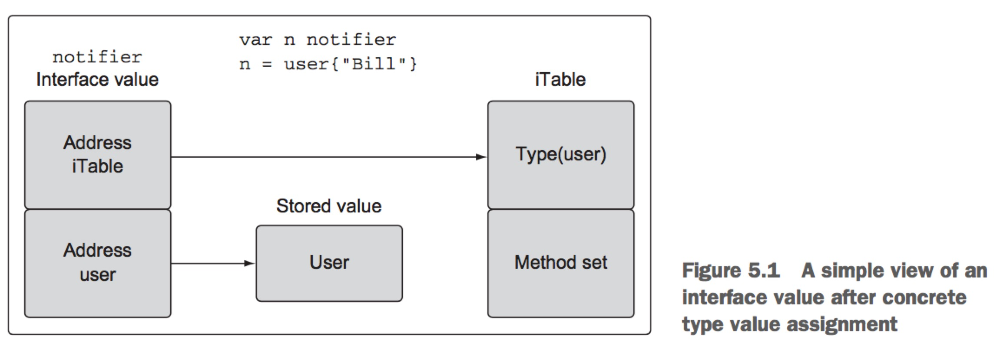
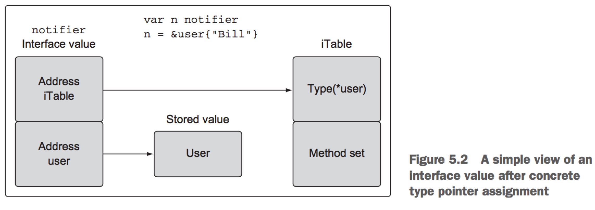

第五章 Go语言的类型系统
=========================

## 5.4 接口
多态是通过实现某些类型来写带有不同行为的代码。一旦类型实现了某个接口，整个功能世界都被打开到那个类型的值。 标准库就是这样的很大例子。io包提供了难以置信的接口集合和函数集合， 使流数据很容易应用到我们自己的代码中。只要实现两个接口，我们就能充分利用io包背后的所有工程。

但是声明和实现用于我们程序的接口有很多细节。即便实现现有接口也需要理解接口是如何工作的。在我们深入接口如何工作和如何实现之前，我们快速看一个标准库中使用接口的例子。

### 5.4.1 标准库
让我们开始看一个简单程序，它实现了流行程序curl的一个版本。

```go
// Sample program to show how to write a simple version of curl using the io.Reader and io.Writer interface support.
package main

import (
    "fmt"
    "io"
    "net/http"
    "os"
)

// init is called before main
func init() {
    if len(os.Args) != 2 {
        fmt.Println("Usage: ./example2 <url>")
        os.Exit(-1)
    }
}

// main is the entry point for the application.
func main() {
    // Get a response from the web server.
    r, err := http.Get(os.Args[1])
    if err != nil {
        fmt.Println(err)
        return
    }

    // Copies from the Body to Stdout.
    io.Copy(os.Stdout, r.Body)
    if err := r.Body.Close(); err != nil {
        fmt.Println(err)
    }
}
```

上面代码展示了接口的强大以及它们在标准库中的使用。简单几行代码，我们就拥有了一个curl程序，利用两个函数来处理接口数据。 首先我们调用http.Get()方法，在它成功和服务器通信后返回类型为http.Request类型的指针。http.Request类型包含了一个名为Body的字段， 那就是io.ReadCloser类型的接口值。 

然后将Body字段传入io.Copy函数作为它第二个参数。 io.Copy函数接受接口类型io.Reader值作为它第二个参数，并且这个值代表的源流的源。 幸运的是Body字段实现了io.Reader接口，因此可以传入Body到io.Copy并使用web服务器作为我们的源。

io.Copy的第一个参数代表的是目标，丙戌是实现了io.Writer接口的值。 对于我们的目标，我们传入了一个来自os包中的特殊的接口值os.Stdout。这个接口值代表标准输出设备，已经实现了io.Writer接口。 当我们传递Body和Stdout值到io.Copy函数后，从web服务器过来的函数流数据就被以小块的形式复制到终端窗口。一旦最后一个块被读取和写入，io.Copy函数就返回了。

io.Copy函数可以执行很多不同类型的存在标准库中的工作流

```go
// Sample program to show how a bytes.Buffer can also be used with the io.Copy function.
package main

import (
    "bytes"
    "fmt"
    "io"
    "os"
)

// main is the entry point for the application.
func main() {
    var b bytes.Buffer

    // Write a string to the buffer.
    b.Write([]byte("Hello"))

    // Use Fprintf to concatenate a string to the Buffer.
    fmt.Fprintf(&b, "World!")

    // Write the content of the Buffer to stdout.
    io.Copy(os.Stdout, &b)
}
```

Listing 5.35 shows a program that uses interfaces to concatenate and then stream data to standard out. On line 14, a variable of type Buffer from the bytes package is created, and then the Write method is used on line 17 to add the string Hello to the buffer. On line 20, the Fprintf function from the fmt package is called to append a second string to the buffer.
The fmt.Fprintf function accepts an interface value of type io.Writer as its first parameter. Since pointers of type bytes.Buffer implement the io.Writer interface, it can be passed in and the fmt.Fprintf function performs the concatenation. Finally, on line 23 the io.Copy function is used once again to write characters to the terminal window. Since pointers of type bytes.Buffer also implement the io.Reader interface, the io.Copy function can be used to display the contents of the buffer to the terminal window.

These two small examples hopefully show you some of the benefits of interfaces and how they’re used in the standard library. Next, let’s explore in greater detail how interfaces are implemented.


### 5.4.2 实现
接口是只声明行为的类型。 这个行为不会被接口类型直接实现，而是由用户自定义类型通过方法来实现。 当用户自定义类型实现了某个接口类型的方法集， 用户自定义类型可以赋值给接口类型的值。这个赋值保存用户自定义类型值到接口值中。

如果某个接口的方法被调用, 存储用户自定义值的等价方法就被执行了。 既然任何用户自定义类型可以实现任何接口，接口的方法调用自然是多态的。这种关系的用户自定义类型通常称为具体类型， 既然接口值没有具体行为，没有存储用户自定义值的实现。

对于使用用户自定义类型值还是指针来满足接口实现是由一些规则的。不是所有的值都是等价创建的。 这些规则来自叫做方法集的规范。在开始研究方法集详情之前，理解接口类型看起来像什么，以及用户自定义类型值如何存储到它们里边的将会有帮助。

在5.1图中你会看到接口值变量在赋值了用户类型值后看起来的样子。接口值是两个词的数据结构。 第一个词包含了指向叫做iTable的内部表的指针， 它包含了关于存储值的类型信息。 iTable包含已经存储的值的类型以及和值相关的方法列表。第二个词是指向存储值的指针。类型信息结合指针绑定了两个值之间的关系。



图5.2展示了当一个指针被赋值给接口值时发生了什么。 在这个情况中，类型信息会反映赋予类型的指针已经存储，地址被赋予被存储在接口值的第二个词中。


### 5.4.3 方法集
方法集定义接口遵从的规则。看看下面的代码，有助于你理解方法集如何在接口中起到重要作用。
```go
// Sample program to show how to use an interface in Go.
package main

import "fmt"

// notifier is an interface that define notification type behavior.
type notifier interface {
    notify()
}

// user defines a user in the program.
type user struct {
    name string
    email string
}

// notify implements a method with a pointer receiver.
func (u *user) notify() {
    fmt.Printf("Sending user email to %s<%s>\n", u.name, u.email)
}

// main is the entry point for the application.
func main() {
    // create a value of type user and send a notification.
    u := user{"Bill", "bill@email.com"}

    // cannot use u (type user) as type notifier in argument to sendNotification:
    // user does not implement notifier (notifier method has pointer receiver)
    sendNotification(u)
}

// sendNotification accepts values that implement the notifier interface and sends notifications.
func sendNotification(n notifier) {
    n.notify()
}
```
上面代码你希望能编译，但是编译不了。 我们声明了一个名为notifier的接口，带有一个单独的方法notify。 然后我们声明了我们自己的具体类型user并实现了notifier接口。方法使用指针接受者来声明的。

sendNotification()方法接受一个单独的notifier类型的值作为参数。然后接口值根据存储的值来调用notify()方法。任何实现notifier接口的值都能传入sendNotification函数。下面我们看看main函数。

main函数中，我们创建了具体类型user的值u. 然后将u传入sendNotification函数。 但是调用sendNotification函数却编译报错。

那么为什么我们给user类型实现了notify()方法却还是接到编译报错呢？我们再看看代码:
```go
type notifier interface {
    notify()
}

func (u *user) notify() {
    // ...
}
```
上面代码展示的是接口如何实现的， 但是编译器仍然告诉我们user类型值没有实现接口。 如果我们仔细看看编译报错信息，我们会看到: notify method has pointer receiver。

要理解为什么user类型的值在接口通过指针接受者实现的时候没有实现接口,你需要理解方法集是什么。 方法集定义与给定类型值或指针相联系的方法集。接受者类型用于确定方法是否和值或指针关联。

我们开始解释Go规范中记录的方法集规则。

```html
Values                     Methods Receivers
--------------------------------------------------
T                          (t T)
*T                         (t T) and (t *T)
```

上面展示了规范中对方法集的描述。 它说类型T的值类型只能将以值接受者声明的方法作为它方法集的一部分。 但是类型T的指针类型能将以值接受者或指针接受者声明的方法作为它的方法集的一部分。 从值的角度来看这些规范会感觉困惑。 下面我们从接受者的角度来看这些规则。

```html
Methods Receivers                  Values
---------------------------------------------------
(t T)                              T and *T
(t *T)                             *T
```
上面展示的规则一样，但是是从接受者的视角来看的。 它就是说如果你使用指针接受者实现接口，那么只有那个类型的指针实现了接口。 如果使用值接受者实现接口，那么那个类型的值和指针都实现了这个接口。 如果你回过头看看上面的代码，那么你就能理解为什么编译器报错了。


因为我们使用的是指针接受者实现的接口，然后尝试传入类型user的值给sendNotification函数, 因此编译报错。但是如果我们使用user类型值的地址传入sendNotification函数，那么就不会报错了。

```go
func main() {
    u := user{"Bill", "bill@mail.com"}

    sendNotification(&u)
    // PASSED THE ADDRESS AND NO MORE ERROR
}
```

上面程序编译通过，并且能正常运行。只有user类型的指针才能被传入sendNotification函数， 既然实现接口的时候使用的是指针接受者。

那么现在的问题是为什么要做这样的限制呢? 答案是我们不是总能获取值的地址这个事实。

```go
// Sample program to show how you can't always get the address of a value.
pacakge main
import "fmt"

// duration is a type with a base type of int.
type duration int

// format pretty-prints the duration value.
func (d *durantion) pretty() string {
    return fmt.Sprintf("Duration: %d", *d)
}

func main() {
    duration(42).pretty()

    // cannot call pointer method on duration(42)
    // cannot take the address of durantion(42)
}
```

上面代码尝试获取duration类型值的地址，但是却不能获取。 这就展示了我们不是总能获取到值的地址。 下面我们再看看方法集的规则:

```html
Values                     Methods Receivers
--------------------------------------------------
T                          (t T)
*T                         (t T) and (t *T)

Methods Receivers                  Values
---------------------------------------------------
(t T)                              T and *T
(t *T)                             *T
```
因为不是总能获取到值的地址， 对于值的方法集只包含了使用值接受者实现的方法。

** 我们并不是总能获取到值的地址， 因此对于值的方法集只包含使用类型值作为接受者实现的方法。**

### 5.4.4 多态
现在你理解了接口和方法集背后的机制，下面我们看最后一个例子，展示的是接口行为的多态。

```go
// Sample program to show how polymorphic behavior with interfaces.
package main

import (
    "fmt"
)

type notifier interface {
    notify()
}

type user struct {
    name string
    email string
}

func (u * user) notify() {
    fmt.Printf("Sending user email to %s<%s>\n", 
               u.name,
               u.email)
}

type admin struct {
    name string
    email string
}

func (a * admin) notify() {
    fmt.Printf("Sending user email to %s<%s>\n", 
               a.name,
               a.email)
}

func main() {
    bill := user{"Bill", "bill@email.com"}
    sendNotification(&bill)

    lisa := admin{"Lisa", "lisa@email.com"}
    sendNotification(&lisa)
}

func sendNotification(n notifier) {
    n.notify()
}
```

上面代码展示了接口如何提供多态行为。 我们声明了两种类型user, admin， 它们都使用指针接受者实现了接口notifier。两个具体的类型实现了同样的接口notifier。

而sendNotification函数接受实现了notifier接口的值。既然user和admin两个具体的类型值都实现了notifier接口，那么这个函数对于它们两个类型来说都能被传入， 因此提供了多态行为。

## 5.5 类型嵌套

Go语言允许你扩展现有类型和改变它们的行为。 这个能力对于代码复用和改变现有类型行为来适应新的需求都非常重要。这个是通过类型嵌入来完成的。 通过拿一个现有类型，在新声明的结构体类型中声明它们来做到的。 被嵌入的类型被称为新外部类型的内部类型。

通过内部类型的提升，内部类型被提升到外部类型。这些提升标识符编程外部类型的一部分， 就像它们被类型自身明确声明的一样。外部类型然后组装所有内部类型包含的东西，能添加新的字段和方法。外部类型可以和内部类型声明同样的标识符，有必要时可以覆盖任意字段或方法。这就是现有类型既可以被扩展也可以被改变的方式。 

下面让我们使用一个简单的程序展示类型嵌入的基本知识:
```go
// Sample program to show how to embed a type into another type and the relationship between the inner and outer type.
package main

import "fmt"

// user defines a user in the program
type user struct {
    name string
    email string
}

func (u * user) notify() {
    // ...
}

type admin struct {
    user // Embedded Type
    level string
}

func main() {
    ad := admin{
        user: user{
            name: "john smith",
            email: "john@yahoo.com",
        },
        level: "super",
    }

    // 我们可以直接访问内部类型的方法。
    ad.user.notify()

    // 内部类型的方法被提升了，我们可以直接通过外部类型来调用它。
    ad.notify()
}
```
要实现嵌入类型，只需要将类型名嵌入新的类型中就可以了。 注意类型嵌入和字段声明之间的区别。

一旦我们给admin嵌入了user类型，我们就可以说user类型是admin的一个内部类型。内部类型和外部类型的概念让我们很方便的理解两者之间的关系。

上面我们为user类型实现了接收指针接受者的方法notify()。

内部类型的特殊之处在于它总是存在其中和自身的存在。这意味着内部类型永远不会丢失它的标识符，并且总是可以直接访问。

```go
ad.user.notify()
```

上面的notify方法调用时通过admin外部变量ad的user内部类型user直接访问。 这展示了内部类型如何存在其中并自身存在的，总是可访问的。 但是辛亏内部类型的提升，notify方法也可以直接从外部变量ad直接可用。

```go
ad.notify()
```

上面就是从外部类型变量直接访问notify()的。 既然内部类型的标识符被提升到外部类型，那么我们可以通过外部类型的值来访问内部类型的标识符。下面我们将代码稍作修改，添加一个接口。

```go
package main

import (
    "fmt"
)

// notifier is an interface that defined notification type behavior.
type notifier interface {
    notify()
}

type user struct {
    name string
    email string
}

// notify implements a method that can be called via a type of user.
func (u *user) notify() {
    fmt.Printf("Sending user email to %s<%s>\n",
               u.name,
               u.email)
}

type admin struct {
    user
    level string
}

func main() {
    ad := admin{
        user: user{
            name: "john smith",
            email: "john@email.com",
        },
        level: "super",
    }

    sendNotification(&ad)
}

// sendNotification accepts values that implement the notifier interface and sends notifications.
func sendNotification(n notifier) {
    n.notify()
}
```

上面代码做了一些细微的修改，实现功能基本类似。

1. 声明一个notifier接口。
2. 让user实现notifier, 使用指针类型接受者。
3. 添加sendNotification(), 接收一个notifier接口类型的值。
4. 我们直接将admin的地址传入sendNotification函数。

下面我们详细看main函数的代码，这是有趣的事情的开始。我们给sendNotification()函数传入的是外部类型变量的地址。 编译器接受外部类型指针作为指针赋值给notifier接口实现。但是你看整个样本程序，我们没有看到对admin类型实现这个接口。

幸亏内部类型的提升，内部类型对接口的实现被提升到外部类型。 也就是意味着外部类型现在实现了接口， 辛亏内部类型的实现。 当我们运行这个程序，我们会得到下面的输出。

Output:
Sending user email to john smith<john@yahoo.com>

你会发现，我们调用了这段代码:
```go
func (u *user) notify() {
    fmt.Printf("Send email to %s<%s>\n",
        u.name,
        u.email)
}
```

实际上就是内部类型的接口实现被调用了。

那么如果外部类型不希望使用内部类型实现，而需要它自己的实现会怎样呢? 让我们看另外一个样本程序解决这个问题。

```go
package main

import (
    "fmt"
)

// notifier is an interface that defined notification type behavior.
type notifier interface {
    notify()
}

type user struct {
    name string
    email string
}

// notify implements a method that can be called via a type of user.
func (u *user) notify() {
    fmt.Printf("Sending user email to %s<%s>\n",
               u.name,
               u.email)
}

type admin struct {
    user
    level string
}

// 对外部类型admin实现自己的notifier接口
func (m *admin) notify() {
    fmt.Printf("Sending admin email to %s<%s>\n",
            m.name,
            m.email)
}
func main() {
    ad := admin{
        user: user{
            name: "john smith",
            email: "john@email.com",
        },
        level: "super",
    }

    sendNotification(&ad)

    ad.user.notify()
    ad.notify()
}

// sendNotification accepts values that implement the notifier interface and sends notifications.
func sendNotification(n notifier) {
    n.notify()
}
```

上面代码添加了对admin类型的notifier接口实现:
```go
func (m *admin) notify() {
    fmt.Printf("Sending admin email to %s<%s>\n",
            m.name,
            m.email)
}
```

然后在main函数里边加入了两行代码:
```
sendNotification(&ad)
ad.user.notify()
ad.notify()
```

那么程序运行后输出如下内容:

Sending admin email To john smith<john@yahoo.com>
Sending user email to john smith<john@yahoo.com>
Sending admin email to john smith<john@yahoo.com>

sendNotification输出第一行内容。 ad.user.notify()输出第二行。 ad.notify()输出第三行内容。 sendNotification(&ad)和ad.notify()输出相同，它们实际都调用的admin类型自己的notifier接口实现。而第二行是内部类型user对notifier接口的实现。 因此可以看到外部类型如果自己实现了同一个接口，那么内部类型对接口的实现就不会被提升，但是内部类型的标识符依然存在，内部类型的方法依然可以访问。

## 5.6 暴露标识符和不暴露标识符
有能力对你声明的标识符应用可见性对于良好API设计至关重要。Go语言支持标识符的暴露出包和不暴露出包来提供这样的功能。在第三章，我们讨论了包以及如何从一个包到另外包import标识符。 有时候，你可能希望类似类型、函数或方法这样的标识符作为包公开API的一部分。 这些情况下，需要声明这些标识符以便让它们能在包外可用。你也需要声明它们不被暴露。

```go counters/counters.go
package counters

// alertCounter is an unexported type that contains an integer counter for alerts.
type alertCounter int
```

上面是代码counters/counters.go, 下面是入口文件:
```
package main

import (
    "fmt"
    "path/to/counters"
)

func main() {
    counter := counters.alertCounter(10)
    // cannot refer to unexported name counters.alertCounter
    // undefined: counters.alertCounter
    fmt.Printf("Counter: %d\n", counter)
}
```


我们在counters/counters.go语言中声明了一个alertCounter类型，以小写字母开头， 是不暴露标识符，因此在外部包引入该包后，不能访问该标识符。因此编译报错。

> 标识符以小写字符开头时，这些标识符载外部包不暴露或不可见。 而当标识符以大写字符开头，那么外部包可见。

下面我们对上面代码稍作修改:

```go counters/counters.go
package counters

type alertCounter int

func New(value int) {
    return alertCounter(value)
}
```

```go main.go
package main

import (
    "fmt"
    "path/to/counters"
)

func main() {
    counter := counters.New(10)
    fmt.Printf("Counter: %d\n", counter)
}
```

上面代码做了几处修改，程序可以编译并正常运行了。

1. 保持counters包中的变量alertCounter声明和变量名不变， 依然以小写开头。
2. counters.go中添加了一个New函数，它接收一个整数值，返回类型alertCount的值。
3. 在main.go的main函数中调用counters.New(10)

main函数依然不能访问alertCounter类型，但是counters.New()却能返回一个alertCounter类型的值。 也就是说函数New()创建了一个不暴露类型。

这样能成为可能原因有两个。 首先，标识符而非值是暴露的或不暴露的。 第二，短变量声明操作符有能力引用和创建不暴露类型的变量。 你可以根本不用明确创建不暴露类型的变量, 但是短变量声明操作符可以。

下面我们看一个新的样本程序，展示了结构体类型如何被这些可见性规则影响。

```go entities/entities.go
package entities

type User struct {
    Name string
    email string
}
```

```
package main

import (
    "fmt"
    "path/to/entities"
)

func main() {
    u := entities.User{
        Name: "Bill",
        email: "bill@email.com",
    }
    // error: unknown entities.User field 'email' in struct literal.
    fmt.Printf("User: %v\n", u)
}
```
仔细阅读上面代码，我们会看到:
1. entities包的entities.go里边声明了一个User类型，注意它的字段包含Name和email。 一个大写字母开头的，一个小写字母开头的。
2. main.go中声明并初始化了一个entities.User类型，但是初始化email字段时编译报错，找不到结构体字面量email。

因此结构体类型，以小写开头的字段是不暴露标识符，以大写字母开头的为暴露标识符。这点和前面的规则保持一致。


下面我们再看最后一个例子，展示类型嵌入如何暴露和不暴露标识符的。

```go
package entities

// user类型是不暴露的
type user struct {
    Name string   // 两个属性是暴露的
    Email string  // 两个属性是暴露的
}

type Admin struct {
    user     // 嵌入类型是不暴露的
    Rights int
}
```
我们声明好entities包里边的类型，下面我们看看如何使用它们：

```
pacakge main

import (
    "fmt"
    "path/to/entities"
)

func main() {
    a := entities.Admin{
        Rights: 10,
    }

    a.Name = "Bill"
    a.Email = "bill@email.com"
    fmt.Printf("User: %v\n", a)
}
```

注意user类型是不暴露类型，因此对于嵌入类型Admin来说，不能使用这个标识符来初始化。 但是user的属性是暴露的，通过嵌入类型的提升能力，可以直接通过外部变量直接访问内部变量的标识符。因此可以先初始化Rights字段，然后通过a.Name, a.Email来初始化内层类型的属性。

## 5.7 总结
- 用户定义类型可以通过关键词struct声明，也可指定现有类型来声明。
- 方法提供了一种为用户定义类型添加行为的方式。
- 类型性质属于两者之一: 原始类型性质和非原始类型性质。
- 接口类型可以声明行为和提供多态。
- 类型嵌入提供了无需继承而对类型进行扩展的能力。
- 标识符要么从包中暴露，要么不暴露。

## 中英文对照
- 多态: polymorphism
- 类型性质: the nature of types
- 本质上: intrinsically
- 类型嵌套: type embedding

## 链接

- [上一章节](4.1.md)
- [目录](../README.md)
- [下一章节](6.1.md)
