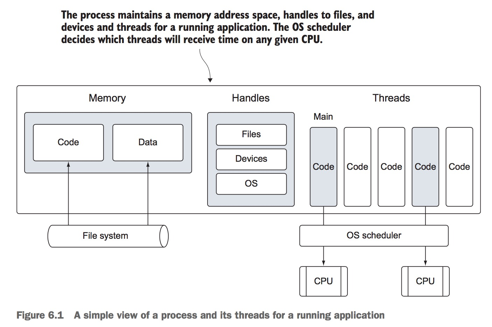
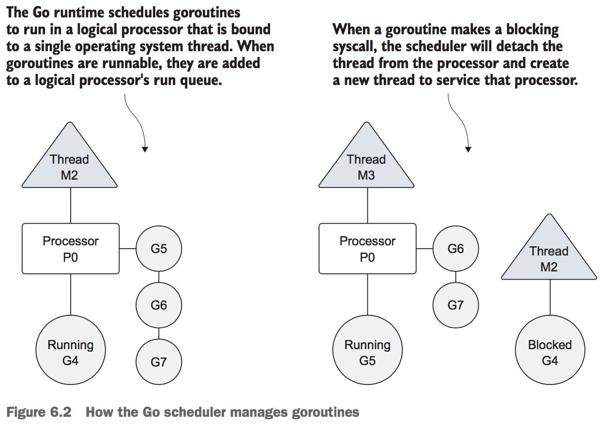
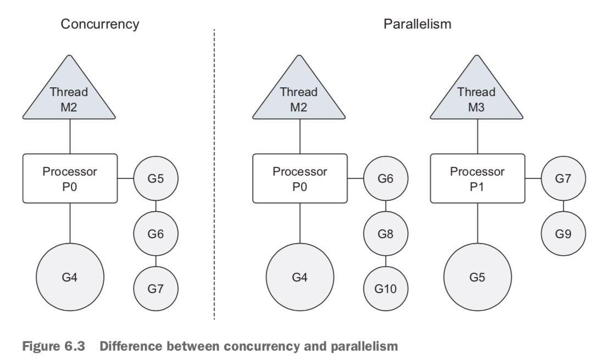
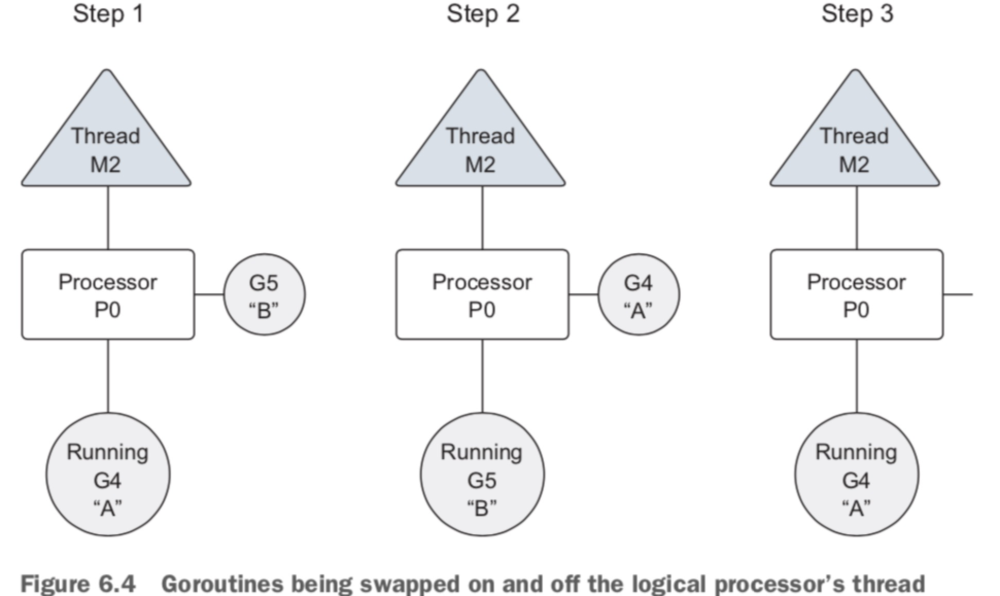
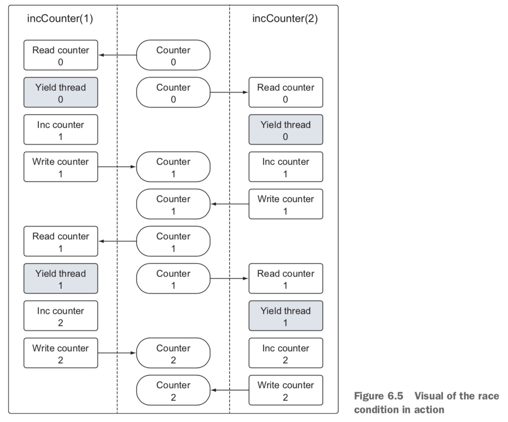
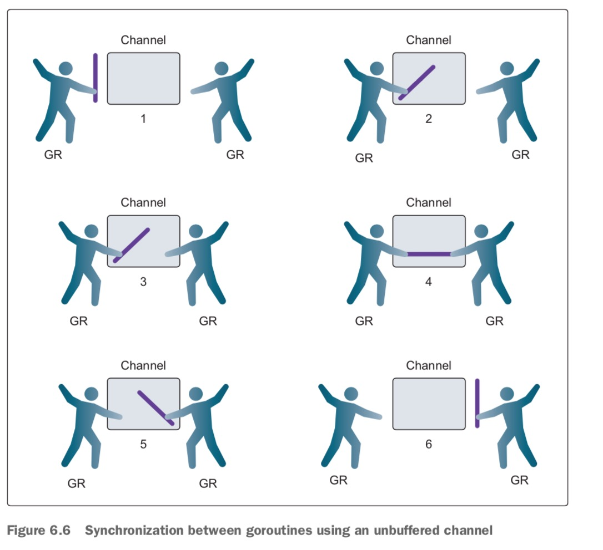
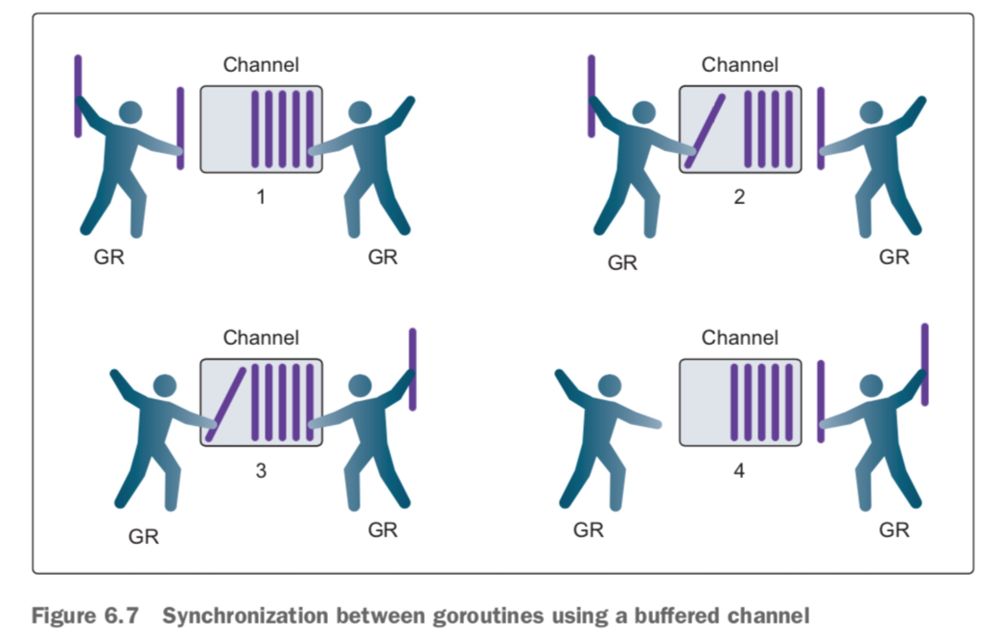

第六章 并发
=============
本章概要
- 使用goroutine运行代码
- 检测和修复竞态条件
- 使用通道共享数据

通常程序可以以线性路径代码实现来执行简单任务并完成。如果这是可能的，我们通常选择这种方式，因为这样类型的编程通常简单易写，并且容易维护。但是很多时候并行执行多个任务有更多好处。 一个常见例子就是web服务器，可以同时接收多个独立socket上的数据请求。每个socket请求都是独立的，可以独立处理。具有并行执行请求的能力可以极大的提升这种类型系统的性能。就是因为考虑到这一点，Go语言已经将并行内置到语言系统和运行系统中。

Go语言中的并发就是独立运行每个功能的能力。 当函数使用goroutine创建，它就被视为一个独立的工作单元，会被调度并在单个可用的逻辑处理器上执行。Go运行时调度器是一个复杂的软件，它管理创建的所有goroutine和所需的处理器时间。调度器位于操作系统顶层，绑定操作系统线程到逻辑处理器,反过来它们执行goroutine。调度器控制所有goroutine在何时运行在哪个逻辑处理器这些事情。

并发同步来自叫做通信顺序处理(CSP)的范式。CSP是一个消息传递模型，通过在goroutine之间通信数据来工作，而不是锁定数据来同步访问实现。goroutine之间用于同步和传递消息的关键数据类型叫做channel(通道)。对很多没有体验过用通道写并行程序的开发者来说， 它们唤起了一种敬畏和兴奋的气氛，你也很希望体验一下吧。 使用通道使你很容易开发并行程序，并且更少犯错。

## 6.1 并发和并行(Concurrency versus parallelism)
让我们从高层次来学习操作系统进程和线程是什么。这会帮助我们理解后续的Go运行时调度如何和操作系统操作来并行运行goroutine。当你运行一个应用程序是，比如IDE或编辑器，操作系统为这个应用程序启动一个进程。你可以认为进程就像一个容器，保存应用程序使用和维持运行的资源。

图6.1展示了包含可能分配个任意进程的通用资源。 这些资源包括但不限于内存地址空间、文件处理器、设备和线程。线程是执行路径，由操作系统调度来运行你所写功能的代码。每个进程包含至少一个线程，进程的最初始化的线程叫做主线程。当主线程终止，应用程序就终止了，因为这个执行路径是应用程序的起源。 操作系统调度线程在处理器上来运行，而不管进程属于哪个处理器。不同操作系统使用的算法用于调度线程，总是变化的，都是来自程序员抽象的。



操作系统调度让线程在物理处理器上运行，Go运行时调度让goroutine在逻辑处理器上运行。每个逻辑处理器都是独立绑定到单个操作系统线程。1.5版本的，默认的为每个物理处理器分配逻辑处理器已可用。 1.5版本之前，只默认分配一个单独的逻辑处理器。 这些逻辑处理器用于执行创建的所有goroutine. 即便在单个逻辑处理器中，成千上万个goroutine可以被调度来并发运行, 并具有令人吃惊的效率和性能。

图6.2， 你可以看到操作系统线程(逻辑处理器)和本地运行队列之间的关系。 随着goroutine的创建和运行就绪，它们被放到调度器的全局运行队列。之后不久，它们被赋予给逻辑处理器，然后放入那个逻辑处理器的逻辑运行队列。从这里，goroutine等待自己变成特定逻辑处理器来执行。



有时候运行goroutine需要执行阻塞的系统调用，例如打开文件。当这种事情发生，线程和goroutine都从逻辑处理器上解除，线程继续阻塞等待系统调用返回。同时，具有一个没有线程的逻辑处理器。 因此调度器创建一个新线程并绑定给那个逻辑处理器。然后调度器会从局部运行队列中选择另外一个goroutine来执行。一旦系统调用返回，那个goroutine就被放回局部运行队列，线程被放入将来使用的里边。

如果goroutine需要调用网络I/O, 进程稍微不同。 这种情况下，goroutine从逻辑处理器解绑，移到运行时集成网络轮询中(network poller)。一旦轮询表明读写操作就绪，goroutine重新赋予回逻辑处理器来处理操作。调度器中能创建多少逻辑处理器没有限制。但是运行时默认情况下，限制每个程序最多1万个线程。这个值可以通过调用runtime/debug包的SetMaxThreads函数来改变。如果程序尝试使用更多的线程，就会崩溃。

并发不是并行的。并行只能通过多片代码同时在不同的物理处理器上执行来达到。并行是关于同时做很多事情的概念。而并发是关于一次管理很多事情的概念。很多情况下，并发比并行性能更好， 因为操作系统和硬件的压力要小很多，这样可以让系统做更多事情。 少即是多哲学是语言圣经。

如果你希望并行运行goroutine, 你必须使用多个逻辑处理器。当有多个逻辑处理器，调度器会均匀的将goroutine分布到不同的逻辑处理器中。这样就导致goroutine在不同的线程上运行。但是要真正拥有并行， 你依然需要将程序运行在多物理处理器的机器上。如果不这样，goroutine会在单个处理器上并发运行, 即便Go语言运行时时使用多线程的。

图6.3展示了在单个逻辑处理器上并发运行goroutine和在两个逻辑处理器上并行并发的区别。 不建议盲目修改运行时默认的逻辑处理器。调度器包含智能算法，在Go语言的每个发布版本中都会更新和提升的。 如果你看到性能问题，并且确信可以通过修改逻辑处理器的数量来解决，那么你可以这样干。稍后你会了解更多细节。




## 6.2 goroutine
让我们揭开调度器更多行为以及如何创建goroutine并管理它们的存在期。我们下面代码运行在单个逻辑处理器, 在讨论如何并行运行goroutine之前。这个程序创建两个goroutine, 分别以大小写形式显示字母。
```
// The sample program demonstrates how to create groutines and how the scheduler behave.
pacakge main

import (
    "fmt"
    "runtime"
    "sync"
)

func main() {
    // Allocate 1 logic processor for scheduler to use.
    runtime.GOMAXPROCS(1)

    // wg is used to wait for program to finish.
    // Add a count of 2, one for each goroutine.
    var wg = sync.WaitGroup
    wg.add(2)

    fmt.Println("Start Goroutines")
    
    // Declare an anonymous function and create an goroutine.
    go func() {
        // Schedule the call to Done to tell main we are done.
        defer wg.Done()

        // Display alphabet three times.
        for count := 0; count < 3; count++ {
            for char := 'a'; char < 'a' + 26; char++ {
                fmt.Printf("%c ", char)
            }
        }
    }()
    
    // Declare an anonymous function and create an goroutine.
    go func() {
        // Schedule the call to Done to tell main we are done.
        defer wg.Done()

        // Display alphabet three times.
        for count := 0; count < 3; count++ {
            for char := 'A'; char < 'A' + 26; char++ {
                fmt.Printf("%c ", char)
            }
        }
    }()

    fmt.Println("Waitting to Finish")
    wg.wait()

    fmt.Println("\nTerminating Program")
}
```

上面代码main的第一行，我们调用runtime.GOMAXPROCS函数，让程序改变调度器使用的逻辑处理器数量。还有一个同名的环境变量可以用于设置它, 如果我们不希望在代码中单独调用的话。 传入1，告诉调度器为该程序使用单个逻辑处理器。

然后我们声明两个匿名函数来显示字母。第一个函数以小写字母的形式显示，第二个函数以大写字母的形式显示。这两个函数都是通过go关键词创建goroutine。你会看到下面的输出结果，两个goroutine的代码在单个逻辑处理器中并发运行。

输出内容如下:
Create Goroutines
Waitting to Finish
A B C D E F G H I J K L M N O P Q R S T U V W X Y Z A B C D E F G H I J K L M N O P Q R S T U V W X Y Z A B C D E F G H I J K L M N O P Q R S T U V W X Y Z a b c d e f g h i j k l m n o p q r s t u v w x y z a b c d e f g h i j k l m n o p q r s t u v w x y z a b c d e f g h i j k l m n o p q r s t u v w x y z 
Terminating Program

第一个goroutine显示字母所花费的时间非常少，在调度器切换到第二个routine之前它就能完成自己的工作。这就是为什么你会看到大写字母先输出，然后才输出小写字母。 我们创建的两个goroutine可以并发运行，一个接一个的，执行它们单独的显示字母的任务。

一旦匿名函数以goroutine的形式创建，main中的代码继续运行。 这就意味着祝函数可以在goroutine完成工作之前返回。如果发生这样的事情，程序会在goroutine获得运行机会前就终止了。 因此在main函数中我们需要调用wg.wait()来等待两个goroutine的完成。

WaitGroup是一个计数信号量(semaphore)，可以用于维持运行的goroutine记录。当WaitGroup的值大于零，Wait方法会被阻塞。上面代码中，我们声明了一个WaitGroup类型变量wg, 然后wg.add(2), 设置WaitGroup值为2，表示两个运行的goroutine. 要减少WaitGroup的值，最终释放(eventually release)， 调用defer wg.Done()方法。就是说匿名函数构建的goroutine执行完，调用wg.Done()。

关键词defer用于调度其他函数，让它在函数返回后在函数内部被调用执行。上面我们使用defer确保goroutine完成工作后，调用wg.Done()。

基于调度器内部算法，运行中的goroutine可以在完成工作之前停止和重新调度再次运行。调度器实现这些，防止任何单独goroutine独占逻辑处理器(processor hostage)。它会停止当前运行的goroutine, 然后给另外的可运行goroutine机会运行。

图6.4从逻辑处理器的角度展示了这个场景(scenario)。步骤1调度器开始执行goroutine A，goroutine B在运行队列中等待轮询。然后，突然在步骤2中，调度器切出goroutine A到goroutine B。既然goroutine A还没有完成， 它被放回到运行队列中。 然后在步骤3中，goroutine B完成它的工作然后消失了。 这样就允许goroutine A回去工作。



你可以通过创建一个需要长时间才能完成工作的goroutine来看这种行为。

```
// This sample program demonstrates how the goroutine scheduler will time slice goroutines on a single thread.
package main

import (
    "fmt"
    "runtime"
    "sync"
)

// wg is used to wait for the program to finish.
var wg sync.WaitGroup

// main is the entry point for all Go programs.
func main() {
    // Allocate 1 logical processors for the scheduler to use.
    runtime.MAXPROCS(1)

    // Add a count of two, one for each goroutine.
    wg.Add(2)

    // Create two goroutines.
    fmt.Println("Create Goroutines")

    go printPrime("A")
    go printPrime("B")

    // Wait for the goroutines to finish.
    fmt.Println("Waiting To Finish")
    wg.Wait()

    fmt.Println("Terminating Program")
}

// printPrime displays prime numbers for the first 5000 numbers.
func printPrime(prefix string) {
    // Schedule the call to Done to tell main we are done.
    defer wg.Done()
next:
    for outer := 2; outer < 5000; outer++ {
        for inner := 2; inner < outer; inner++ {
            if outer%inner == 0 {
                continue next
            }
        }
        fmt.Printf("%s:%d\n", prefix, outer)
    }

    fmt.Println("Completed", prefix)
}
```
上面代码创建了两个goroutine,  打印1到5000之内的素数。查找并显示素数会花费一些十斤啊，这样调度器就能在goroutine首次运行但没有完成查找所有素数之前进行时间分片。

当程序启动，它声明了WaitGroup变量，并将其值设置为2. 两个goroutine通过go关键词加函数printPrime调用被创建。第一个goroutine给了一个A前缀，第二个给了B前缀。就像所有调用函数，参数可以传入创建goroutine的函数。返回参数在goroutine终止的时候不可用。当你看到输出结果，你会看到调度器切换goroutine.

你可以看到类似的输出:
Create Goroutines
Waiting To Finish
B:2
B:3
...
B:4583
B:4591
A:3             切换goroutine
A:5
...
A:4561
A:4567
B:4603          切换goroutine
B:4621
...
Completed B
A:4457          切换goroutine
A:4463
...
A:4993
A:4999
Completed A
Terminating Program

当然，如果你没有看到切换的话，可以将5000改成更大的值试试，因为现在的计算机计算能力很强，有可能对于5000内素数查找也非常快，不会发生切换。

goroutine B首先开始显示素数。然后goroutine B在某个素数的时候，调度器切换到goroutine A。然后goroutine A在线程上执行了一段时间，然后又切换回B，如此反复多次， 直到某个goroutine完成，接着另一个goroutine完成，然后就终止程序。 你会发现每次运行这个程序，调度器对于时间分片发生的点会稍有不同。

上面两个代码都展示了调度器如何在单独的逻辑处理器中并行运行goroutine。正如前面陈述的，Go标准库runtime包里边又一个叫做GOMAXPROCS的函数，可以用于设置调度器使用的逻辑处理器的数量。下面代码是在运行时为每个可用物理处理器分配一个逻辑处理器的。接下来的例子我们会让goroutine并行运行。

```
import "runtime"

// Allocate a logical proccessor for every available core.
runtime.GOMAXPROCS(runtime.NumCPU())
```

runtime包为Go语言运行时提供了配置参数的支持。上面代码我们使用了两个runtime包的函数来修改调度器使用的逻辑处理器数量。runtime.NumCPU()返回可用的物理处理器数量；因此，函数调用GOMAXPROCS()函数为每个物理处理器创建了一个逻辑处理器。需要注意的重要一点是使用一个逻辑处理器以上不一定意味着更好的性能。需要基准测试来理解当配置runtime参数变化时程序如何执行。

如果给调度器多个逻辑处理器使用，我们会看到我们程序给出的输出行为有所不同。下面让我们看看，如果我们将打印英文字母的程序中逻辑处理器的数量改成2会发生什么变化。

```go
package main

import (
	"fmt"
	"runtime"
	"sync"
)

func main() {
	runtime.GOMAXPROCS(2)

	var wg sync.WaitGroup
	wg.Add(2)

	fmt.Println("Start Goroutines")

	// Declare an anonymous function and create an goroutine.
	go func() {
		// Schedule the call to Done to tell main we are done.
		defer wg.Done()

		// Display alphabet three times.
		for count := 0; count < 3; count++ {
			for char := 'a'; char < 'a'+26; char++ {
				fmt.Printf("%c ", char)
			}
		}
	}()

	// Declare an anonymous function and create an goroutine.
	go func() {
		// Schedule the call to Done to tell main we are done.
		defer wg.Done()

		// Display alphabet three times.
		for count := 0; count < 3; count++ {
			for char := 'A'; char < 'A'+26; char++ {
				fmt.Printf("%c ", char)
			}
		}
	}()

	fmt.Println("Waitting to Finish")
	wg.Wait()

	fmt.Println("\nTerminating Program")
}
```

打印结果如下:
Start Goroutines
Waitting to Finish
A B C D E F G H I J K L M N O P Q R S T U V W X Y Z A B C D E F G H I J K L M N O P Q R S T U V W X Y Z A B C D E F G H I J K L a b c d e f g M N h i j k l m n o p q r s t u O P Q R S T U V W v w x y z a b c d e f g h i j k l m n o p q X Y Z r s t u v w x y z a b c d e f g h i j k l m n o p q r s t u v w x y z 
Terminating Program

注意这里的输出和前面我们设置一个逻辑处理器的时候，明显不同，因为我们这里为调度器设置了两个逻辑处理器，允许goroutine并行执行。

仔细看上面的输出，你会看到goroutine是并行运行。几乎是两个goroutine开始运行就立即产生两个goroutine的交叉输出。记住goroutine在单个可用物理处理器上使用多个逻辑处理器的情况下，只能并行运行，每个goroutine同时运行。

你现在知道如何创建goroutine, 理解在引擎盖下面发生了什么。接下来你需要理解的是在写并发程序时的潜在危险和注意事项。

## 6.3 竞态条件(race conditions)
当两个以上goroutine以非同步的方式访问共享资源并尝试同时读写资源，就遇到所谓的竞态条件。竞态条件是并发程序复杂和具有更大的潜在bug的原因。共享资源的读写必须总是原子的(atomic), 或者换句话说，就是同一时间只能一个goroutine来操作。

下面我们看一个有竞态条件的程序例子:

```go
// This sample program demonstrates how to create race conditions in our programs. We don't want to do this.
package main

import (
	"fmt"
	"runtime"
	"sync"
)

var (
	// counter is variable incremented by all goroutines.
	counter int

	// wg is used to wait for program to finish.
	wg sync.WaitGroup
)

func main() {
	// Add a count of two, one for each goroutine.
	wg.Add(2)

	// Create two goroutines.
	go incCounter(1)
	go incCounter(2)

	// Waiting for goroutines to finish.
	wg.Wait()
	fmt.Println("Final Counter:", counter)
}

// incCounter increments the package level counter variable.
func incCounter(id int) {
	// Schedule the call to Done to tell main we are done.
	defer wg.Done()

	for count := 0; count < 2; count++ {
		// Capture the counter.
		value := counter

		// Yield the thread and be placed back in queue.
		runtime.Gosched()

		// Increment our local value of Counter.
		value++
		// Store the value back into Counter.
		counter = value
	}
}
```

上面程序编译后执行，输出结果为:
Final Counter: 2，有时候输出Final Counter 3, 有时候输出Final Counter 4。原书说输出第一种结果，我是在macbook中测试多次得到的多次结果。

counter变量读写四次，每个goroutine分别两次，但是counter变量的值在终止的时候是2, 3或4. 图6.5提供了为什么发生这样事情的线索。

每个goroutine覆盖其他goroutine的工作。 这在goroutine切换的时候发生。 每个goroutine都复制了counter变量的自己副本，然后切换到其他goroutine。当goroutine重新获取到执行时间，counter变量的值已经发生变化，但是goroutine没有更新自己的副本。而是包含了它的副本增加后的值， 然后将那个值重新设置回counter变量，替换其他goroutine执行的工作。



让我们顺着代码下去来理解下代码做了些什么。 从函数incCounter创建了两个goroutine。 incCounter函数读写包变量counter， 而我们这个例子中counter是共享资源。 两个goroutine都是读写counter变量副本到局部变量value上。 然后将副本值增加1，最后将新值赋值回counter变量。函数包含了一个runtime.Gosched函数的调用, 让出线程，给其他goroutine机会运行。通过在操作中箭强制让调度器在两个goroutine之间切换来扩大竞态条件的效果。

Go有一个特殊的工具可以检测代码中的竞态条件。它对找出这种类型的bug极其有用，特别当它们不是很明显, 就比如我们上面的例子。下面让我们使用竞态检测工具对我们代码进行检测。

```shell
> go build -race src/racecondition.go
```

然后运行编译后的程序，可以看到如下输出:
```
./racecondition 
==================
WARNING: DATA RACE
Read at 0x0000011d6318 by goroutine 7:
  main.incCounter()
      src/racecondition.go:38 +0x6f

Previous write at 0x0000011d6318 by goroutine 6:
  main.incCounter()
      src/racecondition.go:46 +0x90

Goroutine 7 (running) created at:
  main.main()
      src/racecondition.go:24 +0x89

Goroutine 6 (finished) created at:
  main.main()
      src/racecondition.go:23 +0x68
==================
Final Counter: 4
Found 1 data race(s)
```

竞态检测指出我们的例子4行代码:
Line 38: value := counter
Line 46: counter = value
Line 24: go incCounter(2)
Line 23: go incCounter(1)

上面展示的是竞态检测工具告诉我们goroutine导致数据竞态条件，两行代码冲突。 毫不奇怪，被指出的代码是读写counter变量。

一种可以修复我们例子， 消除竞态条件的方式是使用Go语言提供的通过锁定共享资源来同步goroutine。

## 6.4 锁定共享资源
Go语言提供了对访问的共享资源进行锁定的传统同步goroutine的支持。如果你需要顺序访问一个整数变量或一块代码，函数需要是原子性的，sync包是好的解决途径。我们将看一些sync包中的原子包函数和互斥类型。

### 6.4.1 原子函数
原子函数提供了同步访问整数和指针的低级锁机制。我们可以使用原子函数来修复上面我们创建代码的竞态条件。
```
// This sample program demonstrates how to create race conditions in our programs. We don't want to do this.
package main

import (
	"fmt"
	"runtime"
	"sync"
	"sync/atomic"
)

var (
	// counter is variable incremented by all goroutines.
	counter int64

	// wg is used to wait for program to finish.
	wg sync.WaitGroup
)

func main() {
	// Add a count of two, one for each goroutine.
	wg.Add(2)

	// Create two goroutines.
	go incCounter(1)
	go incCounter(2)

	// Waiting for goroutines to finish.
	wg.Wait()
	fmt.Println("Final Counter:", counter)
}

// incCounter increments the package level counter variable.
func incCounter(id int) {
	// Schedule the call to Done to tell main we are done.
	defer wg.Done()

	for count := 0; count < 2; count++ {
		atomic.AddInt64(&counter, 1)
		// Capture the counter.
		//value := counter

		// Yield the thread and be placed back in queue.
		runtime.Gosched()

		// Increment our local value of Counter.
		//value++
		// Store the value back into Counter.
		//counter = value
	}
}
```

Final Counter: 4

修改后的代码使用atomic.AddInt64函数来将counter变量加1。 这个函数通过强制同一时间只能有一个goroutine可以执行和完成加操作来同步整数值的增长。当goroutine尝试调用任何atomic函数，它们都自动同步它们引用的变量。 那么我们就正确的获得了值4.

另外两个非常有用的原子函数是LoadInt64和StoreInt64。这些函数为读写整数值提供了安全方法。下面是一个使用LoadInt64和StoreInt64来创建同步标志的例子，可以警告特殊条件下程序中的多个goroutine。
```
package main

import (
	"fmt"
	"sync"
	"sync/atomic"
	"time"
)

var (
	// shutdown is a flag to alert running goroutines to shutdown.
	shutdown int64

	// wg is used to wait for program to finish
	wg sync.WaitGroup
)

func main() {
	// Add a count of two, one for each goroutine.
	wg.Add(2)

	// Create two goroutines
	go doWork("A")
	go doWork("B")

	// Give the goroutines time to run.
	time.Sleep(1 * time.Second)

	// Safely flag it is time to shutdown.
	fmt.Println("Shutdown Now")
	atomic.StoreInt64(&shutdown, 1)

	// Wait for the goroutines to finish.
	wg.Wait()
}

// doWork simulates a goroutine performing work and
// checking the Shutdown flag to terminate early.
func doWork(name string) {
	// Schedule the call to Done to tell main we are done.
	defer wg.Done()

	for {
		fmt.Printf("Doing %s Work\n", name)
		time.Sleep(250 * time.Millisecond)

		// Do we need to shutdown.
		if atomic.LoadInt64(&shutdown) == 1 {
			fmt.Printf("Shutting %s Down\n", name)
			break
		}
	}
}
```
这个例子中，我们启动了两个goroutine来执行一些工作。在它们具体循环迭代之后，goroutine通过LoadInt64来检查shutdown变量的值.这个函数返回shutdown变量的安全副本。 如果变量等于1， goroutine断开循环并终止。

主函数使用StoreInt64函数来改变shutdown变量的值。如果任意一个doWork goroutine在main函数调用StoreInt64的同一时间尝试调用LoadInt64函数, 原子函数会同步这些调用，并保持所有操作安全和无竞态条件。

### 6.4.2 互斥量

另外一种同步访问共享资源的方式是使用互斥量。互斥量是以mutual exclusion(互相排斥)来命名的。互斥量用于在代码中创建临界区域，确保同一时间只有一个goroutine可以执行那个区域代码。 我们也可以使用互斥量来修复我们前面的竞态条件。

```
// This sample program demonstrates how to create race conditions in our programs. We don't want to do this.
// 通过互斥量修复竞态条件
package main

import (
	"fmt"
	"runtime"
	"sync"
)

var (
	// counter is variable incremented by all goroutines.
	counter int

	// wg is used to wait for program to finish.
	wg sync.WaitGroup

	// mutex is used to define a critical section of code
	mutex sync.Mutex
)

func main() {
	// Add a count of two, one for each goroutine.
	wg.Add(2)

	// Create two goroutines.
	go incCounter(1)
	go incCounter(2)

	// Waiting for goroutines to finish.
	wg.Wait()
	fmt.Println("Final Counter:", counter)
}

// incCounter increments the package level counter variable.
func incCounter(id int) {
	// Schedule the call to Done to tell main we are done.
	defer wg.Done()

	for count := 0; count < 2; count++ {

		mutex.Lock()
		{
			// Capture the counter.
			value := counter

			// Yield the thread and be placed back in queue.
			runtime.Gosched()

			// Increment our local value of Counter.
			value++
			// Store the value back into Counter.
			counter = value
		}
		mutex.Unlock()
	}
}
```

上面代码中，counter变量的操作使用边界选区来保护，这个边界选取通过mutex.Lock()和mutex.Unlock()来定义。 选区使用打括号仅仅只是让边界选区更容易读，而非必须的。在同一时刻只能有一个goroutine可以进入边界选区。 直到调用Unlock()函数，其他的goroutine才能进入边界选区。即便在选区里边线程让出，但是调度器依然赋予同一个goroutine继续运行。在程序完成后，我们获得正确的值4， 竞态条件不存在了。

## 6.5 通道

原子函数和互斥量可以工作，但是它们不能让并发程序的实现变容易并且具有更少的错误，或者更有趣。 在Go语言中我们不仅仅有原子函数和互斥量让共享资源安全和消除竞态条件。在需要互相共享发送和接收的资源时使用通道来同步goroutine。

当资源需要在goroutine之间共享，channel扮演goroutine之间的管道(conduit), 提供一种保障同步交互的机制。当声明一个channel时，需要共享的数据类型需要指明。可以通过channel传递内置值类型、指针类型、命名类型、结构体、引用类型。

在Go语言中创建channel可以使用内置函数make。
```
// Unbuffered channel of integers.
unbuffered := make(chain int)
// Buffered channel of strings.
buffered := make(chan string, 10)
```

上面你看到我们使用内置函数make创建了无缓冲通道和缓冲通道。 make第一个参数需要一个关键词chan和一个通道将交换的数据类型。如果要创建缓冲通道，需要指定通道的缓冲值作为第二个参数。

发送值或指针到通道中需要使用<-操作符。

```
// Buffered channel of strings.
buffered := make(chan string, 10)

// Send a string through the channel.
buffered <- "Gopher"
```

上面我们创建了一个缓冲的类型为字符串的channel, 包含缓冲值为10。 然后我们发送"Gopher"给channel。另外一个goroutine需要从通道接收这个字符串，同样使用<-操作符，但是这次只是一元操作符。

```
// Receive a string from the channel.
value := <-buffered
```

当从通道接收到值或指针，<-操作符被绑定到通道变量的左边，正如上所示。

无缓冲通道和缓冲通道稍微不同。 理解它们的区别有助于决定什么情况使用哪种类型通道更好， 下面我们分别看看两个不同类型的通道。

### 6.5.1 无缓冲通道
无缓冲通道是一种没有在接收之前没有容量存储任何值的通道。这种类型的通道同时需要发送goroutine和接收goroutine在任何发送和接收操作完成之前同一瞬间(at the same instant)同时就绪. 如果两个goroutine在那一瞬间都没有就绪，通道会让分别执行发送和接收操作的goroutine首先等待。同步在通道的发送和接收交互中是天然存在的(inherent). 两者缺一不可(缺少谁都不会发生同步)。

在图6.6中，你会看到两个goroutine使用无缓冲通道共享数据的例子。 步骤1中两个goroutine靠近通道，两边都没有产生发送或接收。在步骤2中，左边的goroutine将手插入通道，模拟在通道发送数据。 这个时间点上，左边的goroutine是锁定到通道上的，直到交换完成。步骤3中，右侧的goroutine将手放入通道，模拟在通道接收数据。 那么右侧的goroutine也被锁定，直到交换完成。 在步骤4和步骤5中，产生交换， 最后在步骤6， 两个goroutine都释放出来，各自取出自己的手， 这就模拟了释放锁。 这个时候两边的goroutine可以尽情自娱了。




要更清楚了解，让我们看两个使用无缓冲通道来同步两个goroutine交换数据的完整例子。

在网球游戏中，两个选手来回将球打到对方。其中一个玩家始终处于两种状态之一: 要么等待接球，要么将球想对方发去。你可以模拟网球游戏是使用两个goroutine和一个无缓冲通道来模拟球的交换。

```go
// This sample program demonstrates how to use an unbuffered channel to simulate a game of tennis between two goroutines.
package main

import (
	"fmt"
	"math/rand"
	"sync"
	"time"
)

// wg is used to wait for program finish.
var wg sync.WaitGroup

func init() {
	rand.Seed(time.Now().UnixNano())
}

func main() {
	// create an unbuffered channel.
	court := make(chan int)

	// Add a count of two, one for each goroutine.
	wg.Add(2)

	// Launch two players.
	go player("Nadal", court)
	go player("Djokovic", court)

	// Start the set.
	court <- 1

	// Wait for the game to finish.
	wg.Wait()
}

// player simulates a person playing the game of tennis.
func player(name string, court chan int) {
	// Schedule the call to Done to tell main we are done
	defer wg.Done()

	for {
		// Wait for the ball to be hit back to us.
		ball, ok := <-court

		if !ok {
			// If the channel was closed we won.
			fmt.Printf("Player %s Won\n", name)
			return
		}

		// Pick a random number and see if we miss the ball.
		n := rand.Intn(100)
		if n%13 == 0 {
			fmt.Printf("Player %s Missed\n", name)
			// Close the channel to signal we lost.
			close(court)
			return
		}

		// Display and then increment the hit count by one.
		fmt.Printf("Player %s Hit %d\n", name, ball)
		ball++

		// Hit the ball back to the opposing player.
		court <- ball
	}
}
```

运行上面程序，可能输出如下:

Player Djokovic Hit 1
Player Nadal Hit 2
Player Djokovic Hit 3
Player Nadal Hit 4
Player Djokovic Missed
Player Nadal Won

在main函数中，我们首先创建了一个无缓冲通道来同步交换两个goroutine击中的球。然后两个goroutine开始玩球。首先两者都被锁定，其中一方等待接球。 当一方把球发到通道上去，游戏就开始了，知道其中的一个通道没有接到球为止。

在player函数中，我们使用了无限循环for。 在循环中，游戏在表演着。然后一个goroutine从通道接收球，检查ok是否为false。 如果为false表示通道被关闭，游戏结束。我们在游戏过程中随机产生一个数字，来决定goroutine是击中球还是没有击中。 如果击中球，然后被几种球的计数增加1，然后把球传回对方。 然后两边再次处于锁定状态，直到交换发生。 最终如果某一个玩家没有击中球，那么通道就会关闭。 两个goroutine都会返回，调用defer wg.Done()， 然后程序终止。

另外一个例子，使用不同的模式用无缓冲通道同步goroutine模拟接力比赛。在接力比赛中(relay race), 四个运动员轮流在轨道中跑。 第二个，第三个，第四个运动员在他们没有从前面运动员手中接过棒，就不能开始跑。 交换接力棒是比赛的关键点，需要同步避免失误。当这个同步发生，涉及到交换棒的两个运动员需要同时就绪。

```
// This sample program demonstrates how to use an unbuffered channel to simulate a relay race between four goroutines.
package main

import (
	"fmt"
	"sync"
	"time"
)

// wg is used to wait for the grogram to finish.
var wg sync.WaitGroup

func main() {
	// Create an unbuffered channel.
	baton := make(chan int)

	// Add a count of one for the last runner.
	wg.Add(1)

	// First runner to his mark.
	go Runner(baton)

	// Start the race.
	baton <- 1

	// Wait for the race to finish.
	wg.Wait()
}

// Runner simulates a person running in the relay race.
func Runner(baton chan int) {
	var newRunner int

	// Wait to receive the baton.
	runner := <-baton

	// Start runnint around the track.
	fmt.Printf("Runner %d Running With Baton\n", runner)

	// New Runner to the line.
	if runner != 4 {
		newRunner = runner + 1
		fmt.Printf("Runner %d To The Line\n", newRunner)
		go Runner(baton)
	}

	// Running around the track.
	time.Sleep(100 * time.Millisecond)

	// Is the race over.
	if runner == 4 {
		fmt.Printf("Runner %d Finished, Race Over\n", runner)
		wg.Done()
		return
	}

	// Exchange the baton for the next runner.
	fmt.Printf("Runner %d Exchange With Runner %d\n", runner, newRunner)

	baton <- newRunner
}
```
在Runner的goroutine中，你可以看到接力棒在运动员之间传递。runner := <-baton 让goroutine使用通道上的接受调用来等待接受接力棒。 一旦接收到接力棒，下一个运动员通过go Runner(baton)打上自己的标记， 除非goroutine代表的是第四个运动员。 time.Sleep(100 * time.Millisecond)这行，运动员在赛道跑100毫秒。 wg.Done()这行是在第四个运动员跑完执行的，WaitGroup通过调用Done来对计数器进行递减，然后goroutine就返回了。如果不是第四个运动员， 那么需要通过baton <- newRunner将接力棒传递给下一个等待的运动员。在这个点上，两个goroutine都被锁定，直到交换完成。

上面两个例子我们都使用了无缓冲通道来同步goroutine来模拟网球比赛和接力赛。 代码流和和真实世界中这些事件和活动的方式是一致的。 这样就使得代码有较强的可读性和自我文档化。那么你知道无缓冲通道如何工作了，下一步你可以了解缓冲通道如何工作。

### 6.5.2 缓冲通道
缓冲通道是一种可以在接受之前能保存一个或多个值的通道。 这种类型的通道不强制goroutine必须同时就绪来执行接收。 也有发送和接收的确阻塞的不同条件。 接受者只有在通道没有值可接收时才阻塞。 发送方只有在没有缓冲可用于存放发送值的时候阻塞。 这就导致了无缓冲通道和缓冲通道的一个巨大区别: 无缓冲通道为两个goroutine交换数据的收发一致性提供了保障。缓冲通道不保证收发一致性。

在图6.7中你可以看到两个goroutine在缓冲通道中独立的加和取物件。 第一步中，右侧的goroutine处理从通道接收值。 第二步，这个goroutine还能完成独立接收，左侧goroutine可以发送值给通道。第三步中，左侧goroutine向通道发送一个值，而右侧goroutine从通道中取出另外一个值。步骤3中的这两个操作都不受对方同步或阻塞。 最后，第四步，所有的发送和接收完成，我们的通道还有一些值和空间可用。



让我们看一个使用无缓冲通道管理goroutine集合来接收和处理工作的例子。缓冲通道提供了一个干净直观的方式来实现这个代码。
```
// This sample program demonstrates how to use a buffered channel to work on multiple tasks with a predefined number of goroutines.
package main

import (
	"fmt"
	"math/rand"
	"sync"
	"time"
)

const (
	numberGoroutines = 4  // Number of goroutines to use
	taskLoad         = 10 // Amount of work to process.
)

// wg is used to wait for the program to finish.
var wg sync.WaitGroup

// init is called to initialize the package by the Go runtime prior to any other code being excuted.
func init() {
	// Send the random number generator.
	rand.Seed(time.Now().Unix())
}

func main() {
	// Create a buffered channel to manage the task load.
	tasks := make(chan string, taskLoad)

	// Launch goroutines to handle the work.
	wg.Add(numberGoroutines)
	for gr := 1; gr <= numberGoroutines; gr++ {
		go worker(tasks, gr)
	}

	// Add a bunch of work to get done.
	for post := 1; post <= taskLoad; post++ {
		tasks <- fmt.Sprintf("Task : %d", post)
	}

	// Close the channel so the goroutines will quit when all the work is done.
	close(tasks)

	// Wait for all the work to get done.
	wg.Wait()
}

// worker is launched as a goroutine to process work from the buffered channel.
func worker(tasks chan string, worker int) {
	// Report that we just returned.
	defer wg.Done()

	for {
		// Wait for work to be assigned.
		task, ok := <-tasks
		if !ok {
			// This means the channel is empty and closed.
			fmt.Printf("Worker: %d: Shutting Down\n", worker)
			return
		}

		// Display we are starting the work.
		fmt.Printf("Worker: %d: Started %s\n", worker, task)

		// Randomly wait to simulate work time.
		sleep := rand.Int63n(100)
		time.Sleep(time.Duration(sleep) * time.Millisecond)

		// Display we finished the work.
		fmt.Printf("Worker: %d : Completed %s\n", worker, task)
	}
}
```

执行程序后输出如下:

Worker: 1: Started Task : 1
Worker: 4: Started Task : 2
Worker: 3: Started Task : 4
Worker: 2: Started Task : 3
Worker: 1 : Completed Task : 1
Worker: 1: Started Task : 5
Worker: 4 : Completed Task : 2
Worker: 4: Started Task : 6
Worker: 2 : Completed Task : 3
Worker: 2: Started Task : 7
Worker: 3 : Completed Task : 4
Worker: 3: Started Task : 8
Worker: 2 : Completed Task : 7
Worker: 2: Started Task : 9
Worker: 1 : Completed Task : 5
Worker: 1: Started Task : 10
Worker: 4 : Completed Task : 6
Worker: 4: Shutting Down
Worker: 1 : Completed Task : 10
Worker: 1: Shutting Down
Worker: 3 : Completed Task : 8
Worker: 3: Shutting Down
Worker: 2 : Completed Task : 9
Worker: 2: Shutting Down

因为程序和调度器的随机性，每次运行该程序输出会不同。但是用于处理缓冲通道中工作的四个goroutine不变。 你可以从输出看到每个goroutine如何接收分布在通道中的工作。

在main函数中，我们首先创建了一个容量为10的缓冲通道。然后我们将WaitGroup的计数器设置为4. 然后我们将10个字符串发送到通道来模拟goroutine的工作。一旦最后一个字符串被发送到通道，该通道就关闭。 然后main函数就等待所有工作完成。

关闭通道是代码中的重要代码片段。当通道被关闭，goroutine可以仍然执行从通道接收，但是不再向通道发送了。能够在关闭通道上接收非常重要，因为它允许通道使用将来的接受者来清空通道的所有值，因此通道的东西都不会丢失。 在关闭通道中接收和空通道总是立即返回，提供给声明的通道类型零值。如果你也请求可选标志在通道接收者，你可以获取通道的状态信息。

在worker函数中，你可以看到一个无限循环。在循环中，所有接收到的工作被处理。 每个goroutine阻塞等待从通道接收工作。 一旦接受返回，ok标志检查看通道是否为空或关闭。如果这个值位false, goroutine终止了，这就导致defer语句调用Done, 并返回报告给main.

如果ok为true, 然后接收的值为无效。 接着模拟正在处理的工作。一旦工作完成，goroutine再次在通道阻塞。 一旦通道关闭，通道上的接受者立即返回，goroutine自己终止。

无缓冲通道和缓冲通道的例子提供了一个很好的使用通道写代码例子。下一章我们会看看真实世界的可以用于项目中的并发模式。

## 6.6 总结
- 并发是goroutine的独立执行.
- 函数通过关键词go创建goroutine。
- goroutine是在一个逻辑处理器的作用域中执行，这个逻辑处理器拥有单个操作系统线程，并以队列运行。
- 竞态条件是当两个或多个goroutine尝试访问同样的资源。
- 原子函数和互斥提供了一种保护竞态条件的方式。
- 通道是为两个goroutine提供固有的安全共享数据的方式。
- 无缓冲通道提供了数据交换的保证. 缓冲通道不提供。

## 中英文对照
- 少即是多哲学道尽语言精髓: This less-is-more philosophy is a mantra of the language.
- 存在期: lifespan
- 信号量: semaphore
- 引擎盖下发生了什么: what's happening under the hood. 
- yield: 让出、屈服等意思。抢先式多任务情况下，主动让出CPU给其他程序使用，让其他程序有机会运行。
- 扩大竞态条件的效果: exaggerate the effects of the race contition.
- 互斥量: mutex
- 临界区域: critical section
- 管道: conduit
- 一元操作符: unary operator
- 天然存在的: inherent

## 链接

- [上一章节](5.1.md)
- [目录](../README.md)
- [下一章节](7.1.md)
