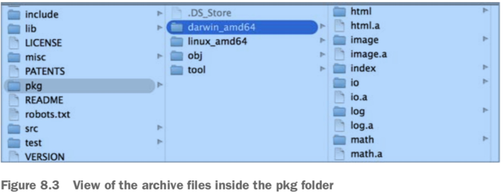

第八章 标准库
====================

本章概述

- 编写输出和日志信息
- JSON编码解码
- 操作IO数据和流数据
- 标准库中包之间的互操作性

Go标准库是什么？为什么它这么重要？Go标准库是强化和扩展语言的核心包集合。这些包增加了不同类型程序的数量, 对这些程序你无需构建自己的包或下载其他人已经发布的包。既然这些包是与语言捆绑的，所以与一些特性保障伴随一起的:
- 它们在语言的每个最小发布版本中都存在的。
- 它们履行向后兼容的承诺。
- 它们是Go语言开发、构建和发布过程的一部分。
- 它们由Go语言贡献者维护和审阅。
- 它们在语言的每个新发布版本中都进行测试和基准测试过的。

这些保证确保了标准库的特殊性，并且你希望尽可能多的利用这些标准库。 通过使用标准库中的包，使得很容易代码管理以及确保代码可信赖。这是因为你无需担心程序在发布周期中突然间断，你也无需管理第三方依赖。

如果标准库没有包含这些确实包含的伟大的包，那么上面的很多优点就不复存在了。Go语言社区开发者比其他语言更依赖这些包。这是因为它们都是设计良好的、并比传统标准库提供更多功能。最后，Go社区开发者依赖标准库的很多东西，而其他语言开发者则不需要这样， 例如网络、HTTP、图片处理、密码学方面的。

本章中我们将对标准库的一部分当前包进行深层次的查看。我们将更详细的探讨三个包，对于很多不同程序都很适用的: log, json, io包。 这些包也展示了Go语言所提供的一些伟大之处。

## 8.1 文档和源代码
标准库中包含很多包，不可能用一章内容覆盖完它们。当前有超过100个包分散到38个不同类别中。

- archive: 实现了tar, zip档案的访问。
- bufio: 实现缓冲io。对io.Reader或io.Writer对象的包装，创建另外一个对象也实现了相应接口，但是提供缓冲，并且提供原文I/O帮助。
- builtin: 提供了Go语言预先声明的标识符的文档。记录在这里的项目实际上不是在包builtin里边的，但是这里的描述可以让godoc能展示语言特定的标识符的文档。
- bytes: byte包实现了字节分片的操作功能。类似于strings包中的工具。
- cmd: 提供了go命令行命令的文档描述。包括go build, go vet, go install等等。
- compress: 提供了对各种压缩文件的读写能力。 例如bzip2, flate, gzip, lzw, zlib等。
- container: 提供了诸如堆(heap)、双向链表(list)、循环链表(ring)之类的数据结构的操作功能。
- context: context包定义了Context类型，它承载了API边界和进程之间的截止时间、取消信号以及其他请求作用域的值。进入服务器的请求应该创建Context, 对服务器的外届调用应该接受一个Context。它们之间的函数调用链必须传播给Context, 可选择性的将它替换为使用派生的使用WithCancel、WithDeadline, WithTimeout或WithValue创建的Context。当Context被取消，那么所有从它派生的Context也都会被取消。
- crypto: 常见的密码学相关的包， 例如: aes, sha等等。
- database: 提供的主要是SQL或类SQL的普遍接口, database/sql。
- debug: dwarf elf gosym macho pe plan9obj
- encoding: 该包定义了一些其他包共享的接口。那些包主要是用于字节级和文本表示之间的互相转换。包括ascii85 asn1 base32 base64 binary csv gob hex json pem xml.
- errors: 该包实现了一些错误操作的一些功能。主要提供了一个New方法, 创建一个具体的错误。
- expvar: 提供了公共变量的标准接口。例如服务器的计数器。通过/debug/vars中的HTTP以JSON的格式来暴露这些变量。
- flag: 该包提供了命令行标志的解析。
- fmt: 该包实现格式化I/O, 功能类似于C语言中的printf和scanf。格式动作是由C语言派生出来的，但是要比它简单些。
- go: 语言相关的文档。包括ast build constant doc format importer parser printer scanner token types.
- hash: 该包提供哈希功能接口。adler32 crc32 crc64 fnv。
- html: 该包提供HTML文本的转义和取消转义(escape and unescape)。 html/template包实现了数据驱动的模版实现，用于生成HTML输出，这样可以免受代码注入的影响。
- image: 基本的二维图像库实现，包括子包:color draw gif jpeg png。
- index: index/suffixarray实现了以对数时间的子字符串查询，使用了内存后缀数组实现。
- internal: 内核相关，暂无。
- io: 提供了I/O元语的基本接口。还包含一个子包ioutil, 提供了一些io工具。
- log: 实现了简单的日志包, 定义了一个Logger, 用于输出格式化。
- math: 数学类功能包。包含子包: big bits cmplx rand。
- mime: 实现了MIME规格的一部分。 还有两个子包:multipart quotedprintable。
- net: 提供了网络I/O的可移植接口，包括TCP/IP, UDP, 域名解决，Unix域名socket等。包含有子包http, mail, rpc, smtp, textproto, url等。
- os: 提供了操作系统功能的平台无关接口。包含子包exec, signal, user等。
- path: 实现操作斜杠分割路径的实用例程。
- plugin: 实现Go语言插件的加载和符号解析。
- reflect: 实现运行时反射，允许程序程序操作任意类型的对象。
- regexp: 实现正则匹配。
- runtime: 包含与Go运行时系统交互的操作，例如控制goroutine的功能。有子包cgo, debug, msan, pprof, race, trace等。
- sort: 为分片和用户自定义集合提供基本的排序。
- strconv: 实现基本类型的字符串表示转换。
- strings: 实现了操作UTF-8编码字符串的简单功能。
- sync: 提供基本的同步元语，例如互斥锁。
- syscall: 包含低级操作系统元语的接口。
- testing: 包含对Go包的自动测试支持。
- text: 为UTF-8编码文本提供扫描和序列化功能。
- time: 提供度量和显示时间的功能。
- unicode: Package unicode provides data and functions to test some properties of Unicode code points.
- unsafe: 包含围绕Go程序类型安全的操作。

上面的很多分类本身也是包自身。 要查看所有可用包的详细描述，可以查看Go团队维护的文档[go packages](http://golang.org/pkg).

golang网站的pkg部分提供了每个包的godoc文档。 

如果你希望有可以交互的文档，那么可以使用[Sourcegraph](https://sourcegraph.com/)， 它已经索引了包含Go代码的标准库和很多公开仓库。

不管你如何安装的go， 所有的源代码都位于你开发机器的$GOROOT/src/pkg目录。具有标准库的源代码是Go工具工作的关键点。类似godoc, gocode甚至go build都读取这些源代码来执行它们的功能。 如果这些源代码没有在你的机器上或者不能通过$GOROOT变量访问，那么在构建代码的时候也会报错。

标准库的源代码已经预先编译好，作为你Go发布包的一部分。 预编译文件叫做archive文件，可以在$GOROOT/pkg目录找到每个你所安装的不同平台和操作系统的文件。archive文件都是以.a为扩展名的。



## 8.2 Logging
程序如果有bug, 即便还没有自己显示出来。 对于软件开发来说是很自然的事情。 Logging就是一种发现这些bug和了解更多程序行为如何的。 Log可以做你的眼睛和耳朵， 提供代码追踪， 性能剖析(profile)和分析。考虑到这一点，标准库提供了log包可以使用，使用一些简单配置即可。 当然你可以创建自定义logger来实现你自己的log需求。

在Unix中，logging历史悠久， 并携带到log包中。传统CLI程序将它们的输出直接输出到标准设备。 这些设备在所有操作系统中都存在，也是标准文本输出的默认目标。终端默认被配置显示写到这些设备上的文本。使用这个目标工作都非常好, 除非你的程序需要既写输出，又写程序功能详情。当你想要写log信息，你需要向不同目标写， 这样你的输出和log不会混在一起。

为了解决这个问题，Unix架构增加了一个叫做stderr的设备。这个设备是为log创建的默认目标。 它允许开发者将程序输出和log分开。对于要看输出和log两者的用户， 终端控制配置来显示stdout和stderr要写入什么。但是如果程序只写日志，那么一般实践经验是，将一般的日志信息输出到stdout, 错误和警告写到stderr。

### 8.2.1 log包
下面在如何创建自定义logger之前先看看log包提供的基本功能。log的目的就是跟踪程序在做什么， 什么地点、什么时间发生。 这就是在每个日志行可以使用配置设置的一些信息。

```go
TRACE: 2009/11/10 23:00:00.000000 /tmpfs/gosandbox-/prog.go:14: message
```

上面就是由log包产生的一条日志实体. 这条日志包含一个前缀， 一个时间戳和写日志的完整的源代码路径， 代码所在行，以及信息内容。 下面我们看一个程序可以让你配置log包来写这样一行的程序。
```go
package main

import (
	"log"
)

func init() {
	log.SetPrefix("TRACE: ")
	log.SetFlags(log.Ldate | log.Lmicroseconds | log.Llongfile)
}

func main() {
	// Println writes to the standard logger.
	log.Println("message")

	// Fatalln is Println() followed by a call to os.Exit(1).
	log.Fatalln("fatal message")

	// Panicln is Println() followed by a call to panic().
	log.Panicln("panic message")
}
```

运行上面代码，就可以得到本节开头类似的日志输出。我们代码中定义了一个init函数，它会在main函数之前执行，在该函数中我们设置了log包的配置， 那么后续使用log包就可以应用这些配置了。我们给日志添加了一个前缀， 然后设置了日志几个标志，用于控制每行日志其他信息的展示。 

log包实现了简单的日志包。 它定义了一个类型Logger, 还有一些格式化输出的方法。它包含有一些预定义的标准Logger访问助手函数:

- Printf
- Println
- Fatalf
- Fatalln
- Panicf
- Panicln

上面这些助手函数比手工创建Logger要使用方便些。logger向stderr写，打印每条日志信息的日期时间等信息。每条日志以独立的行输出: 如果打印信息不是以新行结束，logger会自动添加。 
Fatal函数就是Print函数后面再调用os.Exit(1), 而Panic函数就是Print函数后调用panic()。

```go src/log/log.go
// These flags define which text to prefix to each log entry generated by the Logger.
// Bits are or'ed together to control what's printed.
// There is no control over the order they appear (the order listed
// here) or the format they present (as described in the comments).
// The prefix is followed by a colon only when Llongfile or Lshortfile
// is specified.
// For example, flags Ldate | Ltime (or LstdFlags) produce,
//	2009/01/23 01:23:23 message
// while flags Ldate | Ltime | Lmicroseconds | Llongfile produce,
//	2009/01/23 01:23:23.123123 /a/b/c/d.go:23: message
const (
	Ldate         = 1 << iota     // the date in the local time zone: 2009/01/23
	Ltime                         // the time in the local time zone: 01:23:23
	Lmicroseconds                 // microsecond resolution: 01:23:23.123123.  assumes Ltime.
	Llongfile                     // full file name and line number: /a/b/c/d.go:23
	Lshortfile                    // final file name element and line number: d.go:23. overrides Llongfile
	LUTC                          // if Ldate or Ltime is set, use UTC rather than the local time zone
	LstdFlags     = Ldate | Ltime // initial values for the standard logger
)
```

上面代码来自log包的源代码。定义了一系列常量， 第一个常量Ldate使用一种特殊的语法声明的。

iota关键词在声明一块常量的时候具有特殊目的。 它指示编译器为每个常量复制这个表达式，直到末尾或者遇到赋值语句为止。 iota的另外一个功能就是对每个之前常来那个的iota都会增加1， 初始值为0. 下面我们详细看看。

```go
const (
    Ldate   = 1 << iota         // 1 << 0 = 000000001 = 1
    Ltime                       // 1 << 1 = 000000010 = 2
    Lmicroseconds               // 1 << 2 = 000000100 = 4
    Llongfile                   // 1 << 3 = 000001000 = 8
    Lshortfile                  // 1 << 4 = 000010000 = 16
    ...
)
```
上面展示了常量声明幕后发生了什么。 << 操作符执行操作符左侧值向左的位移。每种情况都是将1左移itoa位. 这样就有效的给每个常量一个唯一的位， 当使用标志常量的时候非常完美。

LstdFlags就展示了给每个常量一个唯一位的背后目的。 LstdFlags = Ldate(1) | Ltime(2) = 000000011 = 3.
你会看到LstdFlags就打破iota链， 因为这里使用了赋值语句。LstdFlags被赋值为3，得益于位或操作符(|). 位或将每个单独的位合并后表示最终的值。 1和2的位或得到3.

下面我们看看我们的init函数中如何设置log的标志的。
```go
func init() {
    ...
    log.SetFlags(log.Ldate | log.Lmicroseconds | log.Llongfile) // 1 | 4 | 8 = 13 = 00001101
}
```

既然每个常量都是用独立的位来表示， 那么就可以使用位或操作符来创建新的值代表我们想要应用的标志集合。log包然后接受这个我们传入的整数值，并检测哪些位被设置应用到我们请求的正确属性。

在init之后，我们可以看如何使用log包写信息。
```go
log.Println("message")

log.Fatalln("fatal message")

log.Panicln("panic message")
```

上面我们使用了Print, Fatal, Panic函数的ln形式写消息。它们还有f形式的函数。 上面我们也提到，Fatal实际上就是Print后面再执行下os.Exit(1), Panic实际上就是Print后面执行panic(), 。发生panic需要修复，否则程序会终止并显示堆栈追踪。 Print族函数是标准的日志书写信息方式。

对于log包来说，比较好的一点是logger是多goroutine安全的。这就意味着多个goroutine可以从同一个logger值同时调用这些函数，而不会互相冲突。标准logger和任何创建的自定义logger都具有这样的属性。


那么现在你知道如何使用log包以及如何配置它， 下面我们探索一下如何创建自定义logger来允许不同的日志级别， 这样可以向不同的目标写入日志。

### 8.2.2 自定义日志
创建自定义日志需要创建自己的Logger类型值。 你创建的每个logger可以配置唯一的目标，以及设置它自己的前缀和标志值。下面我们看一个创建不同Logger类型指针变量来支持不同日志级别的样例程序。
```go
package main

import (
    "io"
    "io/ioutil"
    "log"
    "os"
)

var (
	Trace   *log.Logger // Just about anything
	Info    *log.Logger // Important information
	Warning *log.Logger // Be Connerned
	Error   *log.Logger // Critical Problem
)

func init() {
	file, err := os.OpenFile("errors.txt",
		os.O_CREATE|os.O_WRONLY|os.O_APPEND, 0600)
	if err != nil {
		log.Fatalln("Failed to open error log file:", err)
	}

	Trace = log.New(ioutil.Discard,
		"TRACE: ",
		log.Ldate|log.Ltime|log.Lshortfile)
	Info = log.New(os.Stdout,
		"INFO: ",
		log.Ldate|log.Ltime|log.Lshortfile)
	Warning = log.New(os.Stdout,
		"Warning: ",
		log.Ldate|log.Ltime|log.Lshortfile)
	Error = log.New(io.MultiWriter(file, os.Stderr),
		"Error: ",
		log.Ldate|log.Ltime|log.Lshortfile)

}

func main() {
	Trace.Println("I have something standard to say")
	Info.Println("Special Information")
	Warning.Println("There is something you need to know about")
	Error.Println("Something has failed")
}
```
上面展示了一个完整程序，它创建了四个不同的Logger类型指针变量。 分别命名为Trace, Info, Warning和Error。 每个变量都分别配置，因为每个代表重点不同。 下面我们详细看看代码，看它们如何工作的。

然后我们看看init函数，为了创建每个logger, 我们使用log.New函数，分别为每个logger指定io.Writer, 前缀和标志值。

我们再回顾下log.New()函数:
```go golang.org/src/log/log.go
func New(out io.Writer, prefix string, flag int) {
    return &Logger{out: out, prefix: prefix, flag: flag}
}
```

log.New()函数有三个参数:
- out: 实现了io.Writer的值，是希望logger写入的目标。
- prefix: 是一个字符串前缀。
- flag: 日志标志，控制日志输出字段信息的。

首先我们看下Trace这个日志指针值的创建:
```go
Trace = log.New(ioutil.Discard, "Trace: ", Ldate|Ltime|Llongfile)
```

第一个参数使用的是ioutil.Discard, 这个变量具有一些非常特殊的属性，我们可以从ioutil的源代码中查看到。

```go
// devNull是一个命名类型，使用int作为它的基础类型
type devNull int

// Discard是一个io.Writer, 所有在它上面调用成功都不用作什么事情。
var Discard io.Writer = devNull(0)
// 实现io.Writer接口
func (devNull) Write(p []byte) (int, error){
    return len(p), nil
}
```
Discard变量声明以及围绕它的实现代码如上。 Discard变量被声明为接口类型io.Writer, 并给devNull的零值。 所有写入这个变量的东西都会被丢弃，因为devNull类型实现的Write方法没有做什么事情。 使用Discard变量是一种用于禁用日志级别的技术， 当某些日志级别输出不必要的时候可采用。

Info和Warning日志类型都使用stdout作为写入目标。 stdout的实现也非常有趣。

```go golang.org/src/os/file.go
var (
	Stdin  = NewFile(uintptr(syscall.Stdin), "/dev/stdin")
	Stdout = NewFile(uintptr(syscall.Stdout), "/dev/stdout")
	Stderr = NewFile(uintptr(syscall.Stderr), "/dev/stderr")
)

const (
	// Exactly one of O_RDONLY, O_WRONLY, or O_RDWR must be specified.
	O_RDONLY int = syscall.O_RDONLY // open the file read-only.                         0x0
	O_WRONLY int = syscall.O_WRONLY // open the file write-only.                        0x1
	O_RDWR   int = syscall.O_RDWR   // open the file read-write.                        0x2
	// The remaining values may be or'ed in to control behavior. 
	O_APPEND int = syscall.O_APPEND // append data to the file when writing.            0x400
	O_CREATE int = syscall.O_CREAT  // create a new file if none exists.                0x40
	O_EXCL   int = syscall.O_EXCL   // used with O_CREATE, file must not exist.         0x80
	O_SYNC   int = syscall.O_SYNC   // open for synchronous I/O.                        0x101000
	O_TRUNC  int = syscall.O_TRUNC  // if possible, truncate file when opened.          0x200
)

// golang.org.src/os/file_unix.go
func NewFile(fd uintptr, name string) *File {
    // ...
}
```

我们先看看上面的Stdout的创建，使用函数NewFile创建, 由NewFile的函数原型我们知道，Stdin, Stdout, Stderr三个变量都是File类型的指针值。File类型是实现了io.Writer接口的。
syscall中定义的三个常量Stdin, Stdout, Stderr值分别为0，1，2.

NewFile使用给定的文件描述符和名称返回一个新的File。如果文件描述符fd不是有效的文件描述符，那么会返回nil。 在Unix系统中，如果文件描述符处于非阻塞模式，NewFile会尝试返回一个可轮询的File(SetDeadline方法可以工作的类型)。

最后我们再看看Error变量。
```go
Error = log.New(io.MultiWriter(file, os.Stderr),
        "ERROR: ",
        Ldate|Ltime|Llongfile)
```
上面Error变量创建的时候，我们遇到了新的方法io.MultiWriter.
```go
type multiWriter struct {
	writers []Writer
}

func MultiWriter(writers ...Writer) Writer {
	allWriters := make([]Writer, 0, len(writers))
	for _, w := range writers {
		if mw, ok := w.(*multiWriter); ok {
			allWriters = append(allWriters, mw.writers...)
		} else {
			allWriters = append(allWriters, w)
		}
	}
	return &multiWriter{allWriters}
}
```
很显然io.MultiWriter返回了多个实现了io.Writer接口的序列。也就是说Error既将输出写入到我们提供的打开文件，也同时将输出写入到Stderr中。MultiWriter是可接受任意多个可变参数的函数， 这些参数都需要实现了io.Writer接口。非常有意思，这样可以让log.New在单个writer中同时接受多个写入目标。如果我们使用Error, 输出会同时写入我们给定的文件和stderr。

最后我们在main函数中分别调用这四个变量的方法，输出日志信息到具体的目标中。

Logger的方法有下面这些:
```go
func (l *Logger) Fatal(v ...interface{})
func (l *Logger) Fatalf(format string, v ...interface{})
func (l *Logger) Fatalln(v ...interface{})
func (l *Logger) Flags() int
func (l *Logger) Output(calldepth int, s string) error
func (l *Logger) Panic(v ...interface{})
func (l *Logger) Panicf(format string, v ...interface{})
func (l *Logger) Panicln(v ...interface{})
func (l *Logger) Prefix() string
func (l *Logger) Print(v ...interface{})
func (l *Logger) Printf(format string, v ...interface{})
func (l *Logger) Println(v ...interface{})
func (l *Logger) SetFlags(flag int)
func (l *Logger) SetPrefix(prefix string)
```

### 8.2.3 总结

log包的实现历史悠久，理解日志的目的和如何应用到实践中。将输出写到stdout和将日志记录到stderr是很多CLI程序的传统。 但是当你的程序仅仅输出日志，它们使用stdout, stderr和文件是完全可以接受的。

标准库中的log包中包含你需要日志的所有东西，推荐使用它。 你可以完全相信它的实现，不仅因为它是标准库的一部分，而且因为它在社区中广泛使用。

## 8.3 Encoding/Decoding
很多应用程序，不管它们是使用数据库构建web调用，还是使用分布式系统，都需要消费和发布数据。如果应用程序需要使用XML或JSON工作，标准库中有xml和json包可以让你和这些格式数据工作变的很平常。如果你还有自己的数据格式需要编码解码， 这些包的实现也是你如何实现自己包的很好蓝图。

当今使用JSON格式要比使用XML更加普遍。 这主要因为JSON比XML需要更少的标签。这就意味着每个消息需要更少的数据需要通过网络发送， 这样就可以提升整个系统的性能。JSON也可以转换为BSON(Binary Javascript Object Notation), 这样能更进一步减少每个消息的大小。 鉴于这个原因，我们看看如何来消费和发布JSON数据。 但是操作XML非常相似。

### 8.3.1 JSON解码
我们将要探索的操作JSON的第一个方面就是使用json包中的NewDecoder函数和Decode方法。如果你正在消费来自web响应或文件的JSON，这也是你希望使用的方法和函数。我们看一个例子，操作http包执行Get请求Google搜索API，它返回一个JSON结果。 下面是响应的样子。
```json
{
    "responseData": {
        "results": [
            {
                "GsearchResultClass": "GwebSearch",
                "unescapedUrl": "https://www.reddit.com/r/golang",
                "url": "https://www.reddit.com/r/golang",
                "visibleUrl": "www.reddit.com",
                "cacheUrl": "http://www.google.com/search?q=cache:W...",
                "title": "r/\u003cb\u003eGolang\u003c/b\u003e - Reddit",
                "titleNoFormatting": "r/Golang - Reddit",
                "content": "First Open Source \u003cb\u003eGolang\u..."
            }, {
                "GsearchResultClass": "GwebSearch",
                "unescapedUrl": "http://tour.golang.org/",
                "url": "http://tour.golang.org/",
                "visibleUrl": "tour.golang.org",
                "cacheUrl": "http://www.google.com/search?q=cache:O...",
                "title": "A Tour of Go",
                "titleNoFormatting": "A Tour of Go",
                "content": "Welcome to a tour of the Go programming ..."
            }
        ]
    }
}
```

下面我们将响应json检索并解码到一个结构体类型中。

```go

```
## 8.5 总结
- 标准库附带特殊保证，广泛的在社区中使用。
- 使用标准库中的包，管理更容易，代码更容易信任。
- 超过100个包，分散在38个不同的分类中。 
- 标准库的log包具有日志记录所需的所有东西。
- 标准库中有两个叫做xml和json的包，处理相应数据格式的琐碎事情。
- io包支持非常有效的数据流处理。
- 接口允许代码组装现有功能。
- 从标准库读代码是一种体验Go习惯的好方式。

## 链接
- [sourcegraph go](https://sourcegraph.com/github.com/golang/go)
- [解析响应JSON](http://blog.josephmisiti.com/parsing-json-responses-in-golang)
- [Go package log源码分析](go-package-log.md)
- [上一章节](7.1.md)
- [目录](../README.md)
- [下一章节](9.1.md)
