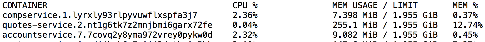

Go微服务理论基础介绍
=========================

## 领域概述

下图是我们整个系列文章中构建的系统领域整体视图。然而，我们将从头开始写我们的第一个Go微服务，然后当我们沿着博客系列的部分进展时，我们将会越来越接近下面的图所代表的结构。

图例基本如下:

- 虚线白框: 在一个或多个节点上运行的逻辑Docker Swarm集群。
- 蓝色框: 来自Spring Cloud/Netflix OSS栈或其他服务例如Zipkin的支持服务。
- 沙色/白盒: 实际的微服务。

它或多或少和Magnus Larssons微服务博客系列中使用的领域相同，主要区别在于实际微服务是使用Go嵌入Java来实现的。qutoes-service是一个例外，它为我们提供了基于JVM的微服务, 我们可以用于和我们的基于Go的微服务的无缝集成对比以及测试平台。

## 理论基础: 运行信息
有人会问，为什么我们要使用Go来写微服务呢? 除了可以使用这么有趣和具有创造性的语言干活之外，使用Go构建微服务的主要理由是具有微小的内存占用。让我们看看下面的截图，我们正运行在Docker Swarm下的Go微服务以及基于Spring Bot和Spring Cloud架构的微服务。

quotes-service是Spring启动的，而compservice和accountservice是基于Go的。两者都是使用大量类库部署和Spring Cloud基础设施集成起来用于处理HTTP的服务器。

2017年真的重要吗? 看看Java实现的微服务和Go实现的微服务所占的内存大小，就会让我们感觉到吃惊, 相差几十倍。确实如此，对于大型企业来说，运行数十个服务都是少的，很多公司会运行成千上万的放在云提供上的微服务。当我们运行大量的容器，节约资源会为公司节省大量的资金。

## 中英文对照
- 运行信息: Runtime footprint, 参考链接: https://bbs.csdn.net/topics/40266756。

