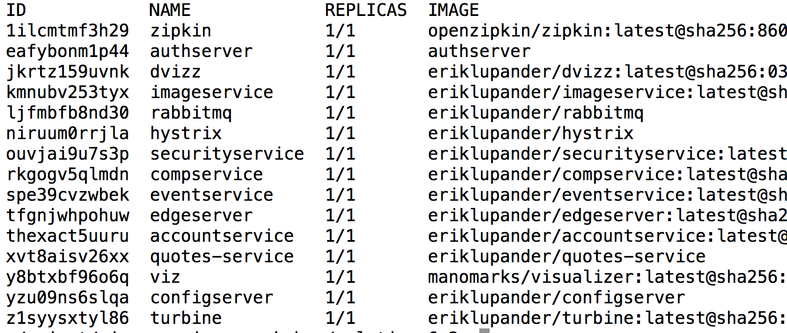

Go微服务理论基础介绍
=========================

## 领域概述

下图是我们整个系列文章中构建的系统领域整体视图。然而，我们将从头开始写我们的第一个Go微服务，然后当我们沿着博客系列的部分进展时，我们将会越来越接近下面的图所代表的结构。


图例基本如下:

- 虚线白框: 在一个或多个节点上运行的逻辑Docker Swarm集群。
- 蓝色框: 来自Spring Cloud/Netflix OSS栈或其他服务例如Zipkin的支持服务。
- 沙色/白盒: 实际的微服务。

它或多或少和Magnus Larssons微服务博客系列中使用的领域相同，主要区别在于实际微服务是使用Go嵌入Java来实现的。qutoes-service是一个例外，它为我们提供了基于JVM的微服务, 我们可以用于和我们的基于Go的微服务的无缝集成对比以及测试平台。

## 理论基础: 运行信息
有人会问，为什么我们要使用Go来写微服务呢? 除了可以使用这么有趣和具有创造性的语言干活之外，使用Go构建微服务的主要理由是具有微小的内存占用。让我们看看下面的截图，我们正运行在Docker Swarm下的Go微服务以及基于Spring Bot和Spring Cloud架构的微服务。


quotes-service是Spring启动的，而compservice和accountservice是基于Go的。两者都是使用大量类库部署和Spring Cloud基础设施集成起来用于处理HTTP的服务器。

2017年真的重要吗? 看看Java实现的微服务和Go实现的微服务所占的内存大小，就会让我们感觉到吃惊, 相差几十倍。确实如此，对于大型企业来说，运行数十个服务都是少的，很多公司会运行成千上万的放在云提供上的微服务。当我们运行大量的容器，节约资源会为公司节省大量的资金。

## 微服务的非功能性需求
本文不仅仅是关于如何使用Go语言构建微服务的 - 它同样是一个在Spring Cloud环境中表现良好的，并且是符合一个生产就绪的微服务领域所需要的品质。

考虑如下(顺序无特殊考虑):
- 集中化配置: Centralized configuration.
- 服务发现: Service Discovery.
- 日志: Logging.
- 分布式跟踪: Distributed Tracing.
- 断路器: Circuit Breaking.
- 负载均衡: Load balancing.
- 边界: Edge.
- 监控: Monitoring.
- 安全: Security.

所有这些东西我认为当你决定尝试微服务的时候都需要考虑的，而不用管你具体使用Go语言、Java语言、js、python、C#还是其他你喜欢的语言来编码。这个博客序列我们从Go语言的视角来揭示所有的这些话题。

另外一个视角是在你实际的微服务实现中的东西。不管你来自什么语言，你都可能有提供了如下功能的类库:

- HTTP/RPC/REST/SOAP/诸如此类的API.
- 持久化API(DB客户端、JDBC、O/R映射).
- 消息API(MQTT、AMQP、JMS).
- 可测试性(单元测试/集成测试/系统测试/验收测试).
- 构建工具(CI/CD)
- 更多...

我不会涵盖这些话题的所有内容。如果我要这么做，我将会写一本书而不是博客系列文章。我将涵盖它们中的一小部分。


## 在Docker Swarm模式下运行
这些文章系列中的系统领域的基本前提是我们的运行环境是Docker Swarm。意思就是所有服务 - 支持服务(配置服务器、边界服务等)或实际微服务实现都是部署为Docker Swarm服务中的。 当我们到文章序列末尾的时候，有如下Docker命令:


再次请注意，上面列举的服务包含了我们在第五部分设置我们的Swarm阵列的时候会包含的很多服务。

## 性能
好吧 - 因为Go微服务占用很小的内存信息 - 但是它们能执行吗? 有意图的对标不同编程语言是非常难的。也就是说， 如果我们拿例如benchmarkgame这样的网站来看，人们可以提交明确算法的各种语言中的实现, 然后互相进行性能比较，Go语言一般稍微比Java 8快些，稍微有点意外。 Go语言实际通常和C++对比稍微慢一点，只是基于一些基准测试场景而言。也就是说, Go语言对于一般的微服务工作负载来说执行很好 - 服务HTTP/RPC, 序列化/反序列化数据结构, 处理网络I/O等等。

Go语言另外一个特别重要的属性就是它具有垃圾回收机制的语言。在Go 1.5的垃圾回收主要重写之后，GC暂停一般几乎应该就几毫秒的样子。如果你来自JVM世界(我自己就是)，Go语言的垃圾回收器可能还不是那么成熟，但是在Go 1.2以后引入的一些改变让它似乎已经非常可靠了。这也是一个不可配置的奇迹--也有一个球形把手(GOGC), 你可以微调Go语言中的GC行为, 可以控制相对可到达对象的总堆尺寸。

然而 - 跟踪性能影响，因为我们将构建我们第一个微服务，并且添加诸如断路器、跟踪、日志等东西到里边， 这样可以非常有意思，因此我们在后面的文章中将使用Gatling测试, 来看我们不断向微服务添加更多功能后的性能变化。

## 启动时间
Go应用程序的另外一个好特点就是它启动非常快。简单的带有一些路由、JSON序列化等的HTTP服务器一般启动时间最多100微秒。当我们在Docker容器中运行我们的Go微服务，我们可以看到它们健康的就绪服务最多数秒以内， 而我们相关的Spring Boot类型的微服务一般需要至少10秒才能就绪。虽然这不是最重要的特点，但是它肯定是有用的，当你的环境需要通过快速扩展来处理无法预料的大访问量。

## 静态链接二进制文件
基于Go语言的Docker微服务的另外一个大好处是，我们可以在一个可执行二进制文件中获得静态链接的二进制所有依赖关系。虽然文件本身不是很紧凑(一个微服务一般来说具有10-20Mb的样子), 最大的好处是我们能得到非常简单的Dockerfile，并且我们可以使用非常裸露的基础Docker映像。 我使用了一个基础映像叫做iron/base, 它大概只有6MB。
```
FROM iron/base

EXPOSE 6868
ADD eventservice-linux-amd64 /
ENTRYPOINT ["./eventservice-linux-amd64", "-profile=test"]
```

换句话说就是 - 没有JVM或其他运行时的必要组件, 除了标准C库(libc)之外，都是包含在基本映像之中的。

我们将在后续文章中更加深入到如何构建我们的二进制以及-profile=test的一些东西。

## 总结
本篇文章中，我们介绍了一些使用Go语言构建微服务的一些关键因素: 例如内存信息占用少、良好的性能以及便捷的静态链接二进制。

## 中英文对照
- 运行信息: Runtime footprint, 参考链接: https://bbs.csdn.net/topics/40266756。
- 单元测试: Unit Test.
- 集成测试: Integration Test.
- 系统测试: System Test.
- 验收测试: Acceptance Test.
- 持续集成: Continuous Integration.
- 持续部署: Continuous Deployment.


## 参考链接
- [Gatling test](https://gatling.io/): Web应用程序的性能测试。
- [构建我们第一个Go语言微服务](2.md)
