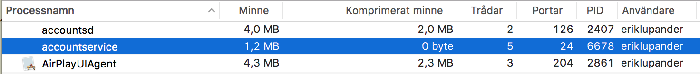

第二部分: Go微服务 - 构建我们的第一个服务
===========================================

第二部分包含:
- 设置我们的Go工作空间。
- 构建我们第一个微服务。
- 通过HTTP使用Gorilla Web Toolkit来提供一些JSON服务。

## 介绍
虽然通过HTTP提供JSON服务不是内部服务和外部服务的唯一选择，但本文聚焦的是HTTP和JSON. 使用RPC机制和二进制消息格式(例如Protocol Buffer)也用于内部通信或外部通信也是非常有趣的，特别是当外部消费者属于另外一个系统的时候。Go语言有内置的RPC支持，并且gRPC也是完全值得看看的。 然而，我们现在只聚焦基于由http包和Gorilla Web Toolkit提供的HTTP。

另外一个需要考虑的方面是很多有用的框架(安全、跟踪等等), 依赖于HTTP头来传输参与者正在进行的请求状态。我们在本文中将看到的例子是我们如何在头中传递相关ID和OAuth票据。虽然其他协议当然也支持类似的机制， 很多框架都是以HTTP构建的，我更愿意尽可能的保持我们的集成更加直接。

## 设置Go工作空间
如果你是一个经验丰富的Go开发者，你可以随意跳过本节内容。 以我拙见，Go语言工作空间结构需要一些时间来适应。一般来说我习惯使用项目根作为工作空间的根，Go语言约定了如何恰当的构造工作空间，因此go编译器可以查找源代码和依赖，有点不正统， 将源代码放在子目录下源码控制路径后以src命名的目录中.我强烈推荐读下官方指南和本文，然后再开始。 我希望我就是这样的。

### 安装SDK
在开始写我们第一行代码之前(或check out完整代码之前), 我们需要安装Go语言SDK。建议按照官方指导来操作，直接操作就足够了。

### 设置开发环境
在这些博客系列中，我们将使用我们安装的内置的Go SDK工具来构建和运行我们的代码，以及按照惯用方式来设置Go的工作空间。

#### 1. 创建工作空间的根目录
所有命令都基于OS X或Linux开发环境。 如果你运行的是Windows, 请采用必要的指令。

```
mkdir ~/goworkspace
cd goworkspace
export GOPATH=`pwd`
```

这里我们创建了一个根目录，然后将GOPATH环境变量赋于那个目录。这就是我们的工作空间的根目录，我们所写的所有Go语言代码和第三方类库都在它下面。我推荐添加这个GOPATH到.bash_profile文件或类似的配置文件中，这样不需要每次都为每个控制台窗口重置它。

#### 2. 为我们第一个项目创建文件夹和文件
鉴于我们已经在工作空间的根目录(例如，和在GOPATH环境变量中指定相同的目录), 执行下面的语句:
```
mkdir -p src/github.com/callistaenterprise
```

如果你希望遵循自己的编码，可以执行下面的命令:
```
cd src/github.com/callistaenterprise
mkdir -p goblog/accountservice
cd goblog/accountservice
touch main.go
mkdir service
```

或者你可以clone这个git仓库，包含相同代码，并切换到P2分支。 从上面你创建的src/github.com/callistaenterprise/goblog.git目录， 执行下面的命令。
```
git clone https://github.com/callistaenterprise/goblog.git
cd goblog
git checkout P2
```

记住: $GOPATH/src/github.com/callistaenterprise/goblog是我们项目的根目录，并且实际是存储在github上面的。

那么我们结构已经足够可以很方便开始了。 用你喜欢的IDE打开main.go文件。

## 创建服务 - main.go
Go语言中的main函数就是你具体做事的地方 - Go语言应用程序的入口点。 下面我们看看它的具体代码：
```go
package main

import (
	"fmt"
)

var appName = "accountservice"

func main() {
	fmt.Printf("Starting %v\n", appName)
}
```

然后运行该程序:
```
> go run path/to/main.go
Starting accountservice
```

就是这样的，程序只打印了一个字符串，然后就退出了。是时候添加第一个HTTP端点了。

## 构建HTTP web服务器
> 注意: 这些HTTP示例的基础是从一个优秀的博客文章派生出来的, 见参考链接。

为了保持代码整洁，我们把所有HTTP服务相关的文件放到service目录下面。

### 启动HTTP服务器
在service目录中创建webservice.go文件。

```go
package service

import (
	"log"
	"net/http"
)

func StartWebServer(port string) {
	log.Println("Starting HTTP service at " + port)
	err := http.ListenAndServe(":"+port, nil) // Goroutine will block here

	if err != nil {
		log.Println("An error occured starting HTTP listener at port " + port)
		log.Println("Error: " + err.Error())
	}
}
```

上面我们使用内置net/http包执行ListenAndServe, 在指定的端口号启动一个HTTP服务器。


然后我们更新下main.go代码:
```go
package main

import (
	"fmt"
	"github.com/callistaenterprise/goblog/accountservice/service" // 新增代码
)

var appName = "accountservice"

func main() {
	fmt.Printf("Starting %v\n", appName)
	service.StartWebServer("6767") // 新增代码
}
```

然后再次运行这个程序，得到下面的输出:
```
> go run *.go
Starting accountservice
2017/01/30 19:36:00 Starting HTTP service at 6767
```

那么现在我们就有一个HTTP服务器，它监听localhost的6767端口。然后curl它:
```go
> curl http://localhost:6767
404 page not found
```

得到404完全是意料之中的，因为我们还没有添加任何路由呢。

Ctrl+C停止这个web服务器。

### 添加第一个路由
是时候让我们的服务器提供一些真正的服务了。我们首先用Go语言结构声明我们的第一个路由，我们将使用它来填充Gorilla路由器。 在service目录中，创建一个routes.go文件。
```go
package service

import (
	"net/http"
)

// Define a single route, e.g. a human readable name, HTTP method and the pattern the function that will execute when the route is called.

type Route struct {
	Name        string
	Method      string
	Pattern     string
	HandlerFunc http.HandlerFunc
}

// Defines the type Routes which is just an array (slice) of Route structs.
type Routes []Route

var routes = Routes{
	Route{
		"GetAccount", // Name
		"GET",        // HTTP method
		"/accounts/{accountId}", // Route pattern
		func(w http.ResponseWriter, r *http.Request) {
			w.Header().Set("Content-Type", "application/json; charset=UTF-8")
			w.Write([]byte("{\"result\":\"OK\"}"))
		},
	},
}
```
上面代码片段，我们声明了一个路径/accounts/{accountId}, 我们后面会用curl来访问它。Gorilla也支持使用正则模式匹配、schemes, methods, queries, headers值等等的复杂路由。因此不限于路径和路径参数。

我们在响应的时候，硬编码了一个小的JSON消息：
```json
{
    "result": "OK"
}
```

我们还需要一些模式化的代码片段，将我们声明的路由挂钩到实际的Gorilla Router上。 在service目录，我们创建router.go文件:
```go
package service

import (
	"github.com/gorilla/mux"
)

// Function that returns a pointer to a mux.Router we can use as a handler.
func NewRouter() *mux.Router {
	// Create an instance of the Gorilla router
	router := mux.NewRouter().StrictSlash(true)

	// Iterator over the routes we declared in routes.go and attach them to the router instance
	for _, route := range routes {
		// Attach each route, uses a Builder-like pattern to set each route up.
		router.Methods(route.Method).
			Path(route.Pattern).
			Name(route.Name).
			Handler(route.HandlerFunc)
	}

	return router
}
```

### 导入依赖包
在router.go中的import区域, 我们声明了依赖github.com/gorilla/mux包。 我们可以通过go get来获取依赖包的源代码。

### WRAPPING UP
我们可以再回到webserver.go文件，在函数StartWebServer开始位置加入下面两行代码。
```go
func StartWebServer(port string) {
    r := NewRouter()
    http.Handle("/", r)
}
```

这就将我们刚创建的Router绑定到http.Handle对/路径的处理。然后重新编译并运行修改后的代码：
```
> go run *.go
Starting accountservice
2017/01/31 15:15:57 Starting HTTP service at 6767
```

然后另开一个窗口，curl如下：
```go
> curl http://localhost:6767/accounts/10000
{"result":"OK"}
```
很好，我们现在有了我们第一个HTTP服务。

## 信息及性能(FOOTPRINT AND PERFORMANCE)
鉴于我们正在探索基于Go的微服务，由于惊人的内存占用和良好的性能，我们最好能快速进行基准测试来看看它们如何执行的。
我已经开发了一个简单的[Gatling](https://gatling.io/)测试, 可以使用GET请求对/accounts/{accountId}进行捶打。 如果之前你是直接从https://github.com/callistaenterprise/goblog.git克隆的代码，那么你的源代码中就包含有负载测试代码goblog/loadtest。或者可以直接查看https://github.com/callistaenterprise/goblog/tree/master/loadtest。

### 你自己运行一下负载测试
如果你需要自己运行负载测试工具，确保accountservice服务已启动，并且运行在localhost的6767端口上。并且你已经checkout我们的P2分支的代码。你还需要Java的运行环境以及需要安装Apache Maven。

改变目录到goblog/loadtest目录下面，在命令行中执行下面的命令。
```cmd
mvn gatling:execute -Dusers=1000 -Dduration=30 -DbaseUrl=http://localhost:6767
```

这样就会启动并运行测试。参数如下:
- users: 模拟测试的并发用户数.
- duration: 测试要运行的秒数.
- baseUrl: 我们要测试的服务的基础路径。当我们把它迁移到Docker Swarm后，baseUrl修改修改为Swarm的公共IP. 在第5部分会介绍。

首次运行，mvn会自动安装一大堆东西。安装完后，测试完成之后，它会将结果写到控制台窗口，同时也会产生一个报告到target/gatling/results中的html中。
### 结果
> 注意: 稍后，当我们的服务运行到Docker Swarm模式的Docker容器中时， 我们会在那里做所有基准测试并捕获度量。

在开始负载测试之前，我们的基于Go的accountservice内存消耗可以从macbook的任务管理器中查看到，大概如下:



1.8MB， 不是特别坏。让我们使用Gatling测试，运行每秒1000个请求。需要记住一点，我们使用了非常幼稚的实现，我们仅仅响应一个硬编码的JSON响应。


服务每秒1000个请求，占用的内存也只是增加到28MB。 依然是Spring Boot应用程序启动时候使用内存的1/10. 当我们给它添加一些真正的功能时，看这些数字变化会更加有意思。

### 性能和CPU使用率


提供每秒1000个请求，每个核大概使用8%。


注意，Gatling一回合子微秒延迟如何， 但是平均延迟报告值为每个请求0ms, 花费庞大的11毫秒。 在这点上来看，我们的accountservice执行还是表现出色的，在子毫秒范围内大概每秒服务745个请求。

## 下一章
在下一部分, 我们将真正的让accountservice做一些有意义的事情。 我们会添加一个简单的嵌入数据库到Account对象，然后提供HTTP服务。我们也会看看JSON的序列化，并检查这些增加对于足迹和性能的影响。

## 参考链接
- http://callistaenterprise.se/blogg/teknik/2017/02/21/go-blog-series-part2/
- http://thenewstack.io/make-a-restful-json-api-go/
- https://github.com/gorilla/
- [下一节](3.md)
