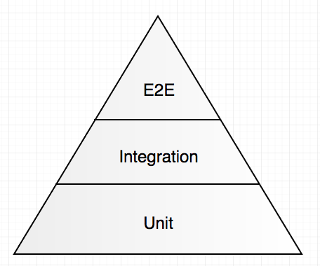

第四部分: Go微服务 - 使用GoConvey进行测试和模拟

如何对待微服务的测试? 当为这个特定领域建立测试策略时，是否需要考虑任何独特的挑战? 在第四部分，我们将看看这些话题。

- 单元上下文中测试微服务的主题。
- 书写GoConvey的BDD样式的单元测试。
- 介绍模拟技术。

既然本部分不会以任何方式改变核心服务, 这个时候无需基准测试。

## 微服务测试介绍
首先，我们在脑海中应该记住测试金字塔的原则。

单元测试应该构成测试的大部分， 因为集成测试、e2e测试、系统测试和验收测试开发和维护成本越来越高。

第二，微服务肯定有一些独特的测试挑战，而其中一部分就如同在为实际测试服务实现确定软件架构时使用的健全的原则(sound principles)。 也就是说，我认为微服务的细节超出了传统单元测试的的范围，这也正是本章内容要处理的问题。

不管怎样，我想强调几个点:
- 像平常一样进行单元测试: 你的业务逻辑、转换器、验证器等都没有什么神奇的，因为它们都是在微服务上下文中运行的。
- 集成组件，如和其他服务通信、发送消息、访问数据库等操作的客户端应该考虑使用依赖注入和可模拟的形式设计。
- 许多微服务细节: 访问配置、和其他服务通信、弹性测试等等如果不花费大量时间编写一个详单小的值模拟很难进行单元测试。将此类测试保存到类集成测试中，那样在测试代码中实际上将依赖的服务作为Docker容器。它将提供更大的价值，也可能更容易跑起来，运行起来。

## 源代码

## 其他类型的测试

## 总结

## 关键术语
- 单元测试: Unit Testing. 是测试代码的自身行为。
- 集成测试: Integration Testing. 也叫组装测试或联合测试。 在单元测试的基础上，将所有模块按照设计要求(如根据结构图)组装成子系统或系统，进行集成测试。
- E2E测试: End to End Testing. 是一种模拟用户行为的测试。
- 系统测试: System Testing. 是对整个系统的测试，将硬件、软件、操作人员看作一个整体，检验它是否有不符合系统说明书的地方。这种测试可以发现系统分析和设计中的错误。如安全测试是测试安全措施是否完善，能不能保证系统不受非法侵入。再例如，压力测试是测试系统在正常数据量以及超负荷量(如多个用户同时存取) 等情况下是否还能正常地工作。
- 验收测试: Acceptance Testing. 验收测试是部署软件之前的最后一个测试操作。在软件产品完成了单元测试、集成测试和系统测试之后，产品发布之前所进行的软件测试活动。它是技术测试的最后一个阶段，也称为交付测试。验收测试的目的是确保软件准备就绪，并且可以让最终用户将其用于执行软件的既定功能和任务。
- 测试驱动开发: TDD(Test Driven Development).
- 行为驱动开发: BDD(Behavior Driven Development).

## 参考链接
- [测试金字塔](https://martinfowler.com/bliki/TestPyramid.html)
- [GoConvey](http://goconvey.co/)
- http://callistaenterprise.se/blogg/teknik/2017/03/03/go-blog-series-part4/
- [下一节](5.md)
