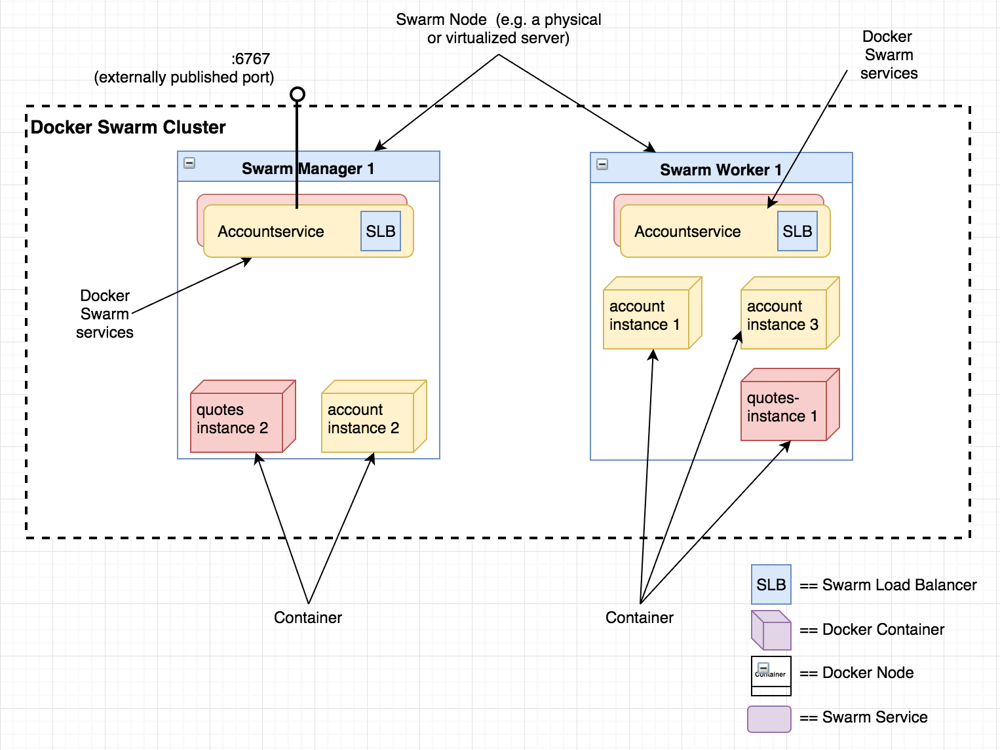
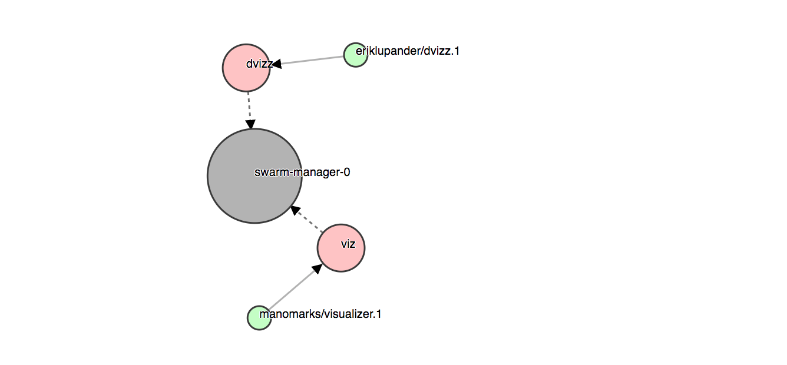

第五部分: Go微服务 - 在Docker Swarm中部署
===========================================
这一部分，我们将让我们的accountservice服务运行在本地部署的Docker Swarm集群上运行，并讨论容器编配的核心概念。

本文处理下面的内容:
- Docker Swarm和容器编配。
- 使用Docker容器化我们的accountservice服务。
- 配置本地Docker Swarm集群。
- 以Swarm服务的方式部署accountservice服务。
- 运行基准测试并搜集度量值。

小心藏地鼠: 在写完博客系列的这部分，我意识到本部分没有Go特定的什么东西。 我依然希望你能喜欢它。

## 什么是Docker编配(CONTAINER ORCHESTRATOR)
在开始实操之前，快速介绍一下容器编配的概念可能会有用。

随着应用程序变得越来越复杂，并且需要处理更高的负载，我们不得不处理这样的一个事实，我们成千上万的服务实例遍布大量物理硬件上。容器编配允许我们将所有硬件作为单个逻辑实体看待。

[容器编排](https://thenewstack.io/containers-container-orchestration/)这篇文章总结如下:
> 容器编排: 通过抽象主机基础设施，编排工具允许用户将整个集群当作单个部署目标看待。

我自己不能很好的总结它 - 使用容器编排器，例如Kubernetes或Docker Swarm，可以允许我们在一个或多个可用的基础设施上将我们的软件组件部署为服务。 在Docker的情况中 - Swarm模式是关于管理叫做swarm的Docker引擎集群的。 Kubernetes使用了一种稍微不同的术语和关键抽象层次结构, 但是总体上来说概念大致相同。

容器编排器不仅为我们处理服务的生命周期， 还为服务发现、负载均衡、内部寻址和日志提供了机制。

## Docker Swarm中的核心概念
在Docker Swarm中有三个概念需要介绍:

- 节点(Node): 节点是Swarm中参与的Docker引擎实例。从技术上讲，可以将其视为拥有自己CPU资源、内存、网络接口的主机。 节点可以是管理节点，也可以是worker节点。
- 服务(Service): 服务是执行在worker节点的东西， 由容器映像和你指示容器执行的命令定义的。服务可以是复制的，也可以是全局的。服务可以视为一种抽象，用于让任意数量的容器形成一个可以通过它的名字, 而无需知道环境内部的网络拓扑情况的情况下在集群内或集群外访问逻辑服务。
- 任务(Task e.g. container): 对所有实用手段而言，可以认为任务就是Docker容器。 Docker文档定义任务就是承载Docker容器和在容器内运行的命令的一些东西。 管理器节点将启动容器运行在给定服务中指定的容器镜像中的任务赋予给(worker)节点。

下面的图展示了我们的微服务景观的一种可能(简化版)部署，其中两个节点总共运行了五个容器实例，通过两个服务accountservice和quotes-service抽象的。



## 源代码
本部分没有对Go代码进行任何修改，只是添加了一些新的文件, 用于在Docker上运行服务。

```
// https://github.com/callistaenterprise/goblog/tree/P5/accountservice
git checkout P5
```
## 将我们的AccountService容器化
### Docker安装
Docker安装，参考[官网安装指导](https://docs.docker.com/engine/installation/)。

### 创建Dockerfile
Dockerfile是Docker用于构建docker容器映像的, 包含所有你希望包含的东西。让我们开始在/accountservice目录下面创建一个Dockerfile吧。

```
FROM iron/base

EXPOSE 6767
ADD accountservice-linux-amd64 /
ENTRYPOINT ["./accountservice-linux-amd64"]
```

快速解释:
- FROM: 定义我们将要开始构建我们自己映像来源的基本映像。 iron/base是非常适合运行Go应用程序的映像。
- EXPOSE: 定义我们希望在Docker网络内部暴露的可以到达的端口号。
- ADD: 添加一个文件accountservice-linux-amd64到容器文件系统的根目录/。
- ENTRYPOINT: 定义当Docker启动这个映像容器时要运行的可执行文件。

### 为另外一种CPU架构/操作系统进行构建
正如你所见，我们在文件名后面添加了linux-amd64。当然我们可以随意使用名字来定义Go语言可执行文件， 但是我喜欢这样的约定，将OS和目标CPU平台放到可执行文件名中。 我写这个博客的时候，使用的是mac os x。 因此如果我只是直接在accountservice目录下面运行go build来构建的话， 会在同一个目录下面产生一个accountservice可执行文件。但是这样的文件在Docker容器中，底层OS是基于Linux的。因此，我们在构建之前，需要设置一些环境变量, 这样编译器和链接器知道我们在为另外的OS、CPU架构进行构建， 我们这里的例子是linux。

```
export GOOS=linux
go build -o accountservice-linux-amd64
export GOOS=darwin
```

上面使用-o标志产生一个可执行二进制文件。 我通常写一个小脚本来为我自动化执行。

既然OS X和linux-based的容器都是运行在AMD64 CPU架构，因为我们无需设置(并重置)GOARCH环境变量。 但是如果你为32位OS构建或ARM处理器构建，就需要在构建之前恰当的设置GOARCH。

### 创建一个Docker映像
那么现在可以构建我们第一个Docker映像来包含我们的可执行文件。进入accountservice父级目录， 应该是$GOPATH/src/github.com/callistaenterprise/goblog。

当构建Docker容器映像时，我们通常使用[prefix]/[name]的命名约定来对其名字打标签。我一般使用我们的github用户名做前缀， 例如eriklupander/myservicename。对于这个博客系列，我们使用someprefix前缀。 在项目根目录(eg: ./goblog)下面执行下面的命令来基于上面的Dockerfile来构建一个Docker映像。

- 在goblog/accountservice目录构建accountservice-linux-amd64可执行文件。
- 构建Docker映像。
```
// 在goblog目录执行构建Docker镜像
docker build -t someprefix/accountservice accountservice/
Sending build context to Docker daemon  14.34kB
Step 1/4 : FROM iron/base
latest: Pulling from iron/base
ff3a5c916c92: Pull complete
43f18fea29ad: Pull complete
Digest: sha256:1489e9c1536af14937ac7f975b8529cbe335672b7b87dae36c6b385d3e4020c0
Status: Downloaded newer image for iron/base:latest
 ---> b438fe7f76e9
Step 2/4 : EXPOSE 6767
 ---> Running in 4246258b66c1
Removing intermediate container 4246258b66c1
 ---> 5113056caf24
Step 3/4 : ADD accountservice-linux-amd64 /
ADD failed: stat /var/lib/docker/tmp/docker-builder076553391/accountservice-linux-amd64: no such file or directory
AppledeMacBook-Pro-2:goblog apple$ docker build -t someprefix/accountservice accountservice/
Sending build context to Docker daemon  7.457MB
Step 1/4 : FROM iron/base
 ---> b438fe7f76e9
Step 2/4 : EXPOSE 6767
 ---> Using cache
 ---> 5113056caf24
Step 3/4 : ADD accountservice-linux-amd64 /
 ---> 7a21b55920e3
Step 4/4 : ENTRYPOINT ["./accountservice-linux-amd64"]
 ---> Running in 5b7115e2f89d
Removing intermediate container 5b7115e2f89d
 ---> 3e23a4268533
Successfully built 3e23a4268533
Successfully tagged someprefix/accountservice:latest
```

很好，我们现在本地docker镜像仓库包含了名为someprefix/accountservice的映像。 如果我们想要运行多个节点或者想要共享我们的镜像， 我们可以使用docker push来将镜像对其他我们当前Docker引擎提供的host之外的host拉取后可用。

然后我们可以直接通过命令行运行这个映像。
```
docker run --rm someprefix/accountservice
Starting accountservice
Seeded 100 fake accounts...
2018/05/16 02:57:37 Starting HTTP service at 6767
```

然而请注意，容器不再是运行在你主机OS的localhost了。它现在位于他自己的网络上下文，并且我们不能直接从我们的主机操作系统实际访问。 当然有办法修复，但是我们先不深入下去，我们先对Docker Swarm进行局部设置，并部署accountservice。

我们先使用Ctrl + C终止这个运行的镜像。

## 配置单节点Docker Swarm集群
本博客的一个目标就是我们想让我们的微服务运行在容器编排上。 对于我们很多人来说，一般意味着Kubernetes或Docker Swarm。 当然也有其他编排器, 例如Apache Mesos和Apcera, 但是本文明确聚焦的是Docker 1.13的Docker Swarm上的。

当在你的开发计算机上配置单节点Docker Swarm集群的时所需做的任务可能依赖于Docker自身怎么安装有关。 建议遵照[Swarm Tutorial](https://docs.docker.com/engine/swarm/swarm-tutorial/)， 或者你可以使用[我的方式](https://github.com/callistaenterprise/goblog/blob/master/extras/docker-setup.md), 使用Docker Toolbox, Oracle Virtualbox和docker-machine, 是基于我同事Magnus lab-repo的关于[服务发现](https://github.com/callistaenterprise/cadec-2017-service-discovery)的文章。

### 安装VirtualBox
VirtualBox是一款开源的虚拟机软件。如果使用Windows或OS X系统安装Docker Swarm， 需要安装这个软件。

下载地址: http://download.virtualbox.org/virtualbox/4.3.24/VirtualBox-4.3.24-98716-OSX.dmg

### 安装Boot2Docker
boot2docker是一个专为Docker而设计的轻量级Linux发型包，解决Windows或者OS X用户不能安装Docker的问题。 Boot2Docker完全运行于内存中，24M大小，启动仅5-6秒。

下载地址: https://github.com/boot2docker/windows-installer/releases。

### 创建Swarm管理器
Docker Swarm集群至少包含一个Swarm管理器和零到多个Swarm worker。 这里为了简单起见，我们只使用一个Swarm管理器 - 这里最少一个。在这节之后，重要的是你需要让Swarm Manager启动并运行起来。

我们这里的例子，使用docker-machine并制作一个虚拟linux机器运行在我们的Swarm管理器的VirtualBox。 这里我们使用"swarm-manager-1"来标示这个管理器。 你也可以参看官方文档看如何创建Swarm。

我们使用下面的命令来初始化docker-machine主机，并标示其为swarm-manager-1作为swarm-manager-1节点相同的swarm节点的ip地址。

```
docker $(docker-machine config swarm-manager-1) swarm init --advertise-addr $(docker-machine ip swarm-manager-1)
```

如果我们需要创建多节点的Swarm集群，我们将确保存储上面命令产生的连接token, 稍后如果我们需要添加额外节点到swarm中。

### 创建一个覆盖网络(CREATE AN OVERLAY NETWORK)
Docker的覆盖网络是一种当我们给Swarm添加类似"accountservice"到上面的时候使用的一种机制，这样它能访问在同一个Swarm集群中的其他容器，而无需知道实际的集群拓扑结构。
使用下面的命令创建一个网络:

```
docker network create --driver overlay my_network
```

这里我们给网络起名为my_network。

## 部署AccountService服务
几乎都已就绪，现在让我们开始部署我们自己的"accountservice"来作为一个Swarm服务吧。docker service create命令接收很多参数，但的确也不疯狂。 下面是我们发布"accountservice"的命令:
```
docker service create --name=accountservice --replicas=1 --network=my_network -p=6767:6767 someprefix/accountservice
```

下面是参数的快速解释:
- name: 为我们的服务赋予一个逻辑名称。 这个名字也是集群中其他服务用于定址该服务所使用的名字。 因此另外一个服务想要调用accountservice, 那个服务只需要做一个GET请求: http://accountservice:6767/accounts/10001即可。
- replicas: 我们服务想要的实例数目。如果我们Docker Swarm集群是多节点的， swarm引擎将自动在这些节点之间进行分布。
- network: 这里我们告诉服务绑定我们刚才创建的覆盖网络名。
- p: 映射, [内部端口号]:[外部端口号]。 这里我们使用6767:6767, 但是如果我们使用6767:80，那么我们在外部调用的时候就要通过端口号80进行服务访问。注意这是一种可以让我们服务从集群外部可以到达的一种机制。通常来说，你无需对外暴露服务。而通常，我们会使用边界服务器(例如: 反向代理)，这样可以有一些路由规则，并且可以有安全配置，这样外部消费者不能到达你的服务，除非你使用一种自愿的方式。
- someprefix/accountservice: 这个参数指定了我们希望容器运行的映像的名字。在我们这个例子中是我们在创建容器的时候指定的标签。 注意！如果我们要运行多节点集群，我们需要将我们的映像推送到Docker仓库中，例如推送到公共(免费)的Docker Hub服务上。 当然我们也可以设置私有docker仓库，或者付费来保持镜像免费。

就是这样了。运行下面的命令来看我们的服务是否成功启动了。
```
> docker service ls
ID            NAME               REPLICAS  IMAGE                      
ntg3zsgb3f7a  accountservice     1/1       someprefix/accountservice
```

很甜美。 我们现在可以使用curl或通过浏览器来查询我们的API。唯一需要知道的就是前面是Swarm的公网IP。即便我们在很多节点的swarm中为我们的服务只运行了一个实例， 覆盖网络和Docker Swarm允许我们请求任意的swarm主机基于端口号来访问服务。也就是说，两个服务在外部不能使用同一端口号暴露。 他们内部端口号可以相同， 但是对外来说必须唯一。

无论如何，请记住我们之前保存的环境变量ManagerIP的值。

```
> echo $ManagerIP
192.168.99.100
```

如果已经改变了终端会话，可以重新导出它。
```go
export ManageIP=`docker-machine ip swarm-manager-0`
```

下面curl请求API:
```
> curl $ManagerIP:6767/accounts/10000
{"id":"10000","name":"Person_0"}
```

非常不错，成功了。

### 部署一个可视化工具
使用docker的命令行API来检查Swarm的状态是完全可行的(docker service ls), 但是使用更加图形化的呈现，看起来更有意思。 例如可视化的有[Docker Swarm Visualizer](https://github.com/ManoMarks/docker-swarm-visualizer), 我们同样可以像部署刚才accountservice服务一样的方式部署这个可视化服务工具。 这样我们可以有另外一种方式来查看我们的集群拓扑结构。 也可以用于确保集群中我们是否让某个服务暴露到给定端口号。

我们可以从预烘培的容器镜像来安装visualizer, 就一行命令:
```
docker service create \
  --name=viz \
  --publish=8080:8000/tcp \
  --constraint=node.role==manager \
  --mount=type=bind,src=/var/run/docker.sock,dst=/var/run/docker.sock \
  manomarks/visualizer
```

这样我们就可以通过8000端口来访问它。直接通过http://$ManagerIP:8000, 记住刚才的ManagerIP的值。


### 令人沸腾的内容!
我也开发了一个小的Swarm可视化器，叫做dvizz, 使用的是Go语言、Docker Remote API和D3.js产生图形。 同样可以使用下面的命令安装这个服务:
```
docker service create \
   --constraint node.role==manager \
   --replicas 1 --name dvizz -p 6969:6969 \
   --mount type=bind,source=/var/run/docker.sock,target=/var/run/docker.sock \
   --network my_network \
   eriklupander/dvizz
```

直接访问http://$ManagerIP:6969, 可以看到类似的展示:




看起来有点潦草， 但是不要太认真，它还是非常有趣的， 看看涂上蹦蹦跳跳、上下缩放服务器、随意拖放每个节点。

### 添加其他服务，例如quotes-service
微服务领域现在只有一个服务(我们普遍存在的accountservice)。 下面我们部署一个前面提到的Spring Boot类型的微服务"Quotes-service", 这个微服务我已经放在公共的Docker仓库中，可以直接部署它。

```
docker service create --name=quotes-service --replicas=1 --network=my_network eriklupander/quotes-service
```

如果使用docker ps来列举运行的Docker容器，我们可能会看到它已经启动了(或正在启动中)。
```
> docker ps
CONTAINER ID    IMAGE                       COMMAND                 CREATED         STATUS                           PORTS                                           NAMES
98867f3514a1    eriklupander/quotes-service "java -Djava.security"  12 seconds ago  Up 10 seconds (health: starting) 8080/tcp 
```

注意这里我们没有导出这个服务的端口映射，意味着它不能从集群外部访问，只有内部通过内部端口8080访问。 我们会在后面第七部分服务发现和负载均衡中来集成这个服务。

如果你已经在集群中添加了dvizz服务，你会看到图中会多出一个quotes-service。

### copyall.sh脚本
要简化事情，我们可以添加一个shell脚本来帮我们做重新构建和重新部署的自动化工作。在goblog的根目录下面，创建一个copyall.sh文件:
```sh
#!/bin/bash
export GOOS=linux
export CGO_ENABLED=0

cd accountservice;go get;go build -o accountservice-linux-amd64;echo built `pwd`;cd ..

export GOOS=darwin

docker build -t someprefix/accountservice accountservice/

docker service rm accountservice
docker service create --name=accountservice --replicas=1 --network=my_network -p=6767:6767 someprefix/accountservice
```

这个脚本设置了GOOS环境变量，这样我们可以安全的为Linux/AMD64架构构建静态链接二进制文件, 然后运行一些docker命令来重新构建映像文件以及重新部署到Swarm服务里边。 可以节约时间，并且少输入很多字母。

Go语言项目的构建，我不在本文中深入介绍。 个人认为，我喜欢shell脚本的简洁，虽然我自己也经常使用gradle插件，并且也知道一个好的ol的make也是相当流行。

## FOOTPRINT AND PERFORMANCE
从现在起，所有的基准测试和搜集CPU/内存度量将用于Docker Swarm中部署的服务。 这意味着之前的文章结果和现在开始之后的结果不可比。

CPU使用和内存使用将使用Docker stats搜集，同时我们会使用之前使用的Gatling测试。

如果你自己运行负载测试， 那么在第二部分引入的要求依然适用。 请注意，需要修改baseUrl参数为Swarm Manager节点的IP, 例如:
```
mvn gatling:execute -Dusers=1000 -Dduration=30 -DbaseUrl=http://$ManagerIP:6767
```

## 总结
到目前为止，我们已经学到如何在本地启动Docker Swarm领域(只有一个节点), 以及如何打包和部署我们的accountservice微服务作为Docker Swarm的服务。

下一节，我们会给我们的微服务添加心跳检查。

## 参考链接

- http://callistaenterprise.se/blogg/teknik/2017/03/09/go-blog-series-part5/
- [Dockerfile](https://docs.docker.com/engine/reference/builder/)
- [Gradle插件](https://plugins.gradle.org/plugin/org.echocat.golang)
- [ol's make, GNU make](https://www.gnu.org/software/make/)
- [下一节](6.md)
