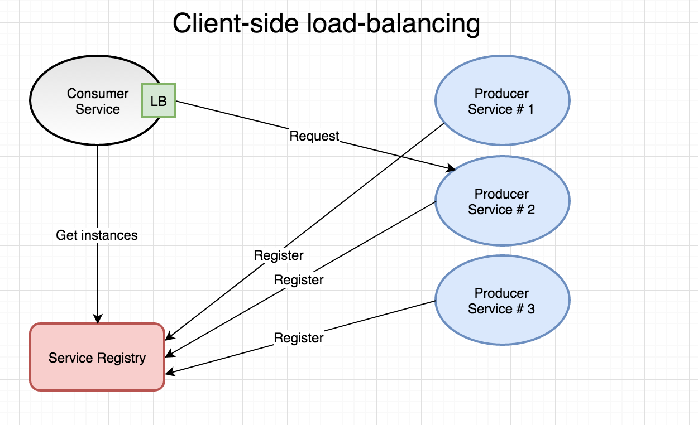
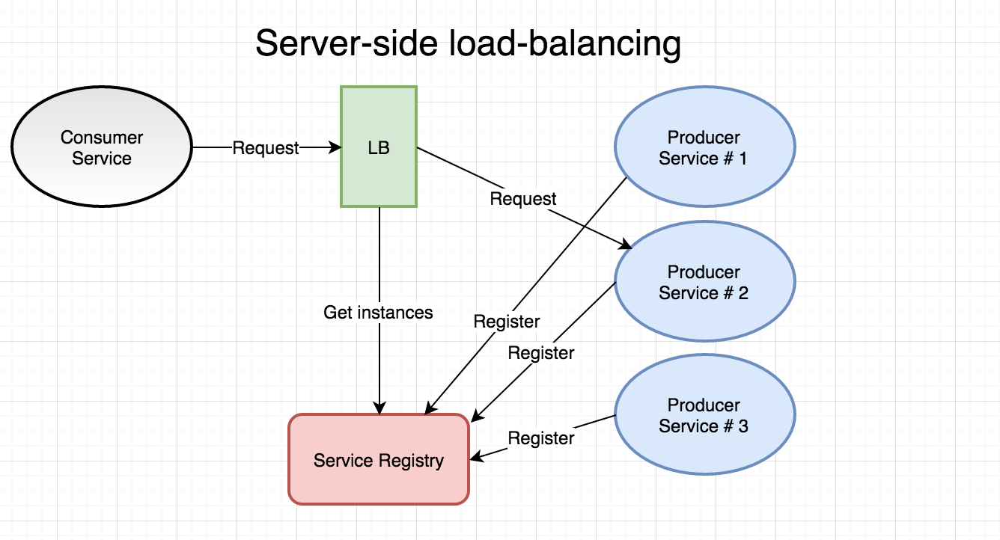
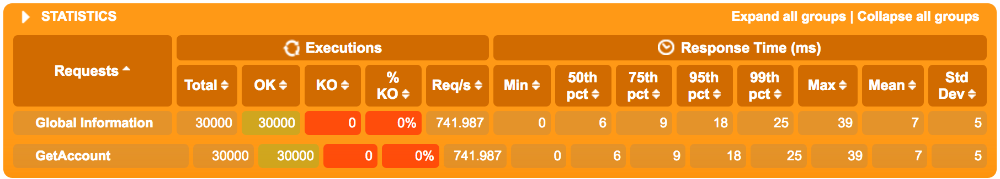
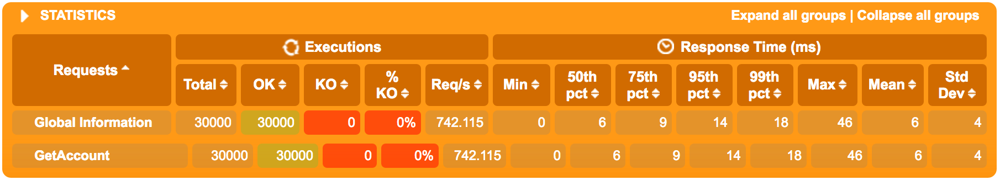

第七部分: Go微服务 - 服务发现和负载均衡
===========================================
本部分处理一个健全的微服务架构的两个基本部分 - 服务发现和负载均衡 - 以及在2017年, 它们如何促进重要的非功能需求的水平扩展。

## 简介
负载均衡是很出名的概念了，但我认为服务发现需要更深入的理解， 我先从一个问题开始。

> 如果服务A要和服务B通话，但是却不知道到哪里找服务B如何处理?

换句话说， 如果我们服务B在任意数量的集群节点上运行了10个实例, 则有人需要跟踪这10个实例。

因此，当服务A需要与服务B通信时，必须为服务A提供至少一个适当的IP地址或主机名(客户端负载均衡), 或者服务A必须能够委托地址解析和路由到第三方给一个已知的服务B的逻辑名(服务端负载均衡). 在微服务领域不断变化的上下问中，这两种方式都需要出现服务发现。在最简单的形式中，服务发现只是为一个或多个服务注册运行实例。

如果这对你来说听起来像DNS服务, 它确实如此。区别在于服务发现用于集群内部，让微服务互相能找到对方，而DNS一般是更加静态的、适用于外部路由，因此外部方可以请求路由到你的服务。此外，DNS服务和DNS协议通常不适合处理具有不断变化微服务环境的拓扑结构，容器和节点来来往往，客户端通常也不遵循TTL值、失败监测等等。

大多数微服务框架为服务发现提供一个或多个选项。 默认情况下，Spring Cloud/Netflix OSS使用Netflix Eureka(支持Consul, etcd和ZooKeeper)， 服务使用已知的Eureka实例来注册自己，然后间歇性的发送心跳来确保Eureka实例知道它们依然活跃着。Consul提供了一个包含DNS集成的丰富的特征集的选项已经变得越来越流行。 其他流行的选项是分布式和可复制key-value存储的使用， 例如etcd中服务可以注册自己。Apache ZooKeeper也将会意识到这样需求的一群人。

本文，我们主要处理Docker Swarm提供的一些机制(Docker in swarm mode)，并展示我们在第五部分探索的服务抽象，以及它实际上如何为我们提供服务发现和服务端负载均衡的。另外，我们也会看看我们单元测试中使用gock模拟HTTP请求输出的模拟, 因为我们再做服务间通信。

> 注意: 当我们引用Docker Swarm的时候，我指的是以swarm mode运行Docker 1.12以上版本。"Docker Swarm"在Docker 1.12之后不再作为一个独立的概念存在了。

### 两种类型的负载均衡
在微服务领域，通常会区分上面提到的两种类型的负载均衡:

- 客户端负载均衡.
- 服务端负载均衡.

**客户端负载均衡**
由客户端查询发现服务来获取它们要调用服务的实际地址信息(IP, 主机名, 端口号), 找到之后，它们可以使用一种负载均衡策略(比如轮询或随机)来选择一个服务。此外，为了不必要让每个即将到来的调用都查询发现服务，每个客户端通常都保持一份端点的本地缓存，这些端点必须与来自发现服务的主信息保持合理同步。 Spring Cloud中客户端负载均衡的一个例子是Netflix Ribbon。类似的东西在etcd支持的go-kit生态中也存在。客户端负载均衡的一些优点是具有弹性、分散性以及没有中心瓶颈，因为每个服务消费者都自己保持有生产端的注册。 缺点就是具有较高的内部服务复杂性，以及本地注册可能会包含过时条目的风险。



**服务端负载均衡**
这个模型中，客户端依赖负载均衡，提供服务逻辑名来查询它要调用服务的合适实例。这种操作模式通常称为代理， 因为它既充当负载均衡器又充当反向代理。我认为它的主要优点就是简单。 负载均衡器和服务发现机制一般都内置于你的容器编排器中，你无需关心安装和管理这些组件。另外，客户端(e.g. 我们的服务)不需要知道服务注册 - 负载均衡器为我们负责这些。 依赖负载均衡器来路由所有呼叫可能降低弹性，并且负载均衡器在理论上来说可能成为性能的瓶颈。



> 注意：当我们使用swarm模式的Docker的服务抽象时, 例如上面的服务端的生产服务注册实际上对作为开发者的你来说是完全透明的。也就是说，我们的生产服务甚至不会意识到它们在操作服务端负载均衡的上下文(或者甚至在容器编排的上下文中). Swarm模式的Docker负责我们全部的注册、心跳、取消注册。

在blog系列的第2部分中，我们一直在使用的例子域中, 我们可能想要请求accountservice，让它从quotes-service获取当前的随机报价。 在本文中，我们将集中使用Docker Swarm的服务发现和负载均衡机制。如果你对如何集成基于Go语言的微服务和Eureka感兴趣， 可以参考我[2016年的一篇博客](http://callistaenterprise.se/blogg/teknik/2016/05/27/building-a-microservice-with-golang/)。我还编写了一个简单的自用的集成Go应用和Eureka[客户端类库](https://github.com/eriklupander/eeureka)，它包含有基本的生命周期管理。

## 消费服务发现信息
假设你想构建一个定制的监控应用程序，并需要查询每个部署服务的每个实例的/health端点(路由)。你的监控程序如何知道需要请求的ip和端口呢? 你需要掌握实际的服务发现细节。如果你使用的是Docker Swarm来作为服务发现和负载均衡的提供者，并且需要这些IP, 你如何才能掌握Docker Swarm为我们保存的每个实例的IP地址呢? 对于客户端解决，例如Eureka， 你只需要使用它的API来消费就可以了。然而，在依赖编排器的服务发现机制的情况中，这可能不那么简单了。我认为需要追求一个主要选择, 以及一些次要选择来考虑更具体的用例。

### Docker远程API
首先，我建议使用Docker的远程API - 例如使用来自服务内的Docker API来查询Swarm Manager的服务和实例信息。毕竟，你正在使用容器编排器的内置服务发现机制，那也是你应该查询的源头。对于可移植性，这是一个问题， 你可以总是为你选择的编排器选择一个适配器。 但是，应该说明的是，使用编排器的API也有一些注意事项 - 它将你的解决方案和特定容器API紧密的联系在一起， 你必须确保你的应用程序可以和Docker Manager进行对话， 例如，它们会意识到它们正在运行的一些上下文，使用Docker远程API的确有些增加了服务复杂度。

### 替代方案(ALTERNATIVES)
* 使用另外一个单独的服务发现机制 - 即运行Netflix Eureka, Consul或类似的东西，并确保除了Docker Swarm模式的机制外，在这些服务发现机制中也可以发现可注册/取消注册的微服务。然后我们只需要使用发现服务的注册/查询/心跳等API即可。我不喜欢这个选项，因为它引入了更多复杂的东西到服务中，当Swarm模式的Docker可以或多或少透明的为我们处理这些里边的大部分的事情。我几乎认为这是一种饭模式，如果除非你必须要这么做，否则还是不要这样了。
* 应用特定的发现令牌 - 在这种方式中，服务想要广播它们的存在，可以周期性的在一个消息话题上post一个带有IP, 服务名等等的发现令牌。消费者需要了解实例以及它们的IP, 可以订阅这个话题(Topic), 并保持它自己的服务实例注册即时更新。当我们在稍后的文章中看不使用Eureka的Netflix Turbine， 我们就会使用这个机制来向一个定制的Turbine发现插件提供信息。这种方式有点不同，因为它们不需要充分利用完整的服务注册表 - 毕竟，在这个特定的用例中，我们只关心特定的一组服务。

## 源代码
请放心的切出本部分的代码: https://github.com/callistaenterprise/goblog/tree/P7。

## 扩展和负载均衡
我们继续本部分，看看如何扩展我们的accountservice, 让它们运行到多个实例中，并且看我们是否能让Docker Swarm自动为我们将请求负载均衡。

为了想要知道具体什么实例真正的为我们提供服务，我们需要给Account添加一个字段， 我们可以使用生产服务实例的IP地址填充它。打开/accountservice/model/account.go文件。
```go
type Account struct {
    Id string `json:"id"`
    Name string  `json:"name"`
    
    // NEW
    ServedBy string `json:"servedBy"`
}
```
然后在提供account服务的GetAccount方法中为account添加ServedBy属性。
```go /accountservice/service/handlers.go
func GetAccount(w http.ResponseWriter, r *http.Request) {
	// Read the 'accountId' path parameter from the mux map
	var accountId = mux.Vars(r)["accountId"]

    // Read the account struct BoltDB
	account, err := DBClient.QueryAccount(accountId)

    account.ServedBy = getIP()      // NEW, add this line
    ...
}

// ADD THIS FUNC
func getIP() string {
    addrs, err := net.InterfaceAddrs()
    if err != nil {
        return "error"
    }
    for _, address := range addrs {
        // check the address type and if it is not a loopback the display it
        if ipnet, ok := address.(*net.IPNet); ok && !ipnet.IP.IsLoopback() {
            if ipnet.IP.To4() != nil {
                return ipnet.IP.String()
            }
        }
    }
    panic("Unable to determine local IP address (non loopback). Exiting.")
}
```
我们使用getIP()获取机器IP,然后填充给ServedBy。在真正的项目中，getIP函数应该放在具体的工具包中，这样每个微服务需要获取非回送IP地址(non-loopback ip address)的时候都可以使用它。

然后使用copyall.sh重新构建并部署accountservice服务。
```
./copyall.sh
```

等待几秒钟，然后输入下面命令:
```
> docker service ls
ID            NAME             REPLICAS  IMAGE
yim6dgzaimpg  accountservice   1/1       someprefix/accountservice
```

使用curl访问如下:
```
> curl $ManagerIP:6767/accounts/10000
{"id":"10000","name":"Person_0","servedBy":"10.255.0.5"}
```

很好，我们已经看到响应中包含有容器的IP地址了。下面我们对这个服务进行扩展。

```
> docker service scale accountservice=3
accountservice scaled to 3
```

等几秒钟，然后再执行docker service ls进行查看，得到下面的内容:
```
> docker service ls
ID            NAME             REPLICAS  IMAGE
yim6dgzaimpg  accountservice   3/3       someprefix/accountservice
```

上面表示accountservice被复制了3份。然后再进行curl多次请求account, 看看我们是否每次都得到不一样的ip地址呢。

```
curl $ManagerIP:6767/accounts/10000
{"id":"10000","name":"Person_0","servedBy":"10.0.0.22"}

curl $ManagerIP:6767/accounts/10000
{"id":"10000","name":"Person_0","servedBy":"10.255.0.5"}

curl $ManagerIP:6767/accounts/10000
{"id":"10000","name":"Person_0","servedBy":"10.0.0.18"}

curl $ManagerIP:6767/accounts/10000
{"id":"10000","name":"Person_0","servedBy":"10.0.0.22"}
```
在10.0.0.22处理完当前请求之前，我们可以看到4次调用分别在三个实例之内循环。这种使用Docker Swarm服务抽象的容器编排提供的负载均衡是非常有吸引力的，因为它把基于负载均衡(例如Netflix Ribbon)的客户端的复杂性去掉了, 并且我们可以负载均衡而无需依赖服务发现机制来为我们提供能调用的IP地址列表。此外，从Docker Swarm 1.3不会路由任何流量到那些没有报告它们自己是健康的节点上, 前提是实现了健康检查。这就非常重要，当你需要将规模变大或变小的时候，特别是你的服务非常复杂的时候，可能需要超过几百毫秒来启动我们当前需要的accountservice。

## FOOTPRINT AND PERFORMANCE WHEN SCALING
有趣的是，如果我们将accountservice实例从1个扩展为4个的时候如何影响延迟和CPU/内存使用的。当Swarm模式的负载均衡器轮询我们请求的时候是不是有实质性的开销?

```
docker service scale accountservice=4
```

等待几秒，让所有事情就绪。

### 在负载测试时CPU和内存使用情况
使用每秒1000个请求来运行Gatling测试。

```
CONTAINER                                    CPU %               MEM USAGE / LIMIT       
accountservice.3.y8j1imkor57nficq6a2xf5gkc   12.69%              9.336 MiB / 1.955 GiB 
accountservice.2.3p8adb2i87918ax3age8ah1qp   11.18%              9.414 MiB / 1.955 GiB 
accountservice.4.gzglenb06bmb0wew9hdme4z7t   13.32%              9.488 MiB / 1.955 GiB 
accountservice.1.y3yojmtxcvva3wa1q9nrh9asb   11.17%              31.26 MiB / 1.955 GiB
```

非常好，我们四个实例几乎完全享有相同的工作负载， 我们看到另外3个新实例内存保持在10M以内， 鉴于这样的情况，每个实例应该不需要服务超过250个请求/s。

### 性能
首先，Gatling引用一个实例:


然后，Gatling引用4个实例:


区别不是很大 - 但是不应该啊 - 所有四个服务实例毕竟都运行在同样的虚拟主机Docker Swarm节点, 并且共用相同的底层硬件(例如我的笔记本)。如果我们给Swarm添加更多可视化实例，它们可以利用未使用主机OS的资源, 那么我们会看到更大的延迟减少，因为它将被分离到不同的逻辑CPU等上来处理负载。然而，我们看到性能的稍微增加，平均大概百分之95/99。我们可以完全得出一个结论， 在这个特定的场景中，Swarm模式负载均衡对性能没有什么负面影响。

## 带出Quote服务
还记得我们在第5部分部署的Java实现的quote服务吗? 让我们将它也扩展多个，然后从accountservice里边调用它，使用quotes-service名。 添加这个的目的是展示服务发现和负载均衡有多透明, 我们唯一需要做的就是要知道我们要调用服务的逻辑服务名。

我们将编辑/goblog/accountservice/model/account.go文件，因此我们的响应会包含一个quote。
```go /goblog/accountservice/model/account.go
type Account struct {
    Id string `json:"id"`
    Name string  `json:"name"`
    ServedBy string `json:"servedBy"`
    Quote Quote `json:"quote"`         // NEW
}

// NEW struct
type Quote struct {
    Text string `json:"quote"`
    ServedBy string `json:"ipAddress"`
    Language string `json:"language"`
}
```
注意，上面我们使用json tag来将来自quotes-service输出的字段映射到我们字节结构体的quote字段，它包含有quote, ipAddress和servedBy字段。

继续编辑/goblog/accountservice/service/handler.go。我们将田间一个简单的getQuote函数，执行一个HTTP调用，请求http://quotes-service:8080/api/quote, 这个请求会返回一个quote值，然后我们用它来产生新的结构体Quote。 我们在GetAccount()方法中调用它。

首先，我们处理下连接: Keep-Alive问题，它会导致负载均衡问题，除非我们明确的恰当配置Go语言的client。在handlers.go中，在GetAccount函数上面添加如下代码:
```go /goblog/accountservice/service/handler.go
var client = &http.Client{}

func init() {
    var transport http.RoundTripper = &http.Transport{
        DisableKeepAlives: true,
    }
    client.Transport = transport
}
```

init函数会确保任何有client实例发出的HTTP请求都具有适当的报头， 确保基于负载均衡的Docker Swarm都能正常工作。接下来，在GetAccount函数中，添加一个包级别的getQuote函数。
```go 
func getQuote() (model.Quote, error) {
    req, _ := http.NewRequest("GET", "http://quotes-service:8080/api/quote?strength=4", nil)
    resp, err := client.Do(req)

    if err == nil && resp.StatusCode == 200 {
        quote := model.Quote{}
        bytes, _ := ioutil.ReadAll(resp.Body)
        json.Unmarshal(bytes, &quote)
        return quote, nil
    } else {
        return model.Quote{}, fmt.Errorf("Some error")
    }
}
```

没有什么特别的。 参数strength=4是quotes-service API特有的，可以用于使它能或多或少的消耗CPU。使用这个请求还有一些问题，我们返回了一个一般化的error。

我们将在GetAccount函数中调用新的getQuote函数, 如果没有发生错误的话，将它的返回值的Quote属性赋给Account实例。
```go 
// Read the account struct BoltDB
account, err := DBClient.QueryAccount(accountId)
account.ServedBy = getIP()

// NEW call the quotes-service
quote, err := getQuote()
if err == nil {
    account.Quote = quote
}
```

> 所有的错误检查是我在Go语言中最不喜欢的事情之一，虽然它能产生很安全的代码，也可以更清楚的表达代码的意图。

## 不产生HTTP请求的单元测试
如果我们运行/accountservice/service/handlers_test.go的单元测试， 它就会失败。 test下面的GetAccount函数现在会尝试发起一个HTTP请求来获取著名的引言， 但是既然没有quote-service运营在特定的URL(我猜想它不能解决任何事), 测试就不能通过。

我们可以有两种可选策略用在这, 给定单元测试一个上下文。

- 将getQuote函数提取为一个接口，提供一种真实实现和一种模拟实现， 就像我们在第四部分，为Bolt客户端那样做的一样。
- 利用HTTP特定的模拟框架来拦截我们将要发出的请求，并返回一个提前确定的响应。

内置httptest包可以为我们开启一个嵌入的HTTP服务器, 可以用于单元测试，但是我更喜欢第三方gock框架，它更加简洁也便于使用。

```go /goblog/accountservice/service/handlers_test.go
func init() {
    gock.InterceptClient(client)
}
```
上面我们添加了一个init函数。这样可以确保我们的http client实例会被gock劫走。

gock DSL为期望发出的HTTP请求和响应提供了细粒度的控制。 在下面的示例中，我们使用New(), Get()和MatchParam()来告诉gock期望http://quotes-service:8080/api/quote?strength=4 GET请求并响应HTTP 200, 并硬编码响应body。

在TestGetAccount函数上面添加如下代码:
```go /goblog/accountservice/service/handlers_test.go
func TestGetAccount(t *testing.T) {
        defer gock.Off()
        gock.New("http://quotes-service:8080").
                Get("/api/quote").
                MatchParam("strength", "4").
                Reply(200).
                BodyString(`{"quote":"May the source be with you. Always.","ipAddress":"10.0.0.5:8080","language":"en"}`)
```

defer gock.Off()确保在当前测试完成后关闭HTTP的劫获， 既然gock.New()会返回http劫获, 这样可能会让后续测试失败。

下面让我们断言期望返回的quote。 在TestGetAccount测试最里边的Convey块中添加新的断言:
```go
Convey("Then the response should be a 200", func() {
    So(resp.Code, ShouldEqual, 200)

    account := model.Account{}
    json.Unmarshal(resp.Body.Bytes(), &account)
    So(account.Id, ShouldEqual, "123")
    So(account.Name, ShouldEqual, "Person_123")
    
    // NEW!
    So(account.Quote.Text, ShouldEqual, "May the source be with you. Always.")
})
```
### 运行测试
```
> go test ./...
?   	github.com/callistaenterprise/goblog/accountservice	[no test files]
?   	github.com/callistaenterprise/goblog/accountservice/dbclient	[no test files]
?   	github.com/callistaenterprise/goblog/accountservice/model	[no test files]
ok  	github.com/callistaenterprise/goblog/accountservice/service	0.011s
```

### 部署并在Swarm上运行

同样我们使用copyall.sh脚本来重新构建和部署。 然后通过curl调用account路由:
```
> curl $ManagerIP:6767/accounts/10000
  {"id":"10000","name":"Person_0","servedBy":"10.255.0.8","quote":
      {"quote":"You, too, Brutus?","ipAddress":"461caa3cef02/10.0.0.5:8080","language":"en"}
  }
```

然后将quotes-service扩展成两个实例。

```
> docker service scale quotes-service=2
```

等待一段时间，大概15-30秒，因为Spring Boot的服务没有Go语言的服务启动快。 然后再使用curl调用几次, 结果可能如下所示:
```
{"id":"10000","name":"Person_0","servedBy":"10.255.0.15","quote":{"quote":"To be or not to be","ipAddress":"768e4b0794f6/10.0.0.8:8080","language":"en"}}
{"id":"10000","name":"Person_0","servedBy":"10.255.0.16","quote":{"quote":"Bring out the gimp.","ipAddress":"461caa3cef02/10.0.0.5:8080","language":"en"}}
{"id":"10000","name":"Person_0","servedBy":"10.0.0.9","quote":{"quote":"You, too, Brutus?","ipAddress":"768e4b0794f6/10.0.0.8:8080","language":"en"}}
```

我们可以看到servedBy很好的在accountservice实例中循环。 我们也可以看到quote的ipAddress字段也有两个不同的IP. 如果我们已经禁用了keep-alive行为的话， 我们可能看到同样的accountservice服务保持同样的quotes-service来提供服务。

## 总结
在本节内容中，我们接触到了微服务上下文中的服务发现和负载均衡的概念, 以及实现了调用其他服务，只需要提供服务逻辑服务名即可。

在第8节中，我们转向另外一个可自由扩展的微服务中最重要的概念, 集中配置。

## 参考连接
- http://callistaenterprise.se/blogg/teknik/2017/04/24/go-blog-series-part7/
- https://github.com/Netflix/eureka
- https://www.consul.io/
- https://github.com/coreos/etcd
- https://zookeeper.apache.org/
- http://callistaenterprise.se/blogg/teknik/2016/05/27/building-a-microservice-with-golang/
- https://github.com/eriklupander/eeureka
- https://github.com/eriklupander/turbine-amqp-plugin
- [gock](https://github.com/h2non/gock)
- [下一节](8.md)
