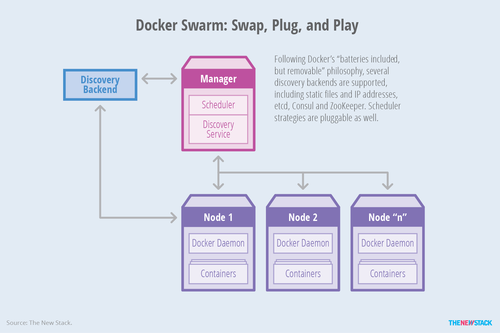
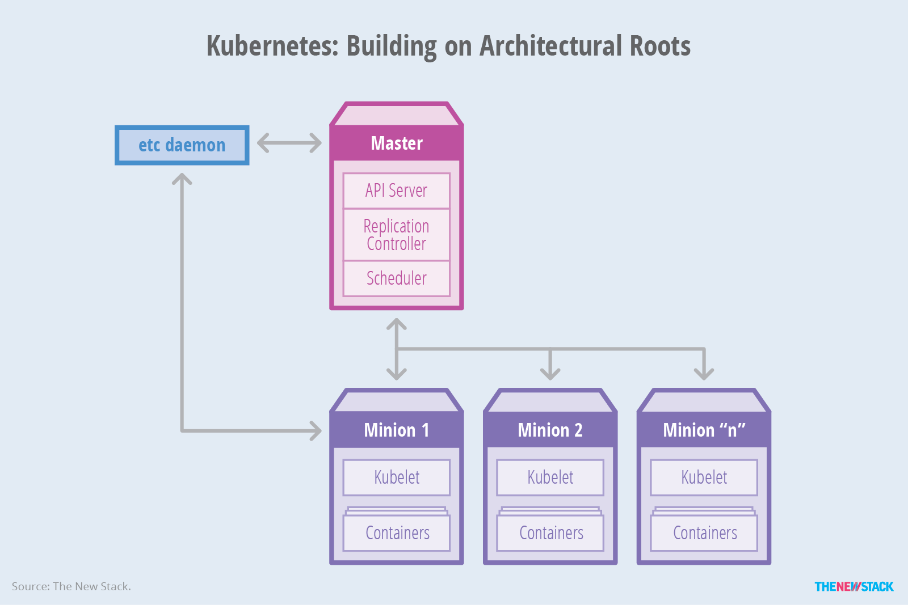
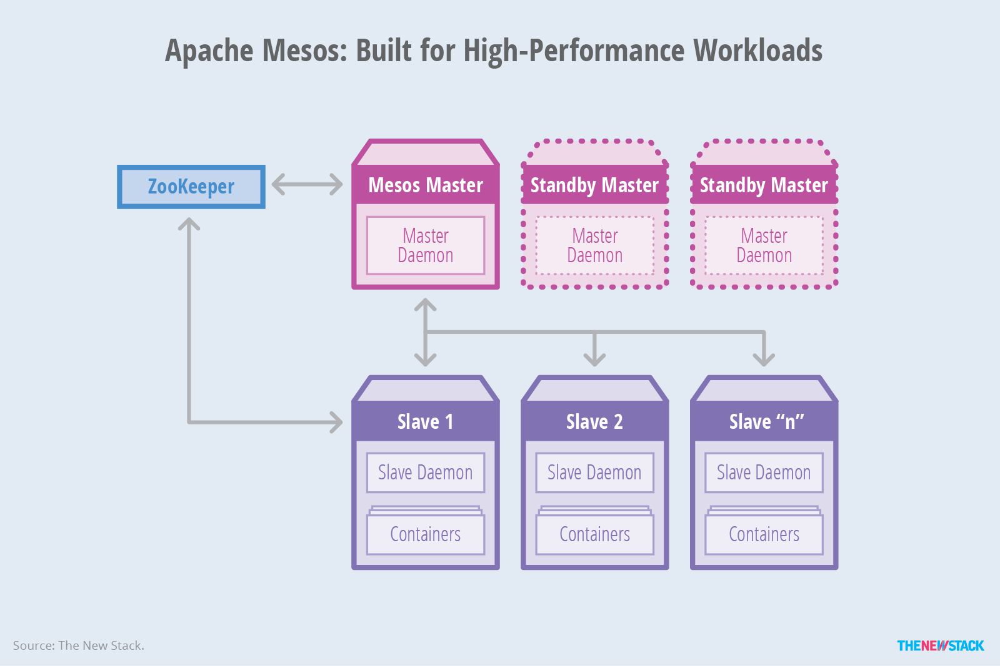

从容器到容器编排
===============

Docker平台以及周边生态系统包含很多工具来管理容器的生命周期。例如，Docker Command Line Interface(CLI)支持下面的容器活动:
- 从注册表中拉取仓库。
- 运行容器并可选的附加一个终端给它。
- 将容器提交新镜像。
- 上传镜像到注册中心。
- 终止运行中的容器。

CLI满足在单个主机上管理容器的需求，但是面对部署在多个主机上的容器时就无所适从了。为了超越单个容器管理，我们必须转向编排工具(业务流程工具)。

编排工具将生命周期管理能力扩展到部署在大量机器集群上部署的复杂的、多容器工作负载。

通过抽象主机基础结构， 编排工具允许用户将整个集群视为单个部署目标。

## 基本特征(Baseline Features) 
编排过程一般涉及应用管理所有方面自动化的工具，例如初始布局、调度和部署到稳态活动例如更新、部署，支持扩展和故障转移的更新和健康监控功能。这些能力已经成为用户希望现代容器编排工具提供的核心特点中的一部分。

## 声明配置
编排工具为DevOps团队提供了一个用于声明应用负载和它的标准方案配置的蓝图选项, 它们使用yaml或json格式。 这些定义还包含支持工作负载的仓库、网络(ports)、存储(volumes)和日志的信息。这种方法允许编排工具多次应用同一配置，并且总是在目标系统上产生相同的结果。 它还允许工具在同一个应用的不同阶段, 例如开发阶段、测试阶段和生产阶段接受不同的配置。

## 规则和限制
工作负载通常对主机放置、性能和高可用具有特殊的策略或要求。例如，在同一主机上提供主备数据库容器是无意义的；它破坏了目的性。类似的，在web服务器同一机器上放置内存缓存可能是个好主意。 编排工具支持定义容易放置的亲和性和约束的机制。

## Provisioning
Provisioning, or scheduling, deals with negotiating the placement of containers within the cluster and launching them. This process involves selecting an appropriate host based on the configuration. Apart from a container-provisioning API, orchestration tools will invoke the infrastructure APIs specific to the host environment.

## Discovery
In a distributed deployment consisting of containers running on multiple hosts, container discovery becomes critical. Web servers need to dynamically discover the database servers, and load balancers need to discover and register web servers. Orchestration tools provide, or expect, a distributed key-value store, a lightweight DNS or some other mechanism to enable the discovery of containers.

## Health Monitoring
Since orchestration tools are aware of the desired configuration of the system, they are uniquely able to track and monitor the health of the system’s containers and hosts. In the event of host failure, the tools can relocate the container. Similarly, when a container crashes, orchestration tools can launch a replacement. Orchestration tools ensure that the deployment always matches the desired state declared by the developer or operator.

## A Closer Look at Three Popular Orchestration Platforms
Docker Swarm
The objective of Docker Swarm is to use the same Docker API that works with the core Docker Engine. Instead of targeting an API endpoint representing one Docker Engine, Swarm transparently deals with an endpoint associated with a pool of Docker Engines. The key advantage to this approach is that the existing tools and APIs will continue to work with a cluster in the same way they work with a single instance. Docker’s tooling/CLI and Compose are how developers create their applications, and therefore, they don’t have to be recoded to accommodate an orchestrator.

Docker Swarm comes with several built-in scheduling strategies, giving users the ability to guide container placement so as to maximize or minimize the spread of containers across the cluster. Random placement is supported as well.

Docker seeks to follow the principle of “batteries included but removable,” meaning that while it currently ships with only a handful of simple scheduling backends, in the future it may support additional backends through a pluggable interface. Based on the scale and complexity of a given use case, developers or operations staff might choose to plug in an appropriate alternative backend.

Docker Swarm supports constraints and affinities to determine the placement of containers on specific hosts. Constraints define requirements to select a subset of nodes that should be considered for scheduling. They can be based on attributes like storage type, geographic location, environment and kernel version. Affinity defines requirements to collocate containers on hosts.

For discovering containers on each host, Swarm uses a pluggable backend architecture that works with a simple hosted discovery service, static files, lists of IPs, etcd, Consul and ZooKeeper.

Swarm supports basic health monitoring, which prevents provisioning containers on faulty hosts.

## Kubernetes
Coming from Google — a company that claims to deal with two billion containers every day — Kubernetes enjoys unique credibility.

Kubernetes’ architecture is based on a master server with multiple minions. The command line tool, called kubecfg, connects to the API endpoint of the master to manage and orchestrate the minions. Below is the definition of each component that runs within the Kubernetes environment:

- Master: The server that runs the Kubernetes management processes, including the API service, replication controller and scheduler.
- Minion: The host that runs the kubelet service and the Docker Engine. Minions receive commands from the master.
- Kubelet: The node-level manager in Kubernetes; it runs on a minion.
- Pod: The collection of containers deployed on the same minion.
- Replication controller: Defines the number of pods or containers that need to be running.
- Service: A definition that allows the discovery of services/ports published by each container, along with the external proxy used for communications.
- Kubecfg: The command line interface that talks to the master to manage a Kubernetes deployment.

The service definition, along with the rules and constraints, is described in a JSON file. For service discovery, Kubernetes provides a stable IP address and DNS name that corresponds to a dynamic set of pods. When a container running in a Kubernetes pod connects to this address, the connection is forwarded by a local agent (called the kube-proxy) running on the source machine to one of the corresponding backend containers.

Kubernetes supports user-implemented application health checks. These checks are performed by the kubelet running on each minion to ensure that the application is operating correctly. Currently, Kubernetes supports three types of health checks:

- HTTP health check: The kubelet will call a web endpoint. If the response code is between 200 and 399, it is considered a success.
- Container exec: The kubelet will execute a command within the container. If it returns “OK,” it is considered a success.
- TCP socket: The kubelet will attempt to open a socket to the container and establish a connection. If the connection is made, it is considered healthy.

## Apache Mesos
Apache Mesos is an open source cluster manager that simplifies the complexity of running tasks on a shared pool of servers. Originally designed to support high-performance computing workloads, Mesos added support for Docker in the 0.20.0 release.

A typical Mesos cluster consists of one or more servers running the mesos-master and a cluster of servers running the mesos-slave component. Each slave is registered with the master to offer resources. The master interacts with deployed frameworks to delegate tasks to slaves. Below is an overview of Mesos’ architecture:

- Master daemon: The mesos-master service runs on a master node and manages slave daemons.
- Slave daemon: The mesos-slave service runs on each slave node to run tasks that belong to a framework.
- Framework: An application definition consisting of a scheduler that registers with the master to receive resource offers, along with one or more executors to launch tasks on the slaves.
- Offer: The list of a slave node’s resources. Each slave node sends offers to the master, and the master provides offers to registered application frameworks.
- Task: The unit of work scheduled by a framework to be executed on a slave node.
- Apache ZooKeeper: The software used to coordinate the collection of master nodes.

Unlike other tools, Mesos ensures high availability of the master nodes using Apache ZooKeeper, which replicates the masters to form a quorum. A high availability deployment requires at least three master nodes. All nodes in the system, including masters and slaves, communicate with ZooKeeper to determine which master is the current leading master. The leader performs health checks on all the slaves and proactively deactivates any that fail.

When Mesos is used in conjunction with Marathon, service discovery can be enabled based on the HAProxy TCP/HTTP load balancer, along with an assistant script that uses Marathon’s REST API to regenerate a HAProxy configuration file periodically. Alternatively, Mesos-DNS, a DNS-based service discovery mechanism, has recently been released in beta.

## Summary
The container ecosystem is growing rapidly. From major infrastructure companies to PaaS vendors to early-stage startups and even in serverless computing, everyone is clamoring to stake out their place in the ecosystem. There are many contributors working on container orchestration tools, as these are essential for deploying real-world applications, thus driving the adoption of Docker and containers. We attempted to highlight some of the key contributors building orchestration tools, but there is more to it than just explicit orchestration tools — it’s also important to look at the build, deployment, CI/CD, PaaS, and other tools that orchestrators interact with, which we cover at great length in the Automation and Orchestration Directory.

## 参考链接
- https://thenewstack.io/containers-container-orchestration/
