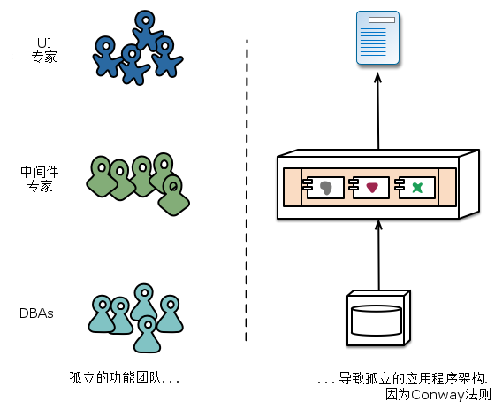
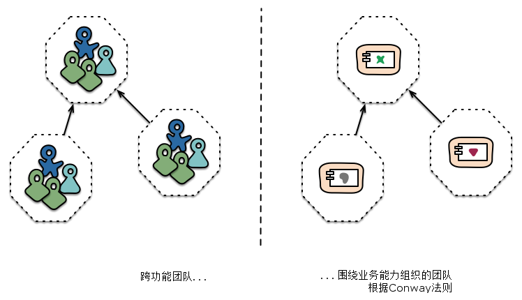
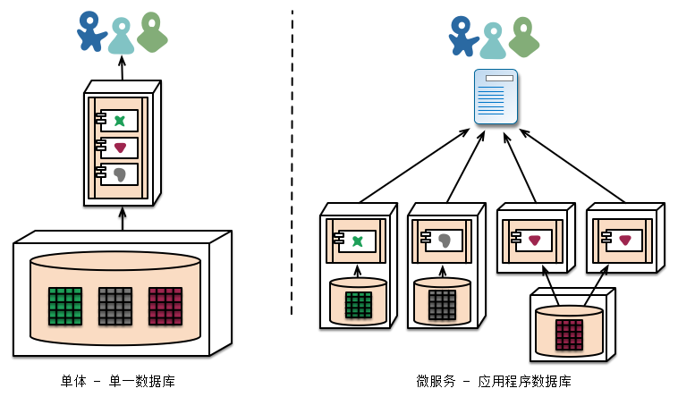
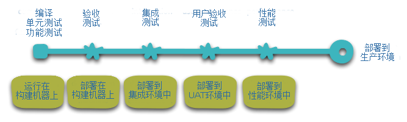
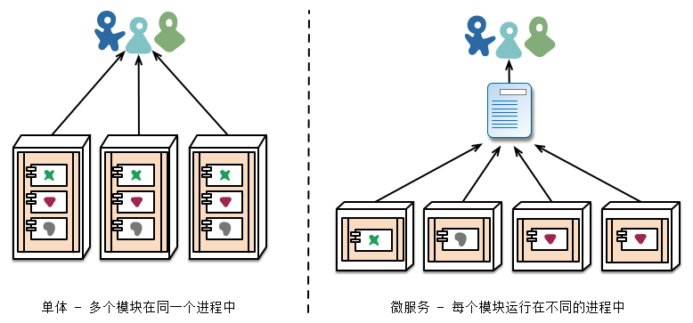

微服务
==============
微服务是一个全新的架构定义术语。

在过去几年中，"微服务架构"这一术语像雨后春笋般涌现出来，它描述了一种将软件应用程序设计成一组独立部署的服务套件的特殊方式。虽然这个架构风格没有确切的定义，但是已经有一些围绕组织、业务能力上的共同特点: 自动化部署、端点智能化、语言与数据的去中心化控制。

微服务 - 是满大街的软件架构中的另外一个新术语。虽然我们自然的倾向是蔑视的瞥它一眼就将它一带而过， 然而我们发现这一术语描述了一种越来越吸引人的软件系统风格。我们已经看到，过去几年中很多项目使用了这种风格，并且到目前为止效果都不错，以致于这已经变成了我们同事在构建企业应用程序时默认使用的架构风格。 然而，遗憾的是并没有太多的信息来概述什么是微服务风格以及应该如何使用这种风格。

简单来说，微服务架构风格就是一种将一个单一应用程序部署为一族小型服务的方式，每个应用运行在自己的进程里，它们通过轻量机制进行通信，通常通过HTTP资源API来通信。这些服务围绕业务能力构建并且可以完全自动化部署机制独立部署。这些服务共用一个非常小的集中化管理， 每个服务可以用不同的语言，并使用不同的数据存储技术实现。

要开始解释微服务风格，有必要将它与单体应用风格做个对比。

单体应用风格是作为一个单独单元构建的。 企业应用通常有三个部分构建：客户端用户界面(HTML页面和运行在用户机器的浏览器中的javascript组成)、数据库(由很多插入到通用的数据库管理系统中的表组成，这些数据库通常都是关系型的。)、服务端应用。服务端应用处理HTTP请求、执行领域逻辑、从数据库检索、更新数据，选择和产生将要发送到浏览器的HTML视图。服务端应用是单体的 - 一个独立逻辑可执行体。 对系统的任何修改都涉及到要构建和发布新版本的服务端应用。

这样的单体服务端是构建这样系统的自然方式。处理请求的所有逻辑都位于一个单独进程中， 允许你使用语言的基本特点将应用分割为类、函数和命名空间。你认真的在开发机上运行测试应用程序，并使用部署管道来保证变更已经被正确的测试并部署到生产环境中。 单体服务可以通过负载均衡后面运行很多实例的方式来横向扩展。

单体应用可能是成功的，但是越来越多使用它们的人感到沮丧 - 特别是随着越来越多的应用要部署到云环境中。 修改周期密切绑定 - 应用的一小部分修改都需要整个单体重新构建和发布。随着时间的推移， 通常很难保持良好的模块化结构， 这使得很难变更只发生在需要变更的模块内。 程序扩展需要扩展整个应用程序，而不是需要更大资源的那部分。

这些挫败(frustration)导致了微服务架构风格: 将应用程序构建为服务包。 除了服务是独立部署和扩展之外，每个服务也提供了一个坚固的模块边界，甚至允许不同服务使用不同语言来实现。同样它们也可以由不同团队来管理。

我们并不认为微服务风格是新颖(novel)或创新的(innovative)，其根源(roots)最少可以追溯到Unix的设计原则。 但是我们确实认为，没有足够的人考虑微服务架构，并且如果使用它的话，很多软件开发将会更好。

## 微服务架构的特点
我们给微服务架构风格给一个正式的定义， 但是我们可以尝试描述我们所看到的符合该架构的一些共性。 正如共性概述的定义一样， 不是所有的微服务架构都具有所有的特性，但是我们确实希望大多数微服务架构具有更多的特点。 虽然我们的作者是这个松散社区的活跃成员，我们的意图是尝试描述我们在自己工作中和我们知道的一些团队的相似努力中的所见所闻。 特别是我们不会制定一些可遵守的定义。

### 通过服务组件化
只要我们还从事软件行业，我们就希望通过将组件插到一起来构建系统， 方式很大程度上像我们在物理世界中看到的东西。在过去的几十年中，我们看到作为大多数语言平台一部分的公共库的大量纲要工作取得了很大的进展。

当谈到组件我们就遇到如何定义组件的问题。我们的定义是组件是一个可独立替换和更新的软件单元。

微服务架构将使用类库，但是组件化的方式主要是拆分服务。 这里我们定义类库(libraries)为链接到程序中，并使用内存函数调用的组件, 而服务(services)是进程外组件，它们通过类似网站服务请求，或远程过程调用的机制来通信。(这点和面向对象程序中的服务对象的概念是不同的。)

使用服务(而不是类库)作为组件的主要原因是服务是独立可部署的。如果你的应用程序在单个进程中包含多个类库，修改任何一个单独组件都会导致整个应用必须重新部署。但是如果应用程序是由多个服务组装的，你可以预测到很多单个服务的改变只需要重新部署那些相关服务。那也不是绝对的，有些改变可能会改变服务接口，导致需要一些协调，但是设计良好的微服务架构目标是通过服务契约中的衔接服务边界和演化机制来减少这些影响。

使用服务作为组件的另外一个结果是具有更加明确的组件接口。 大多数语言没有很好的定义明确发布接口的良好机制。通常它只是防止客户端破坏组件封装的文档和规则，导致组件间过度的紧密耦合。 服务就能很容易通过明确的远程调用机制避免这种情况。

使用这样的服务确实有一些缺点(downsides)。远程调用比进程间调用要更昂贵， 因此远程API需要更粗的粒度， 使用起来往往更笨拙。 如果你需要修改组件间的责任分配，当你在跨进程边界的时候，这样的行为移动就更难达成了。

直观估计，我们可以观察到服务到运行时进程的映射， 但是这只是直观估计而已。一个服务可以由多个一起发布和重新发布的进程组成，例如只能由那个服务使用的应用程序进程和数据库。

### 围绕业务能力组织
当想要把大型应用拆分成多部分是，通常管理层聚焦在技术层面，导致划分为UI团队、服务端逻辑团队、以及数据库团队。 当团队以这种线条来分配的话，即便简单的修改都会导致夸团队项目所需时间和预算的问题。一个敏捷团队将围绕这点进行优化， 两害取其轻 - 只把业务逻辑强制放在它们会访问的应用程序中。换句话说，逻辑无处不在。 这是Conway法则起作用的一个例子。

> 任何设计系统(广泛定义的)的组织将产生一种设计，他的结构就是该组织的通信结构。
> -- Melvyn Conway1967

微服务采用不同的分割方法，划分成围绕业务能力组织的服务。 这些服务采取该业务领域软件的宽栈实现，包括用户接口、持久化存储和任何外部协作。因此团队是跨职能的，包括开发需要的全方位技能： 用户体验、数据库和项目管理。

跨职能团队负责创建和运营产品，产品被划分成若干个体服务，这些服务通过消息总线通信。

大型单体应用程序也总是可以围绕业务能力来模块化，虽然这不是常见的情况。当然，我们将敦促创建单体应用程序的大型团队将团队本身按业务线拆分。我们看到这种情况的主要问题是他们趋向于围绕太多的上下文进行组织。如果单体横跨了多个模块边界，对团队个体成员来说，很难把它们装进他们的短期记忆里。另外，我们看到模块化的路线需要大量的规则来强制实施。服务组件所要求的更加明确的分离，使得它更容易保持团队边界清晰。

> 微服务有多大？
> 虽然，“微服务”已成为这种架构风格的代称，这个名字确实会导致不幸的聚焦于服务的大小，并为“微”由什么组成争论不休。在与微服务实践者的对话中，我们发现有各种大小的服务。最大的服务报道遵循亚马逊两匹萨团队(也就是，整个团队吃两个披萨就吃饱了)的理念，这意味着团队不超过12个人。在更小的规模大小上，我们看到这样的安排，6人团队将支持6个服务。
> 
> 这导致这样一个问题，在服务每12个人和服务每1个人的大小范围内，是否有足够大的不同使他们不能被集中在同一微服务标签下。目前，我们认为最好把它们组合在一起。但随着深入探索这种风格，我们一定有可能改变我们的看法。

### 是产品而非项目
我们看到的很多应用开发效果是使用的项目模式: 目标就是交付一些将要完成的软件。完成后的软件被交接给维护组织，项目构建团队就解散了。

微服务支持者倾向于避免这种模式，更喜欢认为团队应该负责产品的整个声明周期。对此一个共同的启示是亚马逊的"You build, you run it"的原则，其中开发团队完全负责生产环境中的软件。这就让开发人员在日常生产中接触到他们的软件在生产环境中的行为， 增进他们与用户的交互。因为他们必须至少提供一定程度的支持负担。

产品心态和业务能力紧密联系一起。要持续关注软件如何帮助用户增强业务能力，而不是把软件看成是将要完成的一组功能。

没有理由说为什么这些同样的方法不能用于单体应用，但是服务的粒度更小，可以更容易在服务开发者和他们的用户之间建立个人关系。

### 智能端点和哑管道
在不同进程之间构建通信结构的时候，我们已经看到很多产品和方法，将显著的智能性强压进通信机制本身。 一个很好的例子就是企业服务总线(ESB), ESB产品中通常为消息的路由、编排、转换和应用业务规则引入先进的设施。

微服务社区主张另外一种方法: 智能终端和哑管道。基于微服务构建的应用程序的目标是尽可能的解耦并尽可能的具有内聚性 - 它们拥有自己的领域逻辑来接收请求，其行为类似经典的Unix场景中的过滤器, 应用适当的逻辑并产生响应。使用简单的REST风格的协议来编排它们，而不是使用像WS-Choreography或BPEL或中心工具编制(orchestration)等复杂的协议。

最常用的两种协议是使用资源API的请求响应和轻量级消息传递。对第一种协议最好的表达是:
> 本身就是web, 就不要隐藏在web后面了。
> -- Ian Robinson

微服务团队使用的规则和协议，正是构建万维网(在更大程度上，是Unix)的规则和协议。从开发者和运营人员非常少的努力都能让使用的资源缓存。

第二种常用方法是通过轻量级消息总线传递消息。选择的设施是典型的dump(哑的仅仅是扮演消息路由) - 例如RabbitMQ或ZeroMQ之类的简单实现，仅仅提供一种可靠的异步交换结构 - 在服务里，智能仍旧存在于生产和消费消息的终端里。

在单体应用中，组件在进程中执行，它们之间的通信是通过方法调用(method invocation)或函数调用(function call)。把单体应用变成微服务最大的问题在于通信模式的改变。一种单纯的转换是将内存方法调用变成RPC, 这导致频繁通信且性能不好。相反你需要粗粒度通信代替细粒度通信。

#### 微服务与SOA

当我们讨论微服务的时候，常见的问题是它是否仅仅是十年前我们看到的面向服务的架构(SOA)。这一点是有可取之处的，因为微服务风格和SOA赞同的某些主张非常相似。然而，问题是SOA意味着很多不同的东西，而大多数时候，我们遇到的所谓的SOA和这里描述的风格明显不同，这种不同通常由于SOA专注于用于集成单体应用的ESB。

特别是我们已经看到太多搞砸的面向服务实现 - 从趋向于隐藏ESB中的复杂性, 到花费百万并没有产生任何价值的失败的多年举措, 到积极抑制变化的集中治理模型, 这有时候很难看到过去的这些问题。

当然，微服务社区用到的很多技术从开发者在大型组织机构整合服务的经验中成长。Tolerant  Reader模式就是这样的一个例子。使用简单协议是衍生自这些经验的另一个方法，使用网络的努力已经作出原理中央标准的反应。

当然，微服务社区用的很多技术都是从开发者在大型组织整合服务的经验中成长过来的。Tolerant Reader模式就是这样的一个例子。使用简单协议是衍生自这些经验的另一个方法，使用网站的努力已经为远离中心标准的反应作出贡献，坦率的说，中心标准已经达到令人叹为观止的复杂性。(需要一个本体来管理你的本地的任何时候，你就知道你深陷困境。)

SOA的这种常见表现使得一些微服务提倡者完全拒绝SOA标签，尽管其他人认为微服务是SOA的一种形式，也许服务导向做的对。无论那种方式，事实上，SOA意味着如此不同的事情，这就意味着有一个术语来更清晰的定义这种架构风格是有价值的。

### 去中心化管理
集中治理的一个后果是单一技术平台的标准化发展趋势。经验表明，这种方法正在收缩 - 不是每个问题都是钉子，不是每个解决都是锤子。我们更喜欢使用正确的工具来完成工作，而单体应用程序在一定程度上可以利用语言的优势，这不是常见的。

把单体的组件分裂成服务，在构建这些服务是可以有自己的选择。你想使用Node.js开发一个简单的报告页面? 去吧。用C++实现一个特别粗糙的近乎实时的组件？好极了。 你想换用一个更适合组件读操作数据的不同风格的数据库? 我们有技术来重建它。

当然，仅仅是因为你可以做些什么，而不是意味着你应该这样做 - 但是这种方式划分系统意味着你可以选择。

团队在构建微服务时，也更喜欢用不同的方法来达标。它们更喜欢生产有用的工具这种想法，而不是写在纸上的标准，这样其他开发者可以用这些工具解决他们所面临的相似问题。 有时，这些工具通常在实施中收获并与更广泛的群体共享，但不完全使用一个内部开源模型。 现在git和github已经成为事实上的版本控制系统的选择，在内部开发源代码的实践也正变得越来越常见。

Netflix是遵守这一理念的很好的例子。尤其是，以库的形式分享有用的且经过市场检验的代码，这激励其他开发者用类似的方式解决相似的问题，同时还为采用不同方法敞开了大门。共享库倾向于聚焦在数据存储、进程间通信和我们接下来要深入讨论的基础设施自动化的共性问题。

对为服务社区来说，开销特别缺乏吸引力。这并不是说社区不重视服务合约。恰恰相反，因为他们有更多的合约。只是他们正在寻找不同的方式来管理这些合约。像Tolerant Reader和消费者驱动的契约(Consumer-Driven Contracts)这样的模式通常被用于微服务。

这些援助服务合约在独立进化。执行消费者驱动的合约作为构建的一部分，增加了信心并对服务是否在运作提供了更快的反馈。事实上，我们知道澳大利亚的一个团队用消费者驱动的合约这种模式来驱动新业务的构建。他们使用简单的工具定义服务的合约。这已变成自动构建的一部分，即使新服务的代码还没写。服务仅在满足合约的时候才被创建出来 - 这是在构建新软件时避免"YAGNI"困境的一个优雅的方法。围绕这些成长起来的技术和工具，通过减少服务间的临时耦合，限制了中心合约管理的需要。

也许去中心化治理的最高境界就是亚马逊广为流传的build it/run it理念。退队要对他们构建的软件的各方面负责，包括7 * 24小时的运营。 这一级别的责任下绝对是不规范的，但是我们看到越来越多的公司让开发团队负起更多责任。Netflix是采用这一理念的另一家公司。每天凌晨3点被传呼机叫醒无疑是一个强有力的激励， 使你在写代码时关注质量。这是关于尽可能原理传统的集中治理模式的一些想法。

#### 很多语言，很多选择

JVM作为平台的成长就是一个在共同平台内混合语言的一个最新例子。几十年来，shell-out到高级语言利用高层次抽象的优势已经成为一种普遍的做法。如同下拉到机器硬件，用低层次语言写性能敏感的代码一样。然而，很多单体不需要这个级别的性能优化和常见的更高层次的抽象，也不是DSL的。相反，单体通常是单一语言的并趋向于限制使用各种不同技术。

### 去中心化数据管理
去中心化数据管理有很多不同的呈现方式。在最抽象的层面上，这意味着使系统间存在差异的外部世界概念模型。在整合一个大型的企业时，客户的销售视图将不同于支持方的视图。它们确实有可能不同的属性和(更坏的)相同特性, 这些相同属性在语义上有微妙的不同。

这个问题常见于应用程序之间，但也可能发生在应用程序内部，尤其当应用程序被划分成分离的组件时。一个有用的思维方式是有界上下文(Bounded Context)内的领域驱动设计(Domain-Driven Design, DDD)概念。 DDD把一个复杂领域划分成多个有界的上下文，并且映射出它们之间的关系。这个过程对单体架构图和微服务架构都是有用的，但在服务和上下文边界间有天然的相关行，便捷有助于澄清和加强分离，就像业务能力部分描述的那样。

和概念模型的去中心化决策一样，微服务也去中心化数据存储决策。虽然单体应用程序更喜欢单一的逻辑数据库做持久化存储，但企业往往倾向于一系列应用程序共用一个单一的数据库 - 这些决定是提供商授权许可的商业模式驱动的。微服务更倾向于让每个服务管理自己的数据库，或者同一数据库技术的不同实例，或完全不同的数据库系统 - 这就是所谓的混合持久化(Polyglot Persistence)。你可以在单体应用程序中使用混合持久化，但它更常出现在微服务里。

#### 久经考验的标准和执行标准

这里有点两面性，微服务团队倾向于避开企业架构组规定的那种严格的执行标准，但又很乐意使用甚至传统的开放标准，比如HTTP、ATOM和其他微格式。

关键的区别是如何定制标准和如何执行。由诸如IETF等组织管理的标准仅当在世界范围内有几个有用的实现时才变成标准，这往往会从成功的开源项目成长起来。

这些标准是远离企业世界的标准。往往被一个几乎没有近期编程经验的或受供应商过度影响的组织开发的。

对于跨微服务的数据来说，去中心化的责任范围对管理升级有影响。处理更新的常用方法是在更新多个资源时使用事务来保证一致性，这种方法通常用在单体应用中。

使用这样的事务有助于一致性，但是会产生显著的临时耦合，这在横跨多个服务时是有问题的。分布式事务是出了名的难以实现，因此微服务架构强调服务间的无事务协作，必须明确认知到， 对一致性可能只是最终一致性或通过补偿操作处理。

对很多开发团队来说，用这样的方式管理不一致性是一个新的挑战，但这通常与业务实践相匹配的。通常业务处理存在一定程度的不一致，这样可以快速响应需求，同时有某些类型的逆转过程来处理错误。这种权衡是值得的，只要修复错误的代价小于更大的一致性前提下损失业务的代价就行。

### 基础设施自动化
在过去的几年中，基础设施自动化已经发生了巨大变化，特别是云和AWS的演化已经降低了构建、部署和运维微服务的操作复杂度。

许多用微服务构建的产品或系统是由有丰富经验的持续部署以及其前身持续集成的团队构建的。这些团队使用这种方式构建软件，广泛的使用了基础设施自动化。构建线路图如下所示:

既然本文不是关于持续部署的文章，我们只关注几个关键特性。我们希望在软件工作的时候有更多信心，因此我们需要大量自动化测试。促进工作软件管道线条向上意味着我们自动化部署到每个新的环境中。

单体应用可以十分愉快的通过这些环境来构建、测试以及推送。事实证明，一旦让单体应用投入了自动化生产之路，那么部署更多的应用程序就没有那么可怕了。请记住，持续部署的目标之一就是让部署枯燥，那么无论是部署一个还是三个应用，只要部署枯燥就没有关系了。

#### 让它更容易做正确的事情
我们发现不断增加持续交付和持续部署自动化会产生一个副作用, 就是能帮助开发人员和维护人员创造更多有用的工具。创建工具、管理代码库、启动简单服务或添加标准监控和日志这样的工具都现在非常常见了。Web上最好的例子可能就是Netflix的开源工具集，还有一些我们广泛使用的工具集，例如Dropwizard。

我们看到团队使用大量的基础设施自动化的另一个领域是在生产环境中管理微服务时。与我们上面的断言(只要部署是枯燥的)相比，单体和微服务没有太大的差别，各运营场景可以明显不同。

### 设计失效
使用服务作为组件的后果是应用程序需要设计成能够容忍服务失败。任何服务调用都可能因为服务不可用而失败，客户端必须尽可能优雅的应对这种失败。与单体应用设计相比这是一个劣势，因为它引入额外的复杂性来处理它。结果是，微服务团队不断反思服务失效如何影响到用户体验。Netflix的Simian Army在工作日诱导服务甚至是数据中心故障来测试应用程序的弹性和监测。

在生产环境中的这种自动化测试足够给大多数运营团队那种不寒而栗，通常在结束一周的工作之前。这不是说单体风格不能够进行完善的监测设置，只是在我们的经验中比较少见。

#### 断路器和产品就绪代码
断路器(Circuit Breaker)与其他模式如Bulkhead和Timeout出现在《Release it!》中。这些模式是被一起实现的，在构建通信应用程序时，它们是至关重要的。这篇Netflix博文很好的解释了使用这些模式的应用程序。

既然服务随时都可能失败，那么能够快速检测故障，如果可能的话，能自动恢复服务是很重要的。微服务应用程序投入大量比重来进行应用程序的实时监测，既检查架构要素(每秒多少次数据请求)，又检查业务相关指标(例如每分钟收到多少订单)。语义监测可以提供一套早期预警系统，触发开发团队跟进和调查。

这对微服务架构特别重要，因为微服务偏好编排和事件协作，这会带来突发行为。虽然很多专家称赞突发事件的价值，事实的真相是，突发行为有时可能是一件坏事请。监测对于快速发现不良突发行为是至关重要的，所以它可以被修复。

单体可以被构建成和微服务一样透明 - 事实上，它们应该是透明的。不同的是，你绝对需要知道在不同进程中运行的服务是否断开。对同一进程中的库来说，这种透明性是不大可能有用的。

微服务团队希望看到为每个单独的服务设置的完善的监控和日志记录，比如控制面板上显示启动/关闭状态和各种各样的运营和业务相关指标。断路器状态、当前吞吐量和时延的详细信息是我们经常遇到的其他例子。

#### 同步调用被认为是有害的
任何时候，在服务间有大量的同步调用，你将遇到停机的乘法效应。简单地说，就是你的系统的停机时间变成各个组件停机时间的乘积。你面临一个选择，让你的调用变成异步或者管理停机时间。在www.guardian.co.uk，他们已在新平台实现了一个简单的规则 - 每个用户请求一个同步调用，而在Netflix，他们的平台API重设计成在API交换结构(fabric)建立异步性。

### 进化式设计
微服务从业者，通常有进化式设计背景并且把服务分解看做是进一步的工具，使应用程序开发者能够控制他们应用程序中的变更而不减缓变更。变更控制并不一定意味着变更的减少 - 用正确的态度和工具，你可以频繁、快速且控制良好的改变软件。

当你试图把软件系统组件化时，你就面临着如何划分成块的决策 - 我们决定分割我们的应用的原则是什么？组件的关键特性是独立的更换和升级的理念 - 这意味着我们要找到这样的点，我们可以想象重写组件而不影响其合作者。事实上很多微服务群组通过明确地预期许多服务将被废弃而不是长期演进来进一步找到这些点。

卫报网站是被设计和构建成单体应用程序的一个好例子，但它已向微服务方向演化。网站的核心仍是单体，但他们喜欢通过使用调用单体API构建的微服务添加新功能。这种方法对天然临时性的特性特别方便，比如处理体育赛事的专题页面。网站的这样一部分可以使用快速开发语言迅速的被放在一起，并且一旦赛事结束立即删除。在金融机构中，我们看到类似的方法，为一个市场机会添加新服务，并在几个月甚至几周后丢弃掉。

强调可替代性是模块设计更一般原则的一个特例，它是通过变更模式来驱动模块化的。你想保持在同一模块中相同时间改变的事情。系统中很少变更的部分应该和正在经历大量扰动的部分放在不同的服务里。如果你发现你自己不断地一起改变两个服务，这是它们应该被合并的一个标志。

把组件放在服务中，为更细粒度的发布计划增加了一个机会。对单体来说，任何变更都需要完整构建和部署整个应用程序。而对微服务来说，你只需要重新部署你修改的服务。这可以简化和加速发布过程。坏处是，你必须担心一个服务的变化会阻断其消费者。传统的集成方法试图使用版本管理解决这个问题，但是微服务世界的偏好是只把版本管理作为最后的手段。我们可以避免大量的版本管理，通过把服务设计成对他们的提供者的变化尽可能的宽容。

## 微服务是否是将来趋势?

我们写这篇文章的主要目的是讲解微服务的主要思想和原则。通过花时间做这件事情，我们清楚地认为微服务架构风格是一个重要的思想 - 它值得为企业应用程序认真考虑。我们最近用这种风格构建了一些系统，也知道别人用这种风格并赞成这种风格。

那些我们知道的以某种方式开拓这种架构风格的包括亚马逊，Netflix，卫报，英国政府数字服务部门，realestate.com.au，前锋和comparethemarket.com。2013年的会议电路中全是正向微服务类别转移的公司 - 包括Travis CI。此外还有大量的组织长期以来一直在做可归为微服务类别的事情，但是还没有使用这个名字。(这通常被称为SOA - 虽然，正如我们说过的，SOA有许多矛盾的形式。)

尽管有这些积极的经验，但是，我们并不认为我们确信微服务是软件架构的未来发展方向。虽然到目前为止，与单体应用程序相比，我们的经验是正面的，但我们意识到这样的事实，并没有经过足够的时间使我们做出充分的判断。

通常，你的架构决策的真正后果是在你做出这些决定的几年后才显现的。我们已经看到对模块化有强烈愿望的一个好团队用单体架构构建的项目，已经衰败了多年。很多人相信微服务是不太可能出现这种衰败的，因为服务界限是明确的，并且很难围绕它打补丁。然而，知道我们看到经过足够岁月的足够的系统，我们不能真正评估微服务架构有多么成熟。

人们当然有理由希望微服务是多么不成熟。在组件化中做任何努力，成功取决于软件在多大程度上适用于组件化。很难弄清楚组件边界在哪里。进化式设计承认获取正确边界的困难性和使它们易于重构的重要性。但当你的组件是带有远程通信的服务时，那么重构它比重构带有进程内库的服务难很多。跨服务边界移动代码是很困难的，任何接口变更都需要在参与者之间进行协调，需要添加向后兼容层，并且测试也变得更加复杂。

另一个问题是，如果组件不组成的干净利索，那么所有你做的是将复杂度从组件内部转移到组件之间的连接。不仅仅是把复杂性移到周围，它将复杂性移动到一个不太明确、难以控制的地方。在没有服务间的凌乱连接的情况下，当你在看一个小的、简单的组件内部时，你可以很容易的认为事情是更好的。

最后，有团队技能的因素。更熟练的团队倾向于采用新技术。但是对更熟练的团队更有效的一种技术不一定适合于不太熟练的团队。我们已经看到大量的例子，不太熟练的团队构建了凌乱的单体架构，但这需要时间去看当微服务发生这种凌乱时会发生什么。一个差的团队总是创建一个差的系统 - 很难讲在这个例子中微服务会减少这种凌乱还是使它更糟糕。

我们听到的一个合理的说法是，你不应该从微服务架构开始。相反，从单体开始，使它保持模块化，一旦单体成为问题时把它分解成微服务。(虽然这个建议是不理想的，因为一个好的进程内接口通常不是一个好的服务接口。)

所以我们怀着谨慎乐观的态度写了这篇文章。到目前为止，我们已经看到关于微服务风格足以觉得这是一条值得探索的路。我们不能肯定地说，我们将在哪里结束，但软件开发的挑战之一是，你只能基于目前能拿到手的不完善的信息作出决定。

## 中英文对照
- 微服务架构: Microservice Architecture。
- 独立发布服务套件: suites of independently deployable services。
- 业务能力: business capability。
- 自动化部署: automated deployment。
- 语言和数据的非集中式控制: decentralized control of languages and data。
- 单体风格: monolithic application style。
- 坚固的模块边界: firm module boundary。
- 服务契约: service contracts。
- 衔接服务边界: cohesive service boundaries。
- 演化机制: evolution mechanisms。
- Conway法则: Conway law。
- 企业服务总线: ESB(Enterprise Service Bus)。
- 消息路由: Message Routing。
- 编排: choreograpy.
- 转换: transformation。
- 有界上线问: Bounded Context。
- 领域驱动设计: Domain-Driven Design(DDD)。
- 混合持久化: Polyglot Persistence。
- 持续部署: [Continuous Delivery](https://martinfowler.com/bliki/ContinuousDelivery.html)
- 持续集成: [Continuous Integration](https://martinfowler.com/articles/continuousIntegration.html)。

## 工具集
- [Dropwizard](https://github.com/dropwizard/dropwizard): 一个非常简单的用于构建生产就绪的RESTful网站服务的类库。
- [Netflix Genie](https://github.com/Netflix/genie): 分布式大数据编排服务。
- [Netflix Inviso](https://github.com/Netflix/inviso): 一个轻量级工具，它提供了搜索Hadoop作业、可视化性能和查看集群利用的能力。
- [Netflix Lipstick](https://github.com/Netflix/lipstick): Pig可视化框架。
- [Netflix Aegisthus](https://github.com/Netflix/aegisthus): Cassandra的大数据管道。
- [Gradle](https://gradle.org/): Gradle是一个专注于灵活性和性能的开源构建自动化工具。
- [Netflix Nenula](https://github.com/nebula-plugins): Netflix实现的Gradle的构建语言插件。
- [Netflix Aminator](https://github.com/Netflix/aminator): 创建EBS AMI的工具。这个工具当前在Centos/ReadHat Linux颈项下可以工作，即将可以运行到EC2实例中。
- [Netflix Spinnaker](https://www.spinnaker.io/): 企业持续部署。
- [Nextflix更多工具](http://netflix.github.io/)

## 参考连接
- [微服务](https://martinfowler.com/articles/microservices.html): 作者Martin Fowler。
- [断路器](https://martinfowler.com/bliki/CircuitBreaker.html).
- [Release it!](https://epdf.tips/queue/release-it-design-and-deploy-production-ready-software.html)

