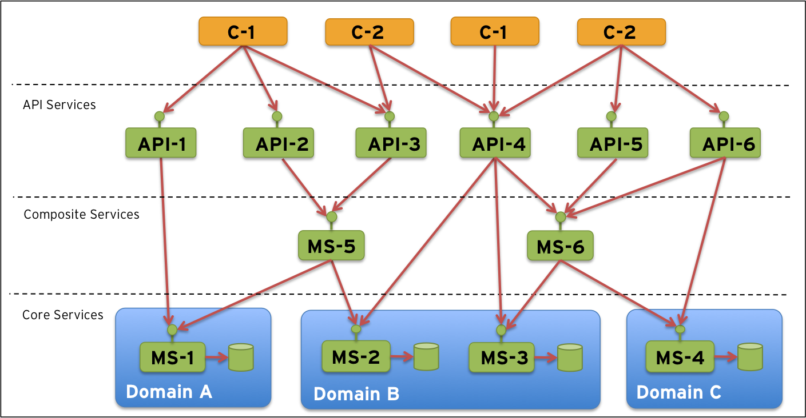

微服务操作模型
======================
本文不是另外一篇介绍微服务的文章，微服务介绍的好文章可以参考Fowler的[微服务](http://martinfowler.com/articles/microservices.html)文章。而本文假设我们已经开始使用微服务来分解单体应用来提高部署性和可扩展性。

当在系统领域部署的微服务数量递增时会有新的挑战出现，这些挑战在只部署一些单体应用的时候不会出现的。这篇文章我们就聚焦这些新的挑战，并为使用大量微服务部署的系统领域的操作模型做个定义。

本文分为下面几部分:
- 先决条件
- 扩展
- 问题
- 必要组件
- 参考模型
- Next step

## 1. 先决条件
首先在系统领域要铺开大量微服务需要什么?

根据Fowler的博客，我们要达到下面的目的:

然而，在我们开始在我们的系统领域铺开大量微服务来代替我们的单体应用之前，我们需要满足一些先决条件(或者至少在某种程度下), 我们需要:
- 目标架构
- 持续发布连锁工具
- 优化的组织结构

让我们看看每个先决条件吧。

### 1.1 目标架构
首先我们需要一个如何分解我们微服务的架构思想。 例如我们可以将他们分解成如下的几个垂直层:

- 核心服务: 处理业务数据持久化以及应用业务规则和其他逻辑的。
- 组装服务: 组装服务可以协调多个核心服务执行普通任务，或者从一些核心服务中聚合信息。
- API服务: 暴露外部可用的功能，例如，允许第三方发明创造性的应用程序，这些应用程序可以使用系统领域的底层功能。

另外水平层面我们可以应用一些域驱动分区。这样目标架构有可能类似如下:

> 注意： 这只是一个目标架构的样例， 你具体的架构可能完全不同。这里关键点在于你需要在开始扩展部署微服务之前需要有一个目标架构。否则看到系统领域就像意大利面条一样, 望而止步， 这样比现有的单体应用的特点还要差劲。

### 1.2 持续发布
我们也假设已经有一些种类的现成的持续发布工具链， 因此我们可以有效的重复的和质量驱动的方式来开始我们的微服务, 例如:

### 1.3 组织结构
最后, 我们假设我们已经采取我们的组织结构来避免Conway法则引发的问题。 康威法则陈述如下。

> Any organization that designs a system (defined broadly) will produce a design whose structure is a copy of the organization’s communication structure.
> 任何设计系统的组织，必然会产生以下设计结果：即其结构就是该组织沟通结构的写照。简单来说： 产品必然是其组织沟通结构的缩影。

## 扩展(SCALING UP)
因此，本文接下来的焦点在于当我们开始将一些单体应用分解并使用微服务替代它们的时候，在系统领域会发生什么?

- 大量部署的单元: 很多微服务代替一些大型的单体应用，当然会导致明显数量的发布单元需要管理和跟踪。
- 微服务既暴露服务也消费服务: 这就导致系统领域中大多数微服务需要互相交互。
- 某些微服务会暴露外部API: 这些微服务会负责屏蔽其他微服务免受外部访问。
- 系统领域更加动态: 新微服务部署后，旧的需要替换或移除，原有微服务的新实例需要启动来满足负载增加。 这就意味着服务比之前的来回访问要更频繁些。
- 平均故障间隔时间(MTBF)会降低, 例如系统领域的失败发生的频率还是比较高的: 软件组件有时会出错。 对于有大量小的部署单元的系统来说，系统领域中的部分失败的概率会增大，相对于只使用一些大的单体应用程序的概率来说。

## 问题
这样会导致一些重要的以及在新运行环境中引发的新问题:

- 我们所有的微服务如何配置以及这样是否正确? 处理配置对于一些应用程序来说，不是主要问题， 例如，每个应用程序在磁盘中的属性文件或自己的数据库中的配置表来存储它自己的配置。在多个服务器为大量微服务部署多个实例，这种方式中管理变得更加复杂。导致大量小的配置文件/表遍布系统领域，使得很难有效维护，也很难有很好的质量。
- 我们部署了什么微服务，以及微服务部署在哪里?  使用一些简单的应用程序来跟踪服务暴露的主机和端口号非常简单，因为这些量少并且改变的几率也不大。使用大量独立部署的微服务，在系统领域来看或多或少会有一些不断变化的情况，如果手动来处理这些可能会导致很难维护。
- 如何让路由信息保持不变？对于在动态系统领域中的服务消费者可能有挑战。 具体来说如果所在路由表，例如反向代理或消费者配置文件需要手动更新。基本上来说没有时间在或多或少处于不断演化的微服务领域中手动编辑路由表来弹出新的host/port地址。交付时间太长，容易冒手工错误的风险，这样会影响质量方面和/或无必要高的操作代价。
- 如何防止连锁失败? 既然微服务需要互相连接，需要特别注意系统领域中的连锁失败。例如，如果其他一些微服务依赖的某个微服务失败了，依赖的微服务也将失败等等。如果处理不当，系统领域的大量部分都会因为单个失败的微服务而受影响, 导致脆弱的系统领域。
- 如何验证所有服务已启动并且在运行中? 跟踪少量应用的状态相对容易，但是我们如何验证所有的微服务的健康以及准备接收请求?
- 如何跟踪服务间的消息流? 如果支持组织开始抱怨一些失败的处理怎么办? 如何找到相关的处理，例如，订单号12345的处理被卡住，因为微服务A不可访问或在微服务B可以发送关于那个订单的确认信息之前需要执行手工审批。
- 如何确保只有API服务是外部暴露的? 例如，如何避免来自外部到内部微服务的无授权访问?
- 如何让API服务安全? 不是关于微服务的新问题或特性问题，但是对于让真正暴露外部的微服务安全来说依然非常重要。

## 必要组件
为了解决这些问题的大部分，需要在不必要的系统景观中加入必要操作和管理功能, 或者至少在一定程度上，当只操作几个应用的时候。上述问题的建议解决方式包括下面的组件:

- 集中配置服务器: 代替每个部署单元(例如微服务)的局部配置, 我们需要集中化配置管理。 我们也需要微服务可以用于获取配置信息的配置API。
- 服务发现服务器: 代替手工跟踪当前发布了什么微服务，以及服务发现功能允许的host和port，通过API，微服务启动时可以自动注册。
- 动态路由以及负载均衡: 给定的服务发现功能，路由组件可以使用发现API来查找请求的微服务在哪里部署以及负载均衡组件可以决定将请求路由到哪个实例，如果对于请求服务部署了多个实例的话。
- 断路器: 为了避免连锁失败问题，我们需要应用断路器模式，要了解详情可以参考[Release It!](https://pragprog.com/book/mnee/release-it)这本书或者Fowler的[短路器](http://martinfowler.com/bliki/CircuitBreaker.html)文章。
- 监控: 鉴于我们有就绪的断路器，我们可以从它们身上开始监测它们的状态以及搜集运行时间统计来获取系统领域以及当前使用的健康状态。这些信息可以收集并显示在dashboard上，并且可以通过配置的阀值来自动告警。
- 集中化日志分析: 为了能够跟踪消息并监测它们何时被卡住，我们需要一个集中化日志分析功能，它们能到达服务器并且搜集每个微服务产生的日志文件。日志分析功能将日志信息保存在集中数据库中，提供搜索和dashboard能力。 注意: 为了能够查找相关消息，在日志消息中使用相应的id对于所有微服务来说是非常重要的。
- 边界服务器: 为了对外暴露API并防止对内部微服务的未授权访问，我们需要一个边际服务器，所有的外部流量都通过它。 边际服务器可以基于上面描述的服务发现组件来复用动态路由和负载均衡能力。边际服务器将扮演一个动态的、活动的反向代理，每当内部系统领域改变的时候无需手工更新。
- OAuth 2.0保护的API: 为了保护暴露的API服务，推荐使用OAuth 2.0标准。 将OAuth 2.0应用到建议的解决方案中:
    - 新组件可以扮演OAuth授权服务器.
    - API服务将扮演OAuth资源服务器.
    - 外部API消费者将扮演OAuth客户端.
    - 边际服务器将扮演OAuth Token中继，意思是:
        - 它将扮演OAuth资源服务器.
        - 它将传递来自外部请求带来的OAuth Token给API服务.

> 注意: 随着时间的推移，OAuth 2.0标准将最有可能与OpenID连接标准相补充，以提供改进的授权功能。

## 参考模型
总之，意味着微服务需要一系列上面描述的支持服务设施，微服务使用它们的API来交互。可以通过下面的图片可视化:

> 注意：为了减少图片中的复杂性，微服务和支持服务之间的交互是不可见的。

## Next Step
在即将出现的博文中我们会描述和演示建议的参考模型是如何实现的，可以参考文章序列 - [构建微服务](http://callistaenterprise.se/blogg/teknik/2015/05/20/blog-series-building-microservices/)。

## 术语
- MTBF: 平均故障时间(Mean Time Between Failures).
- 连锁失败: chain of failures.

## 参考链接
- [微服务操作模型原文](http://callistaenterprise.se/blogg/teknik/2015/03/25/an-operations-model-for-microservices/)
- [OAuth 2.0](http://oauth.net/)
- [OpenID](http://openid.net/connect/)
